# MAESTRO Agent Team Architecture — v1.0

**Project**: MAESTRO — Personalised Learning Companion for IT Students
**Source spec**: MAESTRO Requirements v0.2 (15 May 2026)
**Mandate**: Production-ready 6-month MVP — write requirements v0.3, design HLD architecture, deliver deployable code, build complete test suite, file DPIA
**Architectural horizon**: MVP only; no premature engineering, but no architectural decisions that force rewrites for V1/V2
**Convention**: PROMETHEUS v3.0 conventions, namespace `MSTR-`, Claude Opus 4.6 native Agent Teams
**Authority model**: Triadic — Programme Director (governance) + Chief Technical Architect (technical authority) + Chief Pedagogical Architect (learning model authority). The third leg is required because MAESTRO is irreducibly half tech, half pedagogy.

---

## 1. Executive Summary

MAESTRO is a multi-agent learning companion targeting minor users (13–19) studying IT in Italian high schools, with strict GDPR Art. 8 / Art. 9 exposure, mandatory WCAG 2.1 AA conformance, 12-language localisation horizon, and a six-state mastery model whose pedagogical validity is contested in the learning-sciences literature. Building it as a *production* MVP means the delivery team cannot be a generic software squad — it needs full coverage of learning sciences, privacy/compliance engineering, safeguarding, accessibility, localisation, AI/ML ops, and infrastructure, alongside conventional backend / mobile / data engineering.

The team is structured as **23 agents in 6 tiers**, orchestrated through Claude Opus 4.6 Agent Teams in hybrid mode (parallel Agent Teams workstreams + focused subagents for research and review). Three architectural choices anchor the design:

1. **Triadic leadership**, with CPA co-equal to CTA on educational decisions. Without this, learning-sciences concerns get systematically deprioritised under engineering pressure.
2. **Verification Sidecar as a separate agent**, not a sub-pattern of QA Sentinel. Given minor-protection and pedagogical-integrity stakes, evidence-based truth enforcement deserves its own context window and authority chain.
3. **Tech stack revalidation as Phase 1 work**, not assumption. The v0.2 reference stack is treated as input only; the team produces an Architecture Decision Record (ADR) for each component before any code is written.

Estimated cost: **~$180–240 per full team run** (single complete pass through Phase 1→6). MVP delivery is expected to take 30–50 runs across the 6-month horizon, with cost concentrated in Phases 4–5 (implementation + testing).

---

## 2. Opus 4.6 Execution Strategy

```yaml
execution_strategy:
  orchestration_mode: "hybrid"
  rationale: |
    Agent Teams for parallel domain workstreams (architecture, engineering tracks,
    domain specialist tracks) which need peer-to-peer communication and shared task
    board. Subagents within engineering agents for focused research, code review,
    framework documentation lookup. Single-session work only for tightly sequential
    refactors during implementation.

  effort_distribution:
    max:    [MSTR-02 CTA, MSTR-03 CPA, MSTR-04 Agent-Systems-Architect]
    high:   [MSTR-01 Director, MSTR-05 KG-Architect, MSTR-06 Content-Architect,
             MSTR-07 Data-Architect, MSTR-10 AI/ML-Engineer, MSTR-15 LSS,
             MSTR-16 Privacy-Engineer, MSTR-19 Safeguarding, MSTR-20 QA-Sentinel,
             MSTR-22 Pedagogical-Reviewer]
    medium: [MSTR-08 Backend, MSTR-09 Frontend, MSTR-11 Data-Engineer,
             MSTR-12 DevOps/SRE, MSTR-13 Security, MSTR-14 Test-Engineer,
             MSTR-17 Accessibility/UX, MSTR-18 Localization, MSTR-21 Verification-Sidecar,
             MSTR-23 Infrastructure-Manager]
    low: []
    rationale: |
      No fixed low-effort roles. Effort Router (embedded in MSTR-23) can dynamically
      downshift triage tasks to low. Distribution: 13% max / 48% high / 39% medium —
      heavier on high than the typical 60% medium target because production-grade
      delivery with minor-safety stakes raises the quality bar across the board.

  context_plan:
    agents_needing_1M:
      - MSTR-01 Director           # global programme visibility
      - MSTR-02 CTA                # full HLD + cross-component coherence
      - MSTR-03 CPA                # pedagogical model coherence across all touchpoints
      - MSTR-04 Agent-Systems-Arch # full agent graph reasoning
      - MSTR-05 KG-Architect       # whole curriculum + 30+ macro-nodes
      - MSTR-20 QA-Sentinel        # cross-cutting deliverable review
      - MSTR-22 Pedagogical-Reviewer # cross-content coherence
    agents_within_200K: [all others]
    rationale: |
      1M tier sized to 7 agents. Engineering and specialist tracks work in focused
      200K contexts with handoff documents on filesystem; this is cheaper and reduces
      context-rot risk on long-running implementation tasks.

  compaction_plan:
    long_running_agents:
      - MSTR-01 Director           # entire programme run
      - MSTR-20 QA-Sentinel        # entire programme run
      - MSTR-08 Backend            # implementation phase 4-5
      - MSTR-10 AI/ML-Engineer     # implementation phase 4-5
      - MSTR-14 Test-Engineer      # testing phase 5
    compaction_threshold: 50000  # tokens
    persistence_strategy: |
      External persistence on filesystem before compaction can drop critical state:
        - .maestro/decisions/      → all ADRs (architecture decisions)
        - .maestro/handoffs/       → inter-agent handoff documents (JSON)
        - .maestro/qa_findings/    → QA Sentinel findings register
        - .maestro/dpia/           → privacy & compliance work products
        - .maestro/pedagogical/    → pedagogical reviewer notes
        - .maestro/tests/          → test specifications and coverage records
      Verbose intermediate reasoning, superseded drafts, exploratory searches that
      yielded no result → safe to compact. ADRs, QA findings, DPIA artefacts, test
      specs → never compact; always persisted externally before any window pressure.

  mcp_servers_needed:
    - name: "github"
      url: "https://api.githubcopilot.com/mcp/"
      capabilities: [code repo access, PRs, issues]
      assigned_to: [MSTR-08, MSTR-09, MSTR-10, MSTR-11, MSTR-14, MSTR-12, MSTR-20]
    - name: "context7"
      url: "https://mcp.context7.com/mcp"
      capabilities: [library/framework documentation]
      assigned_to: [MSTR-08, MSTR-09, MSTR-10, MSTR-11, MSTR-12, MSTR-13]
    - name: "linear-or-jira"
      url: "tbd"
      capabilities: [project management, sprint tracking]
      assigned_to: [MSTR-01, MSTR-23]
    - name: "confluence-or-notion"
      url: "tbd"
      capabilities: [documentation, knowledge base]
      assigned_to: [MSTR-01, MSTR-02, MSTR-03, MSTR-15, MSTR-16]

  estimated_token_budget:
    per_full_run: "180-240 USD"
    breakdown:
      phase_1_foundation:       "20-30 USD  (3 tasks, max-effort heavy)"
      phase_2_architecture:     "35-50 USD  (5 tasks, architects parallel)"
      phase_3_compliance:       "25-35 USD  (5 tasks, domain specialists)"
      phase_4_implementation:   "50-70 USD  (8 tasks, engineering heavy)"
      phase_5_testing:          "30-40 USD  (6 tasks, test engineer + reviewers)"
      phase_6_deployment:       "20-30 USD  (5 tasks, devops + privacy)"
    full_mvp_runs_expected: "30-50 across 6 months"
    total_estimated_cost_range: "5,400 - 12,000 USD"
```

---

## 3. Team Roster

### 3.1 Leadership Tier (3 agents)

```yaml
- id: MSTR-01
  name: Programme Director
  tier: leadership
  execution:
    mode: team_lead
    effort_level: high
    thinking: { type: adaptive }
    context_budget: 1M
    compaction_enabled: true
    compaction_threshold: 50000
    max_output_tokens: 64000
  primary_objective: |
    Orchestrate the full MAESTRO MVP delivery from v0.3 requirements to deployed
    production system. Programme governance, stakeholder synthesis, escalation
    handler, final delivery sign-off (jointly with CTA + CPA).
  reports_to: [human user]
  supervises: [all team agents]
  spawn_authority: yes
  decision_scope: |
    - Programme scope, schedule, sequencing
    - Cross-track conflict resolution
    - Stakeholder communication (school, DPO, families — via human user)
    - Final delivery acceptance (joint with CTA + CPA)
  escalation_triggers:
    - Cross-track architectural conflict CTA vs CPA cannot resolve
    - DPIA blocker
    - Pedagogical model validity finding from LSS that invalidates F11
    - QA Sentinel veto on delivery
  mcp_servers: [linear-or-jira, confluence-or-notion]
  task_management:
    owns_tasks: [T1.1, T6.5]
    visibility: [all]

- id: MSTR-02
  name: Chief Technical Architect
  tier: leadership
  execution:
    mode: teammate
    effort_level: max
    thinking: { type: adaptive }
    context_budget: 1M
    compaction_enabled: true
  primary_objective: |
    Technical authority across MAESTRO. Owns the HLD, validates ADRs from domain
    architects, ratifies the tech stack revalidation, synthesises interface
    contracts between subsystems, signs off on production readiness.
  reports_to: [MSTR-01]
  supervises: [MSTR-04, MSTR-05, MSTR-06, MSTR-07, MSTR-08..MSTR-14]
  decision_scope: |
    - Tech stack choices (revalidation of v0.2 §5 reference stack)
    - HLD structure, interface contracts, ADR ratification
    - Production readiness sign-off (joint with MSTR-12 DevOps + MSTR-13 Security)
  escalation_triggers:
    - Scalability blocker discovered (MVP choice that breaks V1/V2)
    - Tech stack revalidation reveals reference stack infeasibility
    - Cross-architect ADR conflict
  mcp_servers: [github, confluence-or-notion]
  task_management:
    owns_tasks: [T1.2, T2.5]

- id: MSTR-03
  name: Chief Pedagogical Architect
  tier: leadership
  execution:
    mode: teammate
    effort_level: max
    thinking: { type: adaptive }
    context_budget: 1M
    compaction_enabled: true
  primary_objective: |
    Pedagogical authority. Co-equal with CTA on any decision that touches the
    learning model. Owns: F3 learning-style profile design, F11 state machine
    semantics, retention-check intervals, macro/micro rollup rule, F13
    bilingualism pedagogy, gamification anti-pattern enforcement.
  reports_to: [MSTR-01]
  supervises: [MSTR-15, MSTR-18, MSTR-19, MSTR-22]
  collaborates_with: [MSTR-02 (joint authority), MSTR-06, MSTR-17]
  decision_scope: |
    - Pedagogical model validity (with LSS input)
    - Content generation quality bar
    - Bilingualism pedagogical strategy (F13.20 transition rules etc.)
    - Safeguarding pedagogical thresholds
  escalation_triggers:
    - LSS finds F3/F11 model unsupported by evidence → escalate to Director
    - Content output fails Pedagogical Reviewer repeatedly → cross-track meeting
  mcp_servers: [confluence-or-notion]
  task_management:
    owns_tasks: [T1.3]
```

### 3.2 Architecture Tier (4 agents)

```yaml
- id: MSTR-04
  name: Agent Systems Architect
  tier: architecture
  execution:
    mode: teammate
    effort_level: max
    thinking: { type: adaptive }
    context_budget: 1M
  primary_objective: |
    Design the runtime multi-agent architecture of MAESTRO itself (the product —
    not this delivery team). Orchestrator pattern, per-agent specs, MCP integration
    points for the running system, agent communication, fallback paths.
  reports_to: [MSTR-02]
  collaborates_with: [MSTR-05, MSTR-06, MSTR-07, MSTR-10, MSTR-04 outputs feed MSTR-08]
  deliverables: [MAESTRO product agent architecture HLD, per-agent specs, runtime MCP map]
  task_management:
    owns_tasks: [T2.1]

- id: MSTR-05
  name: Knowledge Graph & Curriculum Architect
  tier: architecture
  execution:
    mode: teammate
    effort_level: high
    thinking: { type: adaptive }
    context_budget: 1M
  primary_objective: |
    Design the knowledge graph schema (macro/micro nodes per F1.7, prerequisite
    edges per F1.2, school-level attribute per F1.6), curriculum ingestion pipeline
    (F2-A teacher lessons + F2-B complementary materials), concept-mapping engine
    (F2.4 lesson-to-concept linking).
  reports_to: [MSTR-02]
  collaborates_with: [MSTR-03 (rollup rule), MSTR-07 (state store integration), MSTR-11]
  deliverables: [KG schema ADR, ingestion pipeline HLD, mapping engine spec]
  task_management:
    owns_tasks: [T2.2]

- id: MSTR-06
  name: Content Generation & Multimodal Architect
  tier: architecture
  execution:
    mode: teammate
    effort_level: high
    thinking: { type: adaptive }
    context_budget: 200K
  primary_objective: |
    Design the five content channels: text (F5), podcast two-voice (F6), visual
    diagrams (F10), game/gamification (F7), dialog (F10.4). Specify generation
    pipelines, voice/style adaptation hooks, LLM prompt architecture, TTS
    integration, caching layer.
  reports_to: [MSTR-02]
  collaborates_with: [MSTR-03 (quality bar), MSTR-10 (LLM ops), MSTR-18 (bilingualism)]
  deliverables: [Content architecture ADR, per-channel HLD, prompt template registry spec]
  task_management:
    owns_tasks: [T2.3]

- id: MSTR-07
  name: Data & Mastery State Architect
  tier: architecture
  execution:
    mode: teammate
    effort_level: high
    thinking: { type: adaptive }
    context_budget: 200K
  primary_objective: |
    Design the Knowledge Map Manager: per-(student, node) state store with full
    transition history (F11.5), retention-check scheduler (F11.10), heatmap
    aggregation (F11.13), override audit log (F11.12), and the F14 identity/
    consent/enrolment data model with audit log.
  reports_to: [MSTR-02]
  collaborates_with: [MSTR-05, MSTR-11, MSTR-16 (audit & GDPR compliance)]
  deliverables: [Data model ADR, state store schema, audit log spec, F14 data model]
  task_management:
    owns_tasks: [T2.4]
```

### 3.3 Engineering Tier (7 agents)

```yaml
- id: MSTR-08
  name: Backend Engineer
  tier: engineering
  execution:
    mode: teammate
    effort_level: medium  # escalates to high on multi-service or security-touching changes
    thinking: { type: adaptive }
    context_budget: 200K
    compaction_enabled: true
  primary_objective: |
    Build backend orchestration: agent framework wrapper (LangGraph or alternative
    per CTA ADR), REST/GraphQL API, KMM service, F14 admin path service,
    teacher-dashboard backend, integration with vector store + Neo4j (or
    alternative) + audit log.
  reports_to: [MSTR-02]
  collaborates_with: [MSTR-09, MSTR-10, MSTR-11, MSTR-13]
  subagent_types: [framework-docs-researcher, security-sentinel]
  mcp_servers: [github, context7]
  task_management:
    owns_tasks: [T4.1, T4.4, T4.5, T4.7]
    blocks: [T5.1, T5.2]

- id: MSTR-09
  name: Mobile & Frontend Engineer
  tier: engineering
  execution:
    mode: teammate
    effort_level: medium
    thinking: { type: adaptive }
    context_budget: 200K
  primary_objective: |
    Build student mobile app MVP (React Native or Flutter — per CTA ADR), teacher
    dashboard web frontend. Implement accessibility per MSTR-17 design system,
    multimodal content rendering per MSTR-06 architecture, bilingual layouts per
    MSTR-18, state-machine UI for F11 (six-state semaphore with gap-closure
    missions visualisation).
  reports_to: [MSTR-02]
  collaborates_with: [MSTR-17, MSTR-18, MSTR-08]
  subagent_types: [accessibility-checker, framework-docs-researcher]
  mcp_servers: [github, context7]
  task_management:
    owns_tasks: [T4.6, T4.7]
    blocks: [T5.2, T5.3]

- id: MSTR-10
  name: AI/ML Engineer
  tier: engineering
  execution:
    mode: teammate
    effort_level: high
    thinking: { type: adaptive }
    context_budget: 200K
  primary_objective: |
    Build LLM ops: prompt management, RAG pipeline against KG + materials store,
    evaluation harness (factual accuracy, pedagogical fidelity, bias, age-
    appropriateness), TTS integration for podcasts, pseudonymisation layer (per
    N1: no PII to external LLMs), model routing/fallback. Implement product-level
    Effort Router (mirroring team-level pattern).
  reports_to: [MSTR-02]
  collaborates_with: [MSTR-06, MSTR-19, MSTR-22]
  subagent_types: [framework-docs-researcher, performance-analyzer]
  mcp_servers: [github, context7]
  task_management:
    owns_tasks: [T4.3]
    blocks: [T5.1, T5.6]

- id: MSTR-11
  name: Data Engineer
  tier: engineering
  execution:
    mode: teammate
    effort_level: medium
    thinking: { type: adaptive }
    context_budget: 200K
  primary_objective: |
    Build data layer: ingestion pipelines (lesson transcription with timestamps
    + speaker ID per F2.2, vector indexing of materials per F2.10), KG operations
    (Neo4j or alternative), KMM state store (PostgreSQL + time-series for heatmap
    per F11.13), ETL for analytics. EU residency enforced.
  reports_to: [MSTR-02]
  collaborates_with: [MSTR-05, MSTR-07, MSTR-12]
  mcp_servers: [github, context7]
  task_management:
    owns_tasks: [T4.2]
    blocks: [T5.1]

- id: MSTR-12
  name: DevOps & SRE
  tier: engineering
  execution:
    mode: teammate
    effort_level: medium
    thinking: { type: adaptive }
    context_budget: 200K
  primary_objective: |
    Build CI/CD, IaC (Terraform/Pulumi), monitoring (metrics + logs + traces),
    alerting, DR plan (RPO ≤ 24h, RTO ≤ 4h per N2), EU residency infrastructure
    (cloud region constraints), cost monitoring (LLM token consumption tracking
    per agent + per student per day).
  reports_to: [MSTR-02]
  collaborates_with: [MSTR-13]
  mcp_servers: [github, context7]
  task_management:
    owns_tasks: [T6.1, T6.2]

- id: MSTR-13
  name: Security Engineer
  tier: engineering
  execution:
    mode: teammate
    effort_level: medium
    thinking: { type: adaptive }
    context_budget: 200K
  primary_objective: |
    Authn/authz (SSO with school IdP per N2), encryption at rest + in transit,
    secrets management, pen-test preparation and remediation, threat model,
    audit log integrity (write-once, tamper-evident — joint with MSTR-16),
    pseudonymisation infrastructure for LLM calls.
  reports_to: [MSTR-02]
  collaborates_with: [MSTR-12, MSTR-16]
  subagent_types: [security-sentinel]
  mcp_servers: [github, context7]
  task_management:
    owns_tasks: [T3.5, T5.4]

- id: MSTR-14
  name: Test Engineer
  tier: engineering
  execution:
    mode: teammate
    effort_level: medium  # escalates to high on safety-critical paths (minor protection, F14 consent flows)
    thinking: { type: adaptive }
    context_budget: 200K
  primary_objective: |
    Build full test suite: unit (per service), integration (cross-service +
    LLM eval), E2E (student journeys + teacher workflows), accessibility (axe +
    manual screen-reader scenarios), security regression, pedagogical-efficacy
    test design (joint with MSTR-22 + MSTR-15), bias audit harness (joint with
    MSTR-19). Test coverage targets per CLAUDE.md governance.
  reports_to: [MSTR-02]
  collaborates_with: [all engineers, MSTR-22, MSTR-15, MSTR-19, MSTR-17]
  mcp_servers: [github]
  task_management:
    owns_tasks: [T5.1, T5.2, T5.3, T5.5, T5.6]
```

### 3.4 Domain Specialist Tier (5 agents)

```yaml
- id: MSTR-15
  name: Learning Sciences Specialist
  tier: domain_specialist
  execution:
    mode: teammate
    effort_level: high
    thinking: { type: adaptive }
    context_budget: 200K
  primary_objective: |
    Independently validate the pedagogical model in v0.2: F3 learning-style
    profile (note: "learning styles" as a fixed-trait construct has thin
    empirical support — Pashler et al. 2009, Newton 2015; team should treat F3
    as a *content-adaptation profile*, not a *learner-typing claim*), F11 six-
    state machine, D+3/D+7/D+21 retention intervals (compare against FSRS, SM-2),
    macro/micro worst-state rollup (validate against alternative weighted
    schemes), gamification anti-patterns (F7.7).
  reports_to: [MSTR-03]
  collaborates_with: [MSTR-22, MSTR-06, MSTR-14]
  deliverables: [Pedagogical model validation report, ADR on F3 reframing if needed, retention-interval rationale, rollup rule justification]
  escalation_triggers: [F3 reframing rejected by team, retention intervals unsupported]
  task_management:
    owns_tasks: [T1.3]

- id: MSTR-16
  name: Privacy & Compliance Engineer
  tier: domain_specialist
  execution:
    mode: teammate
    effort_level: high
    thinking: { type: adaptive }
    context_budget: 200K
  primary_objective: |
    Drive the DPIA, design F14.3 granular consents (5 consents: profiling /
    native-language Art. 9 / family communications / cross-year history /
    aggregated research), GDPR Art. 8 compliance for minor users, Art. 9
    treatment of native language as ethnic-origin proxy, Garante Privacy
    alignment, EU residency enforcement, retention policies per data category,
    audit log requirements (joint with MSTR-13), right-to-erasure implementation
    per F14.9.
  reports_to: [MSTR-01]
  collaborates_with: [MSTR-07, MSTR-13, MSTR-18]
  deliverables: [DPIA, consent UX design, retention policy register, Art. 9 handling spec, erasure procedure]
  escalation_triggers: [Garante Privacy guidance conflicts with design, DPIA finds high residual risk]
  task_management:
    owns_tasks: [T3.1, T6.3, T6.4]

- id: MSTR-17
  name: Accessibility & UX Specialist
  tier: domain_specialist
  execution:
    mode: teammate
    effort_level: medium
    thinking: { type: adaptive }
    context_budget: 200K
  primary_objective: |
    Design system for WCAG 2.1 AA conformance, dyslexia-friendly font support
    (F9.1), high-contrast and dark/light/sepia modes (F9.5), screen-reader
    compatibility (NVDA/JAWS/VoiceOver), keyboard navigation, semaphore-state
    visualisation that does not rely on colour alone (F9.3), age-adaptive
    granularity UX (F1.8 — biennio vs triennio default views), DSA/BES user
    testing protocol.
  reports_to: [MSTR-03 jointly with MSTR-02]
  collaborates_with: [MSTR-09, MSTR-06, MSTR-14]
  deliverables: [Design system, accessibility audit plan, DSA/BES testing protocol]
  task_management:
    owns_tasks: [T3.3]

- id: MSTR-18
  name: Localization & Bilingualism Lead
  tier: domain_specialist
  execution:
    mode: teammate
    effort_level: medium
    thinking: { type: adaptive }
    context_budget: 200K
  primary_objective: |
    Design F13 bilingual ops for MVP (2 languages: ukrainian + arabic per pilot
    consideration). Architect for V1 expansion to 6 and V2 to 12. Native-reviewer
    SLA, glossary register per language, two-column layout spec for text,
    cross-language podcast format spec (F13.11), transition-detection logic
    (F13.20: student reading only native column → suggest exercises in official
    language). Bilingualism as Art. 9 data per N1 + F14.3.b.
  reports_to: [MSTR-03]
  collaborates_with: [MSTR-06, MSTR-16, MSTR-17]
  deliverables: [Bilingual ops spec, glossary architecture, native-reviewer process, transition-detection algorithm]
  task_management:
    owns_tasks: [T3.4]

- id: MSTR-19
  name: Safeguarding & Ethics Specialist
  tier: domain_specialist
  execution:
    mode: teammate
    effort_level: high
    thinking: { type: adaptive }
    context_budget: 200K
  primary_objective: |
    Design Safeguarding Agent specs (the product-level component): content
    moderation pipeline (offensive language, age-appropriateness, stereotype
    filtering per F8.5 + N3), wellbeing pattern detection (frustration,
    abandonment, persistent negative trajectory), escalation flow to school
    referent (psychologist, coordinator), anti-manipulation rules (no dark
    patterns, no FOMO, no scarcity), gamification opt-out (F7.8) enforcement,
    bias audit protocol (N6).
  reports_to: [MSTR-03]
  collaborates_with: [MSTR-06, MSTR-10, MSTR-14, MSTR-22]
  deliverables: [Safeguarding Agent spec, content-moderation policy, wellbeing-detection rules, escalation protocol, bias audit harness]
  escalation_triggers: [Wellbeing pattern detected during pilot, bias audit fails]
  task_management:
    owns_tasks: [T3.2, T5.6]
```

### 3.5 Oversight Tier (3 agents)

```yaml
- id: MSTR-20
  name: QA Sentinel
  tier: oversight
  execution:
    mode: teammate
    effort_level: high
    thinking: { type: adaptive }
    context_budget: 1M
    compaction_enabled: true
  authority: "Veto on all deliverables (requirements, code, tests, deployment)"
  primary_objective: |
    Cross-cutting quality gatekeeper. Reviews every deliverable before sign-off.
    Validates: (a) requirement traceability — every F/N requirement maps to a
    test, an architecture decision, and implemented code; (b) consistency across
    tracks (engineering ↔ pedagogy ↔ privacy ↔ accessibility); (c) CLAUDE.md
    governance compliance; (d) production-readiness criteria for Q1-c scope.
  reports_to: [MSTR-01]
  collaborates_with: [MSTR-21, MSTR-22]
  veto_actions: [block delivery, request revision with evidence, escalate to Director]
  mcp_servers: [github]
  task_management:
    owns_tasks: [reviews all major deliverables — implicit task]

- id: MSTR-21
  name: Verification Sidecar
  tier: oversight
  execution:
    mode: teammate
    effort_level: medium
    thinking: { type: adaptive }
    context_budget: 200K
  authority: "Evidence-based truth enforcement — auto-block claims without evidence"
  primary_objective: |
    Real-time check that agent claims of completion are backed by actual evidence:
      - "Backend service built" → does the service start? Does the API respond? git diff present?
      - "Test passes" → run the test, capture output
      - "DPIA complete" → does the document exist with required sections?
      - "Mobile build" → does it actually compile and install on simulator?
    Outputs evidence packages attached to each task completion event.
  reports_to: [MSTR-20]
  block_actions: [reject task completion with missing evidence, attach evidence requirement]
  mcp_servers: [github]
  task_management:
    owns_tasks: [evidence checks on every task completion — auto-triggered]

- id: MSTR-22
  name: Pedagogical Reviewer
  tier: oversight
  execution:
    mode: teammate
    effort_level: high
    thinking: { type: adaptive }
    context_budget: 1M
  authority: "Veto on content outputs and pedagogical claims (distinct from LSS who validates the model)"
  primary_objective: |
    Sample-based review of generated content (text documents, podcasts,
    mini-quizzes, retention checks) against pedagogical quality bar set by CPA +
    LSS. Distinct from LSS: LSS validates the *model*; Pedagogical Reviewer
    validates the *outputs the model produces*. Checks: factual accuracy of
    domain content (IT/PHP/SQL etc.), tone adherence (F8 + N3), analogy
    appropriateness, lack of stereotyping (N6), age-appropriateness, no
    confusing or misleading explanations.
  reports_to: [MSTR-03]
  collaborates_with: [MSTR-20, MSTR-19, MSTR-06]
  veto_actions: [block content release, require regeneration with feedback]
  task_management:
    owns_tasks: [T5.5 jointly with MSTR-14]
```

### 3.6 Infrastructure Tier (1 agent)

```yaml
- id: MSTR-23
  name: Infrastructure & Resource Manager
  tier: infrastructure
  execution:
    mode: teammate
    effort_level: medium
    thinking: { type: adaptive }
    context_budget: 200K
  primary_objective: |
    Three combined responsibilities:
    1. Effort Routing: monitor task complexity signals, dynamically suggest
       effort level upshift/downshift to Director, track effort-vs-output-quality
       per task type to refine routing.
    2. Context Management: monitor per-agent context usage, trigger compaction
       at threshold, ensure critical state is persisted to .maestro/ filesystem
       structure before any compaction.
    3. Memory Bridge: maintain handoff document standards (JSON schema in
       .maestro/handoffs/), enforce cross-session state availability via shared
       filesystem.
  reports_to: [MSTR-01]
  collaborates_with: [all agents — infrastructure role]
  mcp_servers: [linear-or-jira]
  task_management:
    owns_tasks: [continuous infrastructure — no discrete tasks]
```

---

## 4. Task DAG

Six phases, 32 tasks. Tasks named `T<phase>.<seq>`. Persistence in `.maestro/tasks/`.

```yaml
phase_1_foundation:
  - id: T1.1
    subject: "Requirements v0.3 synthesis"
    description: "Consolidate v0.2 + domain-specialist findings into v0.3 requirements doc"
    owner: MSTR-01
    contributors: [MSTR-02, MSTR-03, MSTR-15, MSTR-16, MSTR-17, MSTR-18, MSTR-19]
    blocked_by: []

  - id: T1.2
    subject: "Tech stack revalidation"
    description: "Validate v0.2 §5 reference stack; produce ADRs for each component; flag alternatives"
    owner: MSTR-02
    contributors: [MSTR-10, MSTR-11, MSTR-12, MSTR-13]
    blocked_by: []

  - id: T1.3
    subject: "Pedagogical model validation"
    description: "Validate F3, F11 state machine, retention intervals, rollup rule against learning-sciences literature; produce ADRs"
    owner: MSTR-03
    contributors: [MSTR-15, MSTR-22]
    blocked_by: []

phase_2_architecture:
  - id: T2.1
    subject: "Multi-agent system HLD"
    owner: MSTR-04
    blocked_by: [T1.1, T1.2, T1.3]

  - id: T2.2
    subject: "Knowledge graph & curriculum architecture"
    owner: MSTR-05
    blocked_by: [T1.1, T1.3]

  - id: T2.3
    subject: "Content generation & multimodal architecture"
    owner: MSTR-06
    blocked_by: [T1.1, T1.3, T2.1]

  - id: T2.4
    subject: "Data & mastery state architecture"
    owner: MSTR-07
    blocked_by: [T1.1, T1.2, T1.3]

  - id: T2.5
    subject: "Cross-component interface contracts + production HLD ratification"
    owner: MSTR-02
    blocked_by: [T2.1, T2.2, T2.3, T2.4]

phase_3_compliance_and_safety:
  - id: T3.1
    subject: "DPIA + consent design (F14.3 granular consents)"
    owner: MSTR-16
    blocked_by: [T2.4]

  - id: T3.2
    subject: "Safeguarding policies + content moderation flows"
    owner: MSTR-19
    blocked_by: [T2.3]

  - id: T3.3
    subject: "Accessibility design system + DSA/BES protocol"
    owner: MSTR-17
    blocked_by: [T2.5]

  - id: T3.4
    subject: "Bilingual ops + native reviewer SLA (MVP: 2 languages)"
    owner: MSTR-18
    blocked_by: [T2.3, T2.5]

  - id: T3.5
    subject: "Security architecture (authn/authz, encryption, audit, pseudonymisation)"
    owner: MSTR-13
    blocked_by: [T2.5, T3.1]

phase_4_implementation:
  - id: T4.1
    subject: "Backend orchestration + agent framework"
    owner: MSTR-08
    blocked_by: [T2.5, T3.5]

  - id: T4.2
    subject: "KG ingestion pipeline + concept mapping"
    owner: MSTR-11
    blocked_by: [T2.2, T2.4]

  - id: T4.3
    subject: "Content generation services (text + minimal podcast)"
    owner: MSTR-10
    blocked_by: [T2.3, T3.2]

  - id: T4.4
    subject: "Knowledge Map Manager + state store + audit log"
    owner: MSTR-08
    blocked_by: [T2.4, T3.5]

  - id: T4.5
    subject: "F14 admin path (anagrafica + consenso + iscrizione)"
    owner: MSTR-08
    blocked_by: [T2.4, T3.1, T3.5]

  - id: T4.6
    subject: "Student mobile app MVP"
    owner: MSTR-09
    blocked_by: [T2.5, T3.3, T4.1]

  - id: T4.7
    subject: "Teacher dashboard"
    owner: MSTR-09
    blocked_by: [T2.5, T3.3, T4.1, T4.4]

  - id: T4.8
    subject: "Bilingual MVP (2 languages)"
    owner: MSTR-18
    blocked_by: [T3.4, T4.3, T4.6]

phase_5_testing_and_verification:
  - id: T5.1
    subject: "Unit + integration test suite"
    owner: MSTR-14
    blocked_by: [T4.1, T4.2, T4.3, T4.4, T4.5]

  - id: T5.2
    subject: "E2E acceptance tests (student + teacher journeys)"
    owner: MSTR-14
    blocked_by: [T4.6, T4.7]

  - id: T5.3
    subject: "Accessibility audit (WCAG 2.1 AA + DSA/BES)"
    owner: MSTR-17
    blocked_by: [T4.6, T4.7]

  - id: T5.4
    subject: "Security pen-test"
    owner: MSTR-13
    blocked_by: [T4.5, T4.7]

  - id: T5.5
    subject: "Pedagogical efficacy test design + first run"
    owner: MSTR-22
    blocked_by: [T4.3, T4.4, T4.8]

  - id: T5.6
    subject: "Bias & safety audit (content + safeguarding)"
    owner: MSTR-19
    blocked_by: [T4.3, T4.8]

phase_6_deployment:
  - id: T6.1
    subject: "CI/CD + monitoring + alerting"
    owner: MSTR-12
    blocked_by: [T5.1]

  - id: T6.2
    subject: "DR plan + EU residency infrastructure"
    owner: MSTR-12
    blocked_by: [T6.1]

  - id: T6.3
    subject: "DPIA filing + Garante Privacy alignment"
    owner: MSTR-16
    blocked_by: [T5.1, T5.4, T5.6]

  - id: T6.4
    subject: "Audit trail end-to-end validation"
    owner: MSTR-16
    blocked_by: [T6.3]

  - id: T6.5
    subject: "Pilot deployment plan (1 school, 1 class)"
    owner: MSTR-01
    blocked_by: [T6.2, T6.4, T5.2, T5.3, T5.5]
```

---

## 5. Organisation Chart

```mermaid
graph TD
    HUMAN[Daniele / Human User]

    HUMAN --> MSTR01[MSTR-01<br/>Programme Director<br/>effort: high · ctx: 1M]

    MSTR01 --> MSTR02[MSTR-02<br/>Chief Technical Architect<br/>effort: MAX · ctx: 1M]
    MSTR01 --> MSTR03[MSTR-03<br/>Chief Pedagogical Architect<br/>effort: MAX · ctx: 1M]
    MSTR01 --> MSTR20[MSTR-20<br/>QA Sentinel<br/>effort: high · ctx: 1M]
    MSTR01 --> MSTR16[MSTR-16<br/>Privacy & Compliance<br/>effort: high]
    MSTR01 --> MSTR23[MSTR-23<br/>Infrastructure Manager<br/>effort: medium]

    MSTR02 --> MSTR04[MSTR-04<br/>Agent Systems Arch<br/>effort: MAX · ctx: 1M]
    MSTR02 --> MSTR05[MSTR-05<br/>KG & Curriculum Arch<br/>effort: high · ctx: 1M]
    MSTR02 --> MSTR06[MSTR-06<br/>Content Arch<br/>effort: high]
    MSTR02 --> MSTR07[MSTR-07<br/>Data & State Arch<br/>effort: high]
    MSTR02 --> ENG[Engineering<br/>MSTR-08..14]

    MSTR03 --> MSTR15[MSTR-15<br/>Learning Sciences<br/>effort: high]
    MSTR03 --> MSTR18[MSTR-18<br/>Localization Lead<br/>effort: medium]
    MSTR03 --> MSTR19[MSTR-19<br/>Safeguarding<br/>effort: high]
    MSTR03 --> MSTR22[MSTR-22<br/>Pedagogical Reviewer<br/>effort: high · ctx: 1M]
    MSTR03 -.joint authority.- MSTR17[MSTR-17<br/>Accessibility & UX<br/>effort: medium]
    MSTR02 -.joint authority.- MSTR17

    MSTR20 --> MSTR21[MSTR-21<br/>Verification Sidecar<br/>effort: medium]

    ENG --> MSTR08[MSTR-08 Backend]
    ENG --> MSTR09[MSTR-09 Frontend/Mobile]
    ENG --> MSTR10[MSTR-10 AI/ML]
    ENG --> MSTR11[MSTR-11 Data]
    ENG --> MSTR12[MSTR-12 DevOps/SRE]
    ENG --> MSTR13[MSTR-13 Security]
    ENG --> MSTR14[MSTR-14 Test Engineer]

    classDef leadership fill:#1e3a8a,color:#fff,stroke:#1e40af
    classDef architecture fill:#7c3aed,color:#fff
    classDef engineering fill:#059669,color:#fff
    classDef domain fill:#d97706,color:#fff
    classDef oversight fill:#dc2626,color:#fff
    classDef infrastructure fill:#475569,color:#fff

    class MSTR01,MSTR02,MSTR03 leadership
    class MSTR04,MSTR05,MSTR06,MSTR07 architecture
    class MSTR08,MSTR09,MSTR10,MSTR11,MSTR12,MSTR13,MSTR14,ENG engineering
    class MSTR15,MSTR16,MSTR17,MSTR18,MSTR19 domain
    class MSTR20,MSTR21,MSTR22 oversight
    class MSTR23 infrastructure
```



---

## 6. Skill & MCP Matrix

| Agent | Core skills | MCP servers | Subagent types |
|---|---|---|---|
| MSTR-01 Director | Orchestration, stakeholder synthesis | linear, confluence | research |
| MSTR-02 CTA | Architecture, ADRs, tech stack eval | github, confluence | framework-docs-researcher |
| MSTR-03 CPA | Pedagogical authority, model design | confluence | research |
| MSTR-04 Agent Systems Arch | Multi-agent design, MCP integration | github | framework-docs-researcher |
| MSTR-05 KG & Curriculum | Knowledge graph, ontology, mapping | confluence | research |
| MSTR-06 Content Arch | Multimodal design, prompt arch, TTS | confluence | framework-docs-researcher |
| MSTR-07 Data & State Arch | Data modelling, time-series, audit | confluence | research |
| MSTR-08 Backend | API, services, orchestration | github, context7 | security-sentinel |
| MSTR-09 Frontend/Mobile | React Native/Flutter, web, a11y | github, context7 | accessibility-checker |
| MSTR-10 AI/ML | LLM ops, RAG, evals, prompts | github, context7 | performance-analyzer |
| MSTR-11 Data Eng | Pipelines, vector store, ETL | github, context7 | — |
| MSTR-12 DevOps/SRE | CI/CD, IaC, monitoring, DR | github, context7 | — |
| MSTR-13 Security | Authn/authz, encryption, threat model | github, context7 | security-sentinel |
| MSTR-14 Test Engineer | Test design, automation, coverage | github | — |
| MSTR-15 LSS | Learning science research, validation | confluence | best-practices-researcher |
| MSTR-16 Privacy | GDPR, DPIA, Garante alignment | confluence | best-practices-researcher |
| MSTR-17 Acc & UX | WCAG, design systems, user testing | — | accessibility-checker |
| MSTR-18 Localization | Bilingual ops, glossaries, MT QA | confluence | — |
| MSTR-19 Safeguarding | Content moderation, bias audit, ethics | confluence | — |
| MSTR-20 QA Sentinel | Cross-track review, traceability | github | — |
| MSTR-21 Verification | Evidence checks, test runs, git diffs | github | — |
| MSTR-22 Ped Reviewer | Content quality, domain accuracy | confluence | — |
| MSTR-23 Infra Manager | Effort routing, context mgmt, handoffs | linear | — |

---

## 7. Communication Flow

```yaml
channels:
  task_board:
    location: ".maestro/tasks/"
    visibility: all
    operations: [TaskCreate, TaskUpdate, TaskComplete]
    primary_use: "Phase progression, dependency tracking, completion events"

  direct_messaging:
    operation: "Teammate write"
    primary_uses:
      - "Architect → Engineer: ADR clarification on implementation"
      - "Engineer → Engineer: cross-component interface negotiation"
      - "QA Sentinel → any: revision request with evidence"
      - "Verification Sidecar → any: missing-evidence block"
      - "LSS → CPA: model validity finding"
      - "Privacy → Director: DPIA blocker"

  handoff_documents:
    location: ".maestro/handoffs/"
    format: "JSON, schema in .maestro/schemas/handoff.json"
    required_fields: [from, to, task_id, context, decisions, open_items, evidence_refs]
    primary_uses:
      - "Architecture → Engineering: per-component HLD + interface contract"
      - "Engineering → Test: implementation surface for test design"
      - "All → Privacy: data flow change requiring DPIA refresh"

  escalation_chain:
    level_1: "Agent → QA Sentinel or Verification Sidecar"
    level_2: "QA Sentinel → CTA / CPA (per domain)"
    level_3: "CTA + CPA → Programme Director"
    level_4: "Director → Human user"
    triggers:
      - "Cross-track conflict unresolvable at peer level"
      - "DPIA blocker"
      - "Pedagogical model invalidation"
      - "Security finding affecting production-readiness"
      - "Three QA rejections on same deliverable"

interaction_patterns:
  fan_out_architecture:
    description: "CTA spawns 4 domain architects in parallel after Phase 1"
    when: "Start of Phase 2"

  fan_out_implementation:
    description: "Engineering tier runs T4.1–T4.8 with internal dependencies"
    when: "Phase 4"

  cross_domain_finding:
    description: "Data Engineer discovers KMM scaling issue → direct message to Data Architect + Backend + QA Sentinel"

  three_way_review:
    description: "Content output reviewed by Pedagogical Reviewer + Safeguarding + Verification Sidecar in parallel"
    when: "Every content-generation deliverable in T4.3"
```

---

## 8. Workflow Sequence

```yaml
spawn_sequence:
  step_1_kickoff:
    spawn: [MSTR-01, MSTR-02, MSTR-03, MSTR-20, MSTR-23]
    purpose: "Leadership + governance up-front; QA Sentinel and Infrastructure Manager observe from start"

  step_2_phase_1_foundation:
    spawn: [MSTR-15, MSTR-16, MSTR-17, MSTR-18, MSTR-19, MSTR-22]
    in_parallel:
      - T1.1 (Director synthesises domain inputs into v0.3 requirements)
      - T1.2 (CTA + AI/ML + Data + DevOps + Security do tech stack revalidation)
      - T1.3 (CPA + LSS + Ped Reviewer validate pedagogical model)
    gate: "All three tasks complete + QA Sentinel approves v0.3 → unlock Phase 2"

  step_3_phase_2_architecture:
    spawn: [MSTR-04, MSTR-05, MSTR-06, MSTR-07]
    in_parallel: [T2.1, T2.2, T2.3, T2.4]
    then_sequential: [T2.5]  # CTA synthesises
    gate: "Production HLD ratified by CTA + CPA + QA Sentinel"
    compaction_checkpoint: "Persist all ADRs to .maestro/decisions/ before continuing"

  step_4_phase_3_compliance_safety:
    spawn: [MSTR-13]  # Security joins
    in_parallel: [T3.1, T3.2, T3.3, T3.4]
    then: T3.5
    gate: "DPIA draft + safeguarding policies + accessibility design + security architecture ratified"
    effort_escalation: "If DPIA finds residual high risk → escalate Privacy effort to max + bring in human DPO"

  step_5_phase_4_implementation:
    spawn: [MSTR-08, MSTR-09, MSTR-10, MSTR-11, MSTR-12, MSTR-14]
    parallel_groups:
      group_a: [T4.1, T4.2]                      # backend + data foundation
      group_b: [T4.3, T4.4, T4.5]                # services depending on group_a
      group_c: [T4.6, T4.7, T4.8]                # frontends + bilingual
    compaction_checkpoint: "Per-week: persist all code state and test results"
    verification_sidecar_active: "Every task completion auto-checked for evidence"

  step_6_phase_5_testing:
    parallel_groups:
      group_a: [T5.1, T5.3, T5.4, T5.6]          # automated + audits
      group_b: [T5.2, T5.5]                       # E2E + pedagogical efficacy
    gate: "All tests pass + audits clean + QA Sentinel approves"
    effort_escalation: "Test failure persisting after 2 attempts → escalate task owner to high"

  step_7_phase_6_deployment:
    sequential: [T6.1, T6.2, T6.3, T6.4, T6.5]   # mostly sequential
    gate: "Pilot deployment plan + DPIA filed + audit trail validated → Director signs off"

shutdown_protocol:
  - "Each phase: completed agents request shutdown via Teammate operation"
  - "Leadership + Oversight tier remain active across all phases"
  - "Final cleanup: Director runs Teammate cleanup"
```

---

## 9. Quality Gates

```yaml
gate_phase_1:
  exit_criteria:
    - v0.3 requirements doc complete with traceability to v0.2
    - Tech stack ADRs covering all v0.2 §5 components (accept/replace/defer with rationale)
    - Pedagogical model validation: F3 reframed if needed, F11 + retention intervals justified or revised, rollup rule justified
  qa_sentinel_checks:
    - Every v0.2 requirement appears in v0.3 (or has documented removal rationale)
    - Every ADR has alternatives considered, chosen option, consequences

gate_phase_2:
  exit_criteria:
    - 4 architecture HLDs (Agent, KG, Content, Data) ratified
    - Cross-component interface contracts defined in machine-readable format (OpenAPI for REST, GraphQL schema, event schemas)
    - Production HLD signed off by CTA + CPA + QA Sentinel
  verification_sidecar_checks:
    - ADR files exist in .maestro/decisions/
    - Interface contracts machine-validated (schema syntax + consistency)

gate_phase_3:
  exit_criteria:
    - DPIA draft complete with risk register
    - 5 consent flows designed (F14.3.a–e) with UX mockups
    - Safeguarding policies documented + content-moderation pipeline spec
    - Accessibility design system + DSA/BES testing protocol
    - Bilingual ops spec for MVP 2 languages + native-reviewer SLA
    - Security architecture: threat model + authn/authz + encryption + audit
  qa_sentinel_checks:
    - DPIA covers all 5 consent categories explicitly
    - Garante Privacy alignment evidence (consultation log or precedent references)

gate_phase_4:
  exit_criteria:
    - All T4.x tasks have code merged on main + passing CI
    - Code coverage targets met (per CLAUDE.md: ≥80% unit, ≥60% integration on critical paths)
    - F11 state machine implementation verified against ADR
    - F14 audit log integrity tested (write-once enforcement)
  verification_sidecar_checks:
    - git diff shows real code (not placeholder)
    - CI passes for every task completion
    - "Test pass" claims backed by CI run artefacts

gate_phase_5:
  exit_criteria:
    - Unit + integration + E2E test suites passing
    - Accessibility audit: WCAG 2.1 AA conformance certificate (no critical or serious findings)
    - Security pen-test: no critical, ≤3 high findings (with remediation plan)
    - Pedagogical efficacy: first-run results documented (even if small sample)
    - Bias audit: results documented, mitigations applied
  qa_sentinel_checks:
    - Every requirement F1–F14 + N1–N7 maps to at least one test
    - No test marked "skipped" without documented rationale

gate_phase_6_production_ready:
  exit_criteria:
    - CI/CD operational + monitoring dashboards live
    - DR plan tested (recovery drill executed once)
    - DPIA filed with Garante (or equivalent regulator alignment confirmed)
    - Audit trail end-to-end validated (sample audit reconstruction)
    - Pilot deployment plan approved by Director + school stakeholder
  final_signoff_required_from:
    - MSTR-01 (Director)
    - MSTR-02 (CTA)
    - MSTR-03 (CPA)
    - MSTR-16 (Privacy — DPIA)
    - MSTR-20 (QA Sentinel — overall)
    - Human user (final acceptance)
```

---

## 10. Deployment Configuration

```yaml
deployment:
  workspace_structure: |
    maestro/
    ├── CLAUDE.md                       # governance source of truth
    ├── .claude/
    │   ├── settings.json
    │   └── agents/                     # per-agent .md prompts
    │       ├── MSTR-01_Director.md
    │       ├── MSTR-02_CTA.md
    │       ├── ...
    │       └── MSTR-23_InfraManager.md
    ├── .maestro/                       # external persistence layer
    │   ├── decisions/                  # ADRs
    │   ├── handoffs/                   # inter-agent JSON handoffs
    │   ├── qa_findings/                # QA Sentinel register
    │   ├── dpia/                       # privacy work products
    │   ├── pedagogical/                # pedagogical reviewer notes
    │   ├── tests/                      # test specs + coverage
    │   ├── tasks/                      # task DAG state
    │   └── schemas/                    # JSON schemas for handoffs
    ├── docs/
    │   ├── requirements/               # v0.3 onwards
    │   ├── architecture/               # HLDs + diagrams
    │   └── operations/                 # runbooks, DR plan
    ├── src/                            # actual MAESTRO product code
    ├── tests/
    └── infra/                          # IaC

  settings_json:
    env:
      CLAUDE_CODE_EXPERIMENTAL_AGENT_TEAMS: "1"
    permissions:
      allow:
        - "Bash(git diff:*)"
        - "Bash(git status)"
        - "Bash(git log:*)"
        - "Bash(pnpm test:*)"
        - "Bash(pnpm build:*)"
        - "Read(.maestro/**)"
        - "Write(.maestro/**)"
    output_style: "engineering"

  estimated_cost:
    per_phase:
      phase_1: "20-30 USD per run"
      phase_2: "35-50 USD per run"
      phase_3: "25-35 USD per run"
      phase_4: "50-70 USD per run"
      phase_5: "30-40 USD per run"
      phase_6: "20-30 USD per run"
    total_mvp_budget_range: "5,400 - 12,000 USD over 6 months"

  monitoring:
    team_level:
      - "Token usage per agent per phase"
      - "Effort level distribution (track drift toward max)"
      - "Compaction frequency per long-running agent"
      - "Task completion rate per phase"
      - "QA rejection rate per task type"
      - "Verification Sidecar block rate (high rate → agents claiming completion without evidence)"
      - "Direct message volume per channel"
    product_level:
      - "Per-agent LLM cost in running MAESTRO"
      - "Generation latency P95 per channel"
      - "Safeguarding intervention rate per category"
      - "F11 state transition events per student per week"
      - "Bilingual disable rate (signal of integration progress per F13)"
```

---

## Appendix A — CLAUDE.md Governance Template

```markdown
# MAESTRO — Workspace Governance

## Authority Model
- **Programme Director** (MSTR-01): programme governance, schedule, final delivery
- **Chief Technical Architect** (MSTR-02): technical authority
- **Chief Pedagogical Architect** (MSTR-03): pedagogical & educational authority
- **QA Sentinel** (MSTR-20): veto power on deliverables
- **Verification Sidecar** (MSTR-21): evidence-based truth enforcement

CTA and CPA are **co-equal** on decisions touching the learning model.

## Non-Negotiable Rules

### Minor Safety
- Every student in MAESTRO is a minor (13–19). No agent generates content without Safeguarding review.
- Native language is GDPR Art. 9 sensitive data. Treat accordingly across all flows.

### Evidence Before Completion
- Claiming "task done" without evidence is a Verification Sidecar block.
- Code: git diff present + CI passes.
- Test: actual test run output.
- DPIA: document with required sections present.
- Pedagogical claim: linked to model validation or empirical evidence.

### Pedagogical Integrity
- "Learning styles" as fixed traits is contested. F3 must be framed as a *content-adaptation profile*, not a learner-typing claim, unless LSS validation explicitly justifies otherwise.
- F11 state changes from override must include teacher motivation in audit log.
- No public student comparisons. No FOMO, scarcity, or addictive patterns in gamification.

### Privacy
- No PII to external LLMs. Pseudonymise at the boundary.
- 5 granular consents (F14.3): each separately captured, separately revocable.
- Right to erasure: full implementation, no soft-delete loopholes.

### Code Quality
- Test coverage: ≥80% unit on services with state, ≥60% integration on critical paths.
- All security-sensitive code reviewed by MSTR-13.
- All UI reviewed by MSTR-17 for accessibility.

### Handoff Standard
- All cross-agent handoffs use JSON schema in `.maestro/schemas/handoff.json`.
- Required fields: from, to, task_id, context, decisions, open_items, evidence_refs.

### Escalation Paths
- Cross-track conflict → CTA + CPA joint resolution
- DPIA blocker → Director → Human
- Pedagogical model invalidation → CPA → Director
- Three QA rejections on same deliverable → mandatory cross-track meeting
```

---

## Appendix B — Cost Model Detail

Per-phase token-consumption profile (assuming Opus 4.6 standard pricing $5/$25 per MTok; max-effort tasks use higher token budgets):

| Phase | Tasks | Max-effort tasks | High-effort tasks | Estimated cost |
|---|---|---|---|---|
| 1 — Foundation | 3 | T1.2 (CTA), T1.3 (CPA) | T1.1 | $20–30 |
| 2 — Architecture | 5 | T2.1 (Agent Sys Arch) | T2.2, T2.3, T2.4, T2.5 | $35–50 |
| 3 — Compliance | 5 | — | T3.1, T3.2 | $25–35 |
| 4 — Implementation | 8 | — | T4.3 (AI/ML) | $50–70 |
| 5 — Testing | 6 | — | T5.5 (Ped Reviewer), T5.6 (Safeguarding) | $30–40 |
| 6 — Deployment | 5 | — | T6.3 (Privacy) | $20–30 |
| **Total per full run** | **32** | **3** | **11** | **$180–255** |

Expected runs across 6-month MVP: 30–50 (concentrated in Phases 4–5 where iteration is highest).

---

## Appendix C — Open Questions for the Team to Resolve

Items from v0.2 §13 the delivery team must address, plus team-design opens:

### From v0.2 §13 — to be resolved by team
1. LLM choice: frontier proprietary vs open source self-hosted (decided by CTA + Privacy in T1.2)
2. Release model: SaaS vs on-premise vs hybrid (decided by Director + CTA after pilot scoping)
3. Pricing model (out of scope for delivery team — escalate to Daniele)
4. Data governance: who owns learning history (decided by Privacy + Director, formalised in DPIA)
5. MIUR certification requirement (researched by Privacy in T3.1)
6. Efficacy study design (delivered by Pedagogical Reviewer + LSS in T5.5)
7. Mini-quiz question bank source (decided by CPA + LSS in T1.3, implemented in T4.3)
8. Macro/micro rollup rule "worst state" — alternatives validated in T1.3
9. Decay temporal — confirmed out of scope for MVP, data model preserves `last_seen` / `last_reinforced`
10. Bilingual dual-mastery dimension — confirmed out of scope for MVP

### Team-design opens
- A1: Will the human user (Daniele) act as DPO liaison, or should an external human DPO be in the loop from Phase 1?
- A2: Pilot school identity (5AI at I.T.E.T. Pantanelli-Monnet, or different) — needed by T6.5
- A3: Confluence vs Notion (or other) — pick before Phase 1 ends (MSTR-23 to track)
- A4: Linear vs Jira (or other) — pick before Phase 1 ends
- A5: Effort Router downshift to "low" — should triage tasks (e.g. mapping a single error to a micro-node) be downshifted? Validate after first Phase 4 run.

---

*MAESTRO Agent Team Architecture v1.0. Deployable in Claude Code with `CLAUDE_CODE_EXPERIMENTAL_AGENT_TEAMS=1`. Single-pass build under PROMETHEUS v3.0 conventions, namespace MSTR-, triadic authority model. 23 agents, 6 tiers, 32 tasks across 6 phases. Production MVP scope, scalable architecture, both Learning Sciences and Privacy/GDPR as full agents on the team.*
