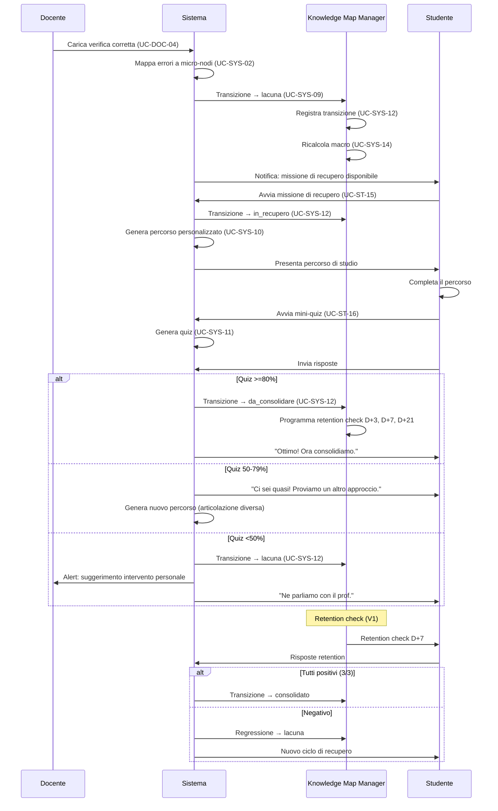
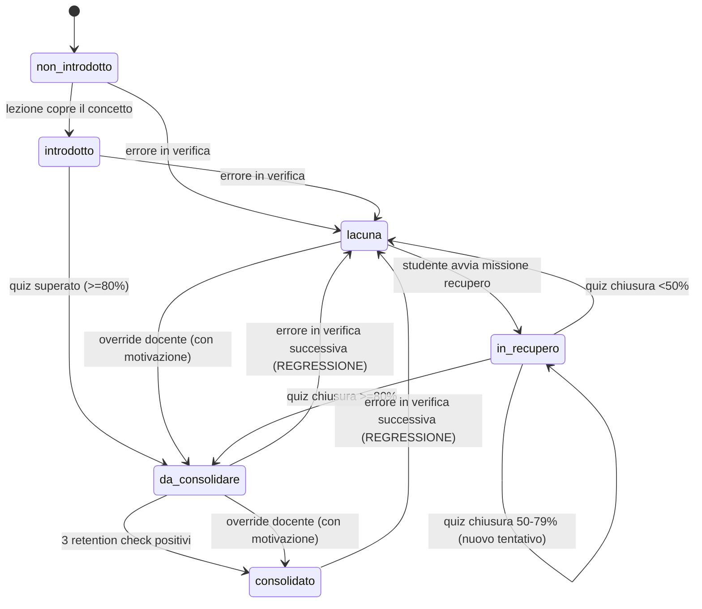

# Catalogo Use Case — MAESTRO v1.0

**Versione:** v1.0
**Allineato a:** MAESTRO_documento_progetto_v0.2.md, MAESTRO_piano_di_lavoro_use_case_v0.2.md
**Template:** Cockburn — Livelli: ☁️ Summary, 🌊 User goal, 🐟 Subfunction
**Convenzione ID:** `UC-<attore>-<NN>` esterni, `UC-SYS-<NN>` sistema

---

## Glossario di dominio

| Termine | Definizione |
|---|---|
| **Concetto** | Unità di conoscenza nel knowledge graph del programma |
| **Macro-nodo** | Concetto strutturante, leggibile da studente e famiglia (es. "Concetto di algoritmo") |
| **Micro-nodo** | Sotto-concetto fine, usato dall'engine diagnostico e dal docente (es. "Proprietà: finitezza") |
| **Stato semaforo** | Uno dei sei stati della macchina a stati: `non_introdotto`, `introdotto`, `lacuna`, `in_recupero`, `da_consolidare`, `consolidato` |
| **Transizione** | Passaggio di stato di un nodo per uno studente, registrato con causa e evidenza |
| **Retention check** | Mini-quiz programmato a D+3, D+7, D+21 dopo il passaggio a `da_consolidare` |
| **Regressione** | Ritorno a `lacuna` di un nodo già in `da_consolidare` o `consolidato` a seguito di errore in verifica successiva |
| **Override tracciato** | Forzatura manuale dello stato di un nodo da parte del docente, con motivazione obbligatoria e audit log |
| **Lacuna persistente** | Nodo in stato `lacuna` o `in_recupero` da più di 14 giorni |
| **Consenso granulare** | Schema a 5 consensi separati: (a) profilazione, (b) lingua nativa Art. 9, (c) comunicazioni famiglia, (d) storico cross-anno, (e) ricerca anonima |
| **Articolazione** | Modalità di fruizione di un contenuto: testo, audio, visuale, pratica, metacognitiva |
| **Granularità** | Livello di dettaglio della vista: macro (per studenti giovani) o micro (per studenti avanzati e docenti) |
| **KMM** | Knowledge Map Manager — componente che gestisce stati, transizioni, retention check |
| **Bilingual Composer** | Componente che genera output in doppia lingua (ufficiale + nativa) |

---

## Catalogo master

| ID | Titolo | Attore | Livello | Priorità | Requisiti |
|---|---|---|---|---|---|
| UC-ST-00 | Attivare per la prima volta l'account | Studente | 🌊 | MVP | F14.6 |
| UC-ST-01 | Completare onboarding e profilazione | Studente | 🌊 | MVP | F3.1–F3.5 |
| UC-ST-02 | Consultare documento di ripasso personalizzato | Studente | 🌊 | MVP | F4, F5 |
| UC-ST-03 | Ascoltare podcast a due voci | Studente | 🌊 | V1 | F6 |
| UC-ST-04 | Esercitarsi su una quest | Studente | 🌊 | V1 | F7.5 |
| UC-ST-06 | Chiedere "perché mi stai mostrando questo" | Studente | 🌊 | MVP | N7 |
| UC-ST-07 | Modificare preferenze di profilo | Studente | 🌊 | MVP | F1.8, F3.4–F3.6, F8 |
| UC-ST-08 | Attivare/disattivare il bilinguismo | Studente | 🌊 | MVP | F13.9 |
| UC-ST-09 | Spiegare a voce un concetto (rubber duck) | Studente | 🌊 | V2 | F10.4 |
| UC-ST-10 | Disattivare la gamification | Studente | 🌊 | V1 | F7.8 |
| UC-ST-11 | Richiedere oblio dei propri dati | Studente | 🌊 | MVP | N1, F14.9 |
| UC-ST-12 | Passare da testo ad audio mantenendo il contesto | Studente | 🌊 | V1 | F10.2 |
| UC-ST-13 | Consultare la mappa della conoscenza | Studente | 🌊 | MVP | F11.1–F11.3, F11.11 |
| UC-ST-14 | Consultare la heatmap temporale | Studente | 🌊 | V1 | F11.13 |
| UC-ST-15 | Avviare percorso di approfondimento su una lacuna | Studente | 🌊 | MVP | F11.6, F11.7 |
| UC-ST-16 | Sostenere il mini-quiz di chiusura | Studente | 🌊 | MVP | F11.8, F11.9 |
| UC-DOC-01 | Caricare una lezione | Docente | 🌊 | MVP | F2.1, F2.7 |
| UC-DOC-02 | Rifinire la trascrizione automatica | Docente | 🌊 | MVP | F2.2–F2.3 |
| UC-DOC-03 | Validare il mapping della lezione sui nodi KG | Docente | 🌊 | MVP | F2.4 |
| UC-DOC-04 | Caricare una verifica per diagnostica formativa | Docente | 🌊 | MVP | F4.1–F4.5 |
| UC-DOC-05 | Generare verifica bilanciata sul programma | Docente | 🌊 | V2 | F12.3 |
| UC-DOC-06 | Consultare heatmap dei gap di classe | Docente | 🌊 | V1 | F11.14, F12.1, F12.4 |
| UC-DOC-08 | Modificare/cancellare contenuto generato | Docente | 🌊 | MVP | F12.5 |
| UC-DOC-09 | Definire la lingua ufficiale del corso | Docente | 🌊 | MVP | F13.1–F13.3 |
| UC-DOC-10 | Aggiornare il knowledge graph | Docente | 🌊 | MVP | F1.4, F1.9 |
| UC-DOC-11 | Visualizzare lacune di copertura materiale | Docente | 🌊 | V1 | F2.12 |
| UC-DOC-12 | Iscrivere uno studente al corso | Docente | 🌊 | MVP | F14.5 |
| UC-DOC-13 | Rimuovere uno studente dal corso | Docente | 🌊 | V1 | F14.5 |
| UC-DOC-14 | Consultare mappa conoscenza di uno studente | Docente | 🌊 | MVP | F11.1, F12.2 |
| UC-DOC-15 | Consultare heatmap lacune di classe nel tempo | Docente | 🌊 | V1 | F11.14 |
| UC-DOC-16 | Forzare stato di un nodo (override tracciato) | Docente | 🌊 | V1 | F11.12 |
| UC-DOC-17 | Configurare livello scolastico e granularità | Docente | 🌊 | MVP | F1.6, F1.8, F1.9 |
| UC-DOC-18 | Consultare pannello override | Docente | 🌊 | V1 | F12.6 |
| UC-DOC-19 | Ricevere alert lacune persistenti di classe | Docente | 🌊 | V1 | F11.15 |
| UC-FAM-00 | Registrare consenso trattamento dati (granulare) | Famiglia | 🌊 | MVP | F14.3, N1 |
| UC-FAM-02 | Consultare report mensile progressi | Famiglia | 🌊 | V1 | F11.16 |
| UC-FAM-03 | Esercitare diritto all'oblio per il minore | Famiglia | 🌊 | MVP | F14.9, N1 |
| UC-FAM-04 | Aggiornare il consenso | Famiglia | 🌊 | V2 | F14.3, F13.5 |
| UC-COR-01 | Consultare dati aggregati di corso/classe | Coordinatore | ☁️ | V1 | F12.1, F11.14 |
| UC-AS-01 | Configurare SSO con registro elettronico | IT scuola | 🌊 | V1 | N2 |
| UC-AS-02 | Gestire utenze e ruoli | IT scuola | 🌊 | MVP | N2 |
| UC-AS-03 | Consultare audit log accessi a dati di minori | IT scuola | 🌊 | MVP | N1, N2, F14.10 |
| UC-AS-04 | Importare massivamente studenti | IT scuola | 🌊 | V1 | F14.2 |
| UC-AS-05 | Creare manualmente un singolo studente | IT scuola | 🌊 | MVP | F14.2 |
| UC-AS-06 | Aggiornare anagrafica studente | IT scuola | 🌊 | V1 | F14.7 |
| UC-AS-07 | Sospendere/disattivare uno studente | IT scuola | 🌊 | V1 | F14.8 |
| UC-AS-08 | Cancellare definitivamente lo studente (oblio) | IT scuola | 🌊 | MVP | F14.9 |
| UC-SYS-01 | Generare documento di ripasso personalizzato | Sistema | 🐟 | MVP | F5 |
| UC-SYS-02 | Mappare errore di verifica al micro-nodo | Sistema | 🐟 | MVP | F4.2 |
| UC-SYS-03 | Aggiornare vettore learning style | Sistema | 🐟 | V1 | F3.3 |
| UC-SYS-04 | Validare output con Safeguarding Agent | Sistema | 🐟 | MVP | N3 |
| UC-SYS-05 | Comporre output in doppia lingua | Sistema | 🐟 | MVP | F13.7–F13.14 |
| UC-SYS-06 | Rilevare pattern di disagio e attivare alert | Sistema | 🐟 | V1 | N3 |
| UC-SYS-07 | Pianificare ripasso con spaced repetition | Sistema | 🐟 | V1 | F11.10 |
| UC-SYS-08 | Rilevare lettura squilibrata lingua nativa | Sistema | 🐟 | V1 | F13.20 |
| UC-SYS-09 | Rilevare lacuna e impostare stato | Sistema | 🐟 | MVP | F4.3, F11.4 |
| UC-SYS-10 | Generare percorso approfondimento per lacuna | Sistema | 🐟 | MVP | F11.7 |
| UC-SYS-11 | Generare e somministrare mini-quiz di chiusura | Sistema | 🐟 | MVP | F11.8 |
| UC-SYS-12 | Aggiornare stato nodo e registrare cronologia | Sistema | 🐟 | MVP | F11.4, F11.5 |
| UC-SYS-13 | Eseguire retention check programmati | Sistema | 🐟 | V1 | F11.10 |
| UC-SYS-14 | Calcolare aggregazione macro da micro | Sistema | 🐟 | MVP | F11.11 |
| UC-SYS-15 | Adattare granularità di vista al livello scolastico | Sistema | 🐟 | MVP | F1.8 |
| UC-SYS-16 | Generare report mensile per la famiglia | Sistema | 🐟 | V1 | F11.16 |
| UC-SYS-17 | Tracciare in audit log un override docente | Sistema | 🐟 | MVP | F11.12, N7 |
| UC-SYS-18 | Rilevare regressione su nodo consolidato | Sistema | 🐟 | V1 | F11.4 |

---

## Riepilogo per priorità

| Priorità | UC esterni | UC sistema | Totale |
|---|---|---|---|
| MVP | 19 | 10 | **29** |
| V1 | 16 | 7 | **23** |
| V2 | 5 | 1 | **6** |
| **Totale** | **40** | **18** | **58** |

---

# Sezione A — Use Case Studente

## UC MVP dettagliati

### UC-ST-00 — Attivare per la prima volta l'account

| Campo | Valore |
|---|---|
| **ID** | UC-ST-00 |
| **Scope** | MAESTRO |
| **Livello** | 🌊 User goal |
| **Attore primario** | Studente |
| **Stakeholder** | Famiglia (consenso già registrato), IT scuola (credenziali fornite) |
| **Priorità** | MVP |
| **Requisiti coperti** | F14.6, F14.1 |

**Precondizioni**
1. L'IT scolastico ha creato l'anagrafica dello studente (UC-AS-05 completato)
2. La famiglia ha registrato il consenso al trattamento dati (UC-FAM-00 completato)
3. Lo studente è iscritto ad almeno un corso (UC-DOC-12 completato)
4. Lo studente possiede credenziali una tantum o accesso SSO scolastico

**Trigger**
Lo studente accede per la prima volta con le credenziali ricevute.

**Scenario principale**
1. Lo studente inserisce le credenziali una tantum (o accede via SSO).
2. Il sistema verifica l'identità e lo stato dell'account (attesa prima attivazione).
3. Il sistema presenta i termini d'uso in linguaggio adattato per minori (non legalese).
4. Lo studente legge e accetta i termini d'uso.
5. Il sistema mostra un riepilogo del consenso registrato dalla famiglia con i 5 consensi attivi/negati.
6. Lo studente conferma di aver preso visione del consenso.
7. Il sistema attiva l'account e imposta lo stato a "attivo".
8. Il sistema registra la prima attivazione in audit log (F14.10).
9. Il sistema reindirizza allo studente all'onboarding di profilazione (UC-ST-01).

**Estensioni**
- *1a. Credenziali errate*: il sistema mostra messaggio di errore generico ("credenziali non valide"), max 5 tentativi, poi blocco temporaneo di 15 minuti.
- *2a. Account non trovato o sospeso*: il sistema mostra messaggio "Contatta la segreteria della tua scuola".
- *2b. Consenso non ancora registrato*: il sistema mostra messaggio "Il consenso della tua famiglia non è ancora stato registrato. Rivolgiti alla segreteria."
- *4a. Studente rifiuta i termini*: il sistema informa che senza accettazione non è possibile procedere; l'account resta in stato "attesa attivazione".

**Post-condizioni (successo)**
- Account in stato "attivo" nel sistema
- Audit log contiene record di prima attivazione con timestamp e identità
- Lo studente è reindirizzato all'onboarding (UC-ST-01)

**Post-condizioni (fallimento)**
- Account resta in stato "attesa attivazione"
- Nessun dato generato per lo studente

**Requisiti speciali**
- Termini d'uso in linguaggio chiaro per minori 13-19 (non legalese)
- Accessibilità WCAG 2.1 AA su tutta la schermata (F9)
- Se lo studente ha lingua nativa valorizzata nel profilo, i termini sono mostrati anche in traduzione

**Criteri di accettazione**
- Il 100% degli studenti con anagrafica + consenso + iscrizione può completare l'attivazione
- L'audit log registra ogni tentativo di attivazione (riuscito o fallito)

---

### UC-ST-01 — Completare onboarding e profilazione learning style

| Campo | Valore |
|---|---|
| **ID** | UC-ST-01 |
| **Scope** | MAESTRO |
| **Livello** | 🌊 User goal |
| **Attore primario** | Studente |
| **Stakeholder** | Docente (beneficia del profilo per adattare i contenuti) |
| **Priorità** | MVP |
| **Requisiti coperti** | F3.1–F3.5 |

**Precondizioni**
1. Lo studente ha completato la prima attivazione (UC-ST-00)
2. Il consenso (a) — profilazione comportamentale — è stato concesso dalla famiglia

**Trigger**
Reindirizzamento automatico dopo UC-ST-00, oppure accesso manuale se l'onboarding era stato interrotto.

**Scenario principale**
1. Il sistema presenta una schermata di benvenuto che spiega lo scopo del quiz ("ci serve per capire come preferisci studiare, non è un test con voto!").
2. Il sistema presenta lo stesso concetto in 4 modalità: testo, audio, immagine, esercizio pratico.
3. Lo studente interagisce con le modalità e il sistema registra: quale apre, quanto tempo ci dedica, quale completa.
4. Il sistema ripete il passo 2-3 per 3-5 concetti diversi (durata totale: 5-10 minuti).
5. Il sistema calcola il vettore di learning style iniziale (5 dimensioni: visivo, uditivo, cinestesico, riflessivo, sociale).
6. Il sistema mostra il profilo risultante in forma visuale (radar chart) e in linguaggio semplice ("Ti piace imparare guardando e facendo").
7. Lo studente può accettare il profilo o modificarlo manualmente.
8. Il sistema chiede le preferenze accessorie: tono (confidenziale/neutro/formale), lunghezza preferita (sintesi/approfondimento).
9. Il sistema salva il profilo e reindirizza alla home dashboard.

**Estensioni**
- *2a. Errore tecnico nel caricamento di una modalità (es. audio non disponibile)*: il sistema salta la modalità non disponibile e procede con le restanti; il vettore è calcolato su un sottoinsieme.
- *3a. Intervento Safeguarding*: il contenuto del quiz è stato pre-validato; se uno studente inserisce testo libero inappropriato, il Safeguarding Agent lo intercetta e mostra "riprova con un'altra risposta".
- *4a. Lo studente abbandona prima di completare*: il sistema salva il progresso; al prossimo accesso riprende dal punto interrotto.
- *7a. Lo studente modifica pesantemente il profilo*: il sistema accetta la modifica; il profilo è sempre sovrascrivibile dallo studente (F3.4).
- *Precondizione 2 non soddisfatta (consenso a negato)*: il sistema esegue l'onboarding senza profilazione comportamentale; il vettore è impostato su valori neutri e il contenuto sarà uniforme.

**Post-condizioni (successo)**
- Vettore learning style salvato nel profilo studente
- Preferenze tono e lunghezza salvate
- Studente accede alla home dashboard

**Requisiti speciali**
- Quiz non deve sembrare un test scolastico: tono leggero, nessun punteggio visibile
- Durata massima 10 minuti (F3.1)
- Accessibilità WCAG 2.1 AA, contenuti fruibili con screen reader

**Criteri di accettazione**
- Il 90% degli studenti completa l'onboarding in <=10 minuti
- Il profilo risultante ha tutte e 5 le dimensioni valorizzate

---

### UC-ST-02 — Consultare il proprio documento di ripasso personalizzato

| Campo | Valore |
|---|---|
| **ID** | UC-ST-02 |
| **Scope** | MAESTRO |
| **Livello** | 🌊 User goal |
| **Attore primario** | Studente |
| **Stakeholder** | Docente (fonte autoritativa dei contenuti) |
| **Priorità** | MVP |
| **Requisiti coperti** | F4, F5, F5.1–F5.5 |

**Precondizioni**
1. Lo studente ha un account attivo con profilo learning style
2. Esiste almeno un documento di ripasso generato (a seguito di UC-SYS-01)
3. Il documento ha superato la validazione Safeguarding (UC-SYS-04)

**Trigger**
Lo studente seleziona un documento di ripasso dalla home dashboard, dalla mappa della conoscenza, o dalla missione di recupero.

**Scenario principale**
1. Lo studente seleziona il documento di ripasso relativo a un concetto specifico.
2. Il sistema recupera il documento personalizzato per il profilo dello studente.
3. Il sistema presenta il documento con la struttura: errore tuo → perché succede → come si fa giusto → ricordati (F5.1).
4. Il codice errato è mostrato evidenziato in giallo, il codice corretto in verde (F5.3).
5. Le analogie sono adattate al profilo dello studente (F5.2).
6. La lunghezza è adattata alla preferenza: 2-3 concetti (sintesi) o 6-8 (approfondimento) (F5.4).
7. Il tono è adattato alla preferenza: confidenziale, neutro o formale (F5.5).
8. Se lo studente ha bilinguismo attivo, il documento è in layout a due colonne: lingua ufficiale a sinistra, lingua nativa a destra (F13.10).
9. Lo studente può navigare tra le sezioni del documento.
10. Lo studente può cambiare articolazione (es. passare al podcast sullo stesso concetto — V1).

**Estensioni**
- *2a. Documento non ancora generato*: il sistema avvia la generazione (UC-SYS-01) e mostra indicatore di progresso; latenza <=60s (N4).
- *2b. Errore tecnico nella generazione*: il sistema mostra "Il documento non è disponibile al momento, riprova tra qualche minuto" con tono incoraggiante.
- *8a. Lingua nativa non supportata*: il sistema genera solo nella lingua ufficiale e informa lo studente.

**Post-condizioni (successo)**
- Lo studente ha consultato il documento
- Il sistema registra la consultazione (per aggiornamento futuro del profilo — V1)

**Requisiti speciali**
- Latenza generazione <=60s (N4)
- Code highlighting accessibile (non solo colore, ma anche etichette "ERRATO"/"CORRETTO")
- Font adattabile (F9.1), dimensione 12-24pt (F9.4)

**Criteri di accettazione**
- Il documento presenta tutti e 4 i blocchi della struttura F5.1
- Le analogie sono coerenti con il profilo dello studente
- KPI: delta punteggio verifica N→N+1 sui concetti ripassati (§8.2)

---

### UC-ST-06 — Chiedere "perché mi stai mostrando questo"

| Campo | Valore |
|---|---|
| **ID** | UC-ST-06 |
| **Scope** | MAESTRO |
| **Livello** | 🌊 User goal |
| **Attore primario** | Studente |
| **Stakeholder** | Famiglia (trasparenza), Garante Privacy |
| **Priorità** | MVP |
| **Requisiti coperti** | N7 |

**Precondizioni**
1. Lo studente sta visualizzando un contenuto generato dal sistema (documento, quiz, missione di recupero, suggerimento)

**Trigger**
Lo studente tocca/clicca il pulsante "Perché questo?" presente su ogni contenuto generato.

**Scenario principale**
1. Lo studente attiva il pannello di spiegabilità.
2. Il sistema mostra in linguaggio comprensibile: (a) i nodi del KG che hanno guidato la scelta, (b) il profilo learning style che ha influenzato la modalità, (c) le transizioni di stato recenti che hanno motivato il contenuto.
3. Lo studente chiude il pannello e torna al contenuto.

**Estensioni**
- *2a. Lo studente non comprende la spiegazione*: può toccare "Spiegami più semplicemente", il sistema riformula con linguaggio adattato all'età.

**Post-condizioni (successo)**
- Lo studente ha ricevuto una spiegazione comprensibile

**Requisiti speciali**
- Il pannello è accessibile da screen reader
- Il linguaggio è adattato all'età dello studente (13-19)

**Criteri di accettazione**
- Ogni contenuto generato ha il bottone "Perché questo?" visibile
- La spiegazione cita almeno un nodo KG e un elemento del profilo

---

### UC-ST-07 — Modificare preferenze di profilo

| Campo | Valore |
|---|---|
| **ID** | UC-ST-07 |
| **Scope** | MAESTRO |
| **Livello** | 🌊 User goal |
| **Attore primario** | Studente |
| **Priorità** | MVP |
| **Requisiti coperti** | F1.8, F3.4–F3.6, F8 |

**Precondizioni**
1. Lo studente ha un account attivo con profilo learning style inizializzato

**Trigger**
Lo studente accede alla sezione "Il mio profilo" dal menu.

**Scenario principale**
1. Il sistema mostra il profilo attuale: radar chart delle 5 dimensioni, tono, lunghezza, font, dimensione, tema, contrasto.
2. Lo studente modifica una o più preferenze.
3. Il sistema aggiorna immediatamente le preferenze.
4. Il sistema conferma il salvataggio.
5. I contenuti futuri useranno le nuove preferenze.

**Estensioni**
- *2a. Lo studente vuole forzare un canale ("voglio solo podcast questo mese")*: il sistema accetta la forzatura (F3.4) e genera solo contenuti nel canale scelto.
- *2b. Lo studente triennio cambia granularità vista (macro ↔ micro)*: la mappa della conoscenza si aggiorna immediatamente (F1.8).
- *2c. Studente biennio tenta di cambiare granularità*: opzione non visibile (default macro per biennio, F1.8).

**Post-condizioni (successo)**
- Preferenze aggiornate nel profilo
- Prossimo contenuto generato riflette le nuove preferenze

**Requisiti speciali**
- Profilo sempre visibile e modificabile dallo studente (F3.6)
- Accessibilità: tutti i controlli navigabili da tastiera

**Criteri di accettazione**
- Lo studente può modificare ogni preferenza e verificare l'effetto immediato
- Le modifiche sono persistenti tra sessioni

---

### UC-ST-08 — Attivare/disattivare il bilinguismo

| Campo | Valore |
|---|---|
| **ID** | UC-ST-08 |
| **Scope** | MAESTRO |
| **Livello** | 🌊 User goal |
| **Attore primario** | Studente |
| **Priorità** | MVP |
| **Requisiti coperti** | F13.9, F13.5, F14.3.b |

**Precondizioni**
1. Lo studente ha un account attivo
2. La famiglia ha concesso il consenso (b) — valorizzazione lingua nativa (Art. 9 GDPR)
3. La lingua nativa dello studente è tra quelle supportate (MVP: ucraino, arabo)

**Trigger**
Lo studente accede alla sezione bilinguismo dalle preferenze di profilo.

**Scenario principale**
1. Il sistema mostra lo stato attuale del bilinguismo (attivo/disattivo) e la lingua nativa configurata.
2. Lo studente attiva o disattiva il bilinguismo con un toggle.
3. Se attiva: il sistema conferma e informa che tutti i contenuti futuri saranno generati in doppia lingua.
4. Se disattiva: il sistema conferma e informa che i contenuti saranno solo nella lingua ufficiale del corso.
5. Il sistema aggiorna il profilo.

**Estensioni**
- *Precondizione 2 non soddisfatta (consenso b negato)*: la sezione bilinguismo non è visibile nel profilo.
- *3a. Lingua nativa non supportata*: il sistema mostra "La tua lingua non è ancora disponibile. Stiamo lavorando per aggiungerla."
- *2a. Lo studente vuole attivare solo per un argomento specifico*: in MVP non è possibile attivazione parziale; il bilinguismo è globale. (V1: attivazione per concetto.)

**Post-condizioni (successo)**
- Bilinguismo attivato/disattivato nel profilo
- I contenuti futuri rispettano la scelta
- Dato sensibile Art. 9 trattato solo con consenso esplicito

**Requisiti speciali**
- Lingua nativa è dato sensibile Art. 9 GDPR — trattamento conforme (F13.21)
- Il bilinguismo non appare mai nelle dashboard di classe a vista dei compagni
- Accessibilità: toggle navigabile da tastiera

**Criteri di accettazione**
- L'attivazione/disattivazione è immediata e persistente
- Il consenso (b) è verificato prima di mostrare l'opzione

---

### UC-ST-11 — Richiedere oblio dei propri dati

| Campo | Valore |
|---|---|
| **ID** | UC-ST-11 |
| **Scope** | MAESTRO |
| **Livello** | 🌊 User goal |
| **Attore primario** | Studente |
| **Stakeholder** | Famiglia, IT scuola, Garante Privacy |
| **Priorità** | MVP |
| **Requisiti coperti** | N1, F14.9 |

**Precondizioni**
1. Lo studente ha un account attivo
2. Lo studente ha almeno 14 anni (altrimenti la richiesta passa dalla famiglia — UC-FAM-03)

**Trigger**
Lo studente accede alla sezione "I miei dati" e seleziona "Richiedi cancellazione".

**Scenario principale**
1. Il sistema presenta una spiegazione chiara in linguaggio per minori di cosa verrà cancellato: profilo, cronologia, mappa della conoscenza, audio, documenti, override docente.
2. Il sistema informa che solo i dati aggregati anonimi saranno preservati (se il consenso e era stato dato).
3. Lo studente conferma la richiesta (prima conferma).
4. Il sistema chiede una seconda conferma ("Sei sicuro? Questa azione è irreversibile.").
5. Lo studente conferma (seconda conferma).
6. Il sistema inoltra la richiesta all'IT scolastico per esecuzione (UC-AS-08).
7. Il sistema conferma che la richiesta è stata inoltrata e informa sui tempi (max 30 giorni GDPR).

**Estensioni**
- *3a. Lo studente annulla*: nessuna azione, ritorno alla schermata precedente.
- *5a. Lo studente annulla alla seconda conferma*: nessuna azione.
- *2a. Studente <14 anni*: il sistema informa che la richiesta deve essere fatta dalla famiglia e fornisce il link/contatto.

**Post-condizioni (successo)**
- Richiesta di oblio registrata in audit log
- IT scolastico notificato
- Account in stato "in attesa cancellazione"

**Requisiti speciali**
- Base giuridica: GDPR Art. 17 (diritto alla cancellazione)
- Linguaggio chiaro per minori
- Doppia conferma obbligatoria

**Criteri di accettazione**
- La richiesta è completata in <=5 step
- L'audit log registra la richiesta con timestamp e identità

---

### UC-ST-13 — Consultare la propria mappa della conoscenza

| Campo | Valore |
|---|---|
| **ID** | UC-ST-13 |
| **Scope** | MAESTRO |
| **Livello** | 🌊 User goal |
| **Attore primario** | Studente |
| **Stakeholder** | Docente (vedono la stessa mappa — UC-DOC-14) |
| **Priorità** | MVP |
| **Requisiti coperti** | F11.1–F11.3, F11.11 |

**Precondizioni**
1. Lo studente ha un account attivo e iscritto a un corso
2. Il knowledge graph del corso esiste con almeno un nodo
3. Stato iniziale nodi: `non_introdotto` (per nodi mai affrontati)

**Trigger**
Lo studente seleziona "La mia mappa" dalla home dashboard o dal menu.

**Scenario principale**
1. Il sistema determina la granularità di vista in base al livello scolastico (UC-SYS-15): biennio → solo macro; triennio → default macro con toggle micro.
2. Il sistema presenta la mappa come grafo navigabile o albero, con ogni nodo colorato secondo lo stato (F11.3): grigio (non_introdotto), bianco (introdotto), rosso (lacuna), arancione (in_recupero), giallo (da_consolidare), verde (consolidato).
3. Ogni nodo mostra: nome, stato tramite colore + icona + testo (mai solo colore — F9.3).
4. Lo studente naviga il grafo toccando/cliccando i nodi.
5. Toccare un nodo apre il dettaglio: stato attuale, cronologia transizioni, materiali disponibili, link alla missione di recupero (se in stato lacuna).
6. Per i nodi in stato `lacuna`, il sistema mostra la missione di recupero come invito ("Vuoi iniziare il recupero?"), mai come obbligo.
7. Lo studente macro-aggregato (F11.11): lo stato del macro è il peggiore dei suoi micro.

**Estensioni**
- *1a. Studente di triennio attiva vista micro*: la mappa si espande mostrando i micro-nodi figli dei macro.
- *1b. Studente di biennio*: il toggle macro/micro non è visibile.
- *5a. Nodo in stato `non_introdotto`*: nessun materiale disponibile; il sistema dice "Questo argomento non è ancora stato trattato a lezione".
- *6a. Il rosso non deve spaventare*: il sistema accompagna sempre il rosso con il messaggio "Hai una missione aperta per recuperare — è un'opportunità, non un problema" (N3).

**Post-condizioni (successo)**
- Lo studente ha visualizzato la propria mappa con stati aggiornati
- Stato finale nodi: invariato (consultazione è read-only)

**Requisiti speciali**
- Mappa esplorabile da tastiera (N5)
- Stati comunicati anche testualmente, non solo dal colore (F9.3, N5)
- Tono: il rosso è "una porta aperta, non un marchio" (N3)
- Nessun confronto con compagni

**Criteri di accettazione**
- Tutti e 6 gli stati sono visivamente distinguibili (colore + icona + testo)
- La mappa è navigabile da tastiera in <=5 tabulazioni per raggiungere qualsiasi nodo
- L'aggregazione macro corrisponde alla regola "stato peggiore" (F11.11)

---

### UC-ST-15 — Avviare un percorso di approfondimento su una lacuna

| Campo | Valore |
|---|---|
| **ID** | UC-ST-15 |
| **Scope** | MAESTRO |
| **Livello** | 🌊 User goal |
| **Attore primario** | Studente |
| **Priorità** | MVP |
| **Requisiti coperti** | F11.6, F11.7 |

**Precondizioni**
1. Lo studente ha un account attivo con profilo
2. Esiste almeno un nodo in stato `lacuna` per lo studente
3. Stato iniziale del nodo: `lacuna` (rosso)

**Trigger**
Lo studente seleziona "Avvia recupero" dalla mappa della conoscenza, dalla home dashboard, o dalla notifica di missione.

**Scenario principale**
1. Lo studente seleziona la missione di recupero per un nodo specifico.
2. Il sistema genera un percorso di approfondimento personalizzato (UC-SYS-10): documento testuale, eventuale segmento della lezione del docente (F2.4), eventuale esercizio guidato.
3. Lo stato del nodo passa a `in_recupero` (arancione) (UC-SYS-12).
4. La transizione è registrata in cronologia con causa "avvio_recupero" (F11.5).
5. Il sistema presenta il percorso come lista di step con barra di avanzamento.
6. Lo studente completa gli step del percorso.
7. Al completamento dell'ultimo step, il sistema propone il mini-quiz di chiusura (UC-ST-16).

**Estensioni**
- *2a. Errore nella generazione del percorso*: il sistema mostra "Il percorso non è disponibile al momento, riprova tra qualche minuto"; lo stato resta `lacuna`.
- *2b. Latenza superiore a 30s*: il sistema mostra barra di progresso animata con messaggio incoraggiante.
- *6a. Lo studente abbandona il percorso a metà*: lo stato resta `in_recupero`; al prossimo accesso riprende dal punto interrotto.
- *6b. Lo studente ha bilinguismo attivo*: i contenuti del percorso sono in doppia lingua (UC-SYS-05).
- *7a. Lo studente non vuole fare il quiz subito*: può tornare alla home; il quiz resta disponibile come azione in sospeso.

**Post-condizioni (successo)**
- Stato nodo: da `lacuna` a `in_recupero`
- Cronologia aggiornata con transizione
- Percorso di approfondimento generato e accessibile

**Post-condizioni (fallimento)**
- Stato nodo: resta `lacuna`
- Nessun percorso generato

**Requisiti speciali**
- Latenza generazione percorso <=30s (N4)
- Contenuti del percorso passati dal Safeguarding Agent (UC-SYS-04)
- Priorità autoriale: lezione del docente > manuale > fonti esterne (F2.5)

**Criteri di accettazione**
- Il percorso contiene almeno 2 step di studio + 1 quiz finale
- Lo stato del nodo è aggiornato in tempo reale nella mappa
- KPI: tempo medio rosso → verde <=21 giorni (§8.7)

---

### UC-ST-16 — Sostenere il mini-quiz di chiusura di una lacuna

| Campo | Valore |
|---|---|
| **ID** | UC-ST-16 |
| **Scope** | MAESTRO |
| **Livello** | 🌊 User goal |
| **Attore primario** | Studente |
| **Priorità** | MVP |
| **Requisiti coperti** | F11.8, F11.9 |

**Precondizioni**
1. Lo studente ha completato il percorso di approfondimento (UC-ST-15)
2. Stato iniziale del nodo: `in_recupero` (arancione)
3. Il mini-quiz è stato generato (UC-SYS-11)

**Trigger**
Lo studente seleziona "Inizia il quiz" al termine del percorso di approfondimento o dalla home dashboard.

**Scenario principale**
1. Il sistema presenta il mini-quiz: 3-5 domande mirate al micro-nodo specifico.
2. Lo studente risponde alle domande.
3. Il sistema calcola il punteggio.
4. **Se >=80% corretto**: lo stato del nodo passa a `da_consolidare` (giallo); il sistema programma i retention check (D+3, D+7, D+21 — MVP: almeno D+7); messaggio: "Ottimo lavoro! Ora lo consolidiamo nel tempo."
5. **Se 50-79%**: lo stato resta `in_recupero`; il sistema propone un secondo giro del percorso variando articolazione (canale diverso, analogia diversa); messaggio: "Ci sei quasi! Proviamo con un altro approccio."
6. **Se <50%**: lo stato torna a `lacuna`; alert per il docente (F11.15) suggerendo intervento personale; messaggio: "Non preoccuparti, ne parliamo con il prof."
7. Il sistema registra la transizione in cronologia (UC-SYS-12).
8. Il sistema mostra il risultato con feedback per ogni domanda (cosa era giusto e perché).

**Estensioni**
- *1a. Il quiz è in lingua ufficiale del corso (F13.19)*: anche per studenti bilingui, il quiz è nella lingua ufficiale. Lo studente può chiedere "lettura assistita" in lingua nativa solo durante lo studio, non durante il quiz.
- *2a. Errore tecnico durante il quiz*: il sistema salva le risposte date; al prossimo tentativo riprende dalle domande non risposte.
- *6a. Tre quiz falliti (<50%) sullo stesso nodo*: alert elevato per il docente con suggerimento di cambio canale (F11.15).

**Post-condizioni (successo — >=80%)**
- Stato nodo: da `in_recupero` a `da_consolidare`
- Retention check programmati
- Cronologia aggiornata

**Post-condizioni (parziale — 50-79%)**
- Stato nodo: resta `in_recupero`
- Nuovo percorso con articolazione diversa disponibile

**Post-condizioni (fallimento — <50%)**
- Stato nodo: da `in_recupero` a `lacuna`
- Alert docente generato

**Requisiti speciali**
- Latenza generazione quiz <=15s (N4)
- Tono feedback sempre incoraggiante, anche per <50% (N3)
- Quiz in lingua ufficiale del corso (F13.19)

**Criteri di accettazione**
- Tasso di chiusura al primo tentativo >=60% (§8.7)
- Il feedback mostra la risposta corretta e la spiegazione per ogni domanda

---

## UC Studente — V1/V2 (summary)

### UC-ST-03 — Ascoltare podcast a due voci su un concetto (V1)
Lo studente seleziona un concetto e avvia un podcast a due voci (4-8 min, F6.1) in cui un "esperto" e un "curioso" discutono il tema con analogie. Lo studente sceglie le voci dalla libreria (F6.2). Trascrizione sincronizzata sempre disponibile (F6.5). Variante cross-language per bilingui (F13.11). Velocità regolabile 0.75x-2x (F6.8).

### UC-ST-04 — Esercitarsi su una quest giornaliera/settimanale (V1)
Lo studente consulta le quest disponibili, generate automaticamente a partire dalle lacune aperte (F7.5). Ogni quest completata dà XP e avanza il livello (F7.2). Le quest mirano ai gap attuali. Modalità cooperativa di classe disponibile (F7.6). Anti-pattern: nessuna classifica pubblica, nessun paragone (F7.7).

### UC-ST-09 — Spiegare a voce un concetto al sistema (V2)
Lo studente attiva la modalità "rubber duck" (F10.4): spiega a voce un concetto. Il sistema trascrive, analizza la solidità della spiegazione e fornisce feedback. Esercizio metacognitivo. Richiede integrazione speech-to-text avanzata.

### UC-ST-10 — Disattivare la gamification (V1)
Lo studente accede alle preferenze e disattiva la gamification con un toggle (F7.8). XP, badge, streak, quest scompaiono dall'interfaccia. Il progresso didattico (mappa, lacune, documenti) resta intatto. Riattivabile in qualsiasi momento.

### UC-ST-12 — Passare da testo ad audio mantenendo il contesto (V1)
Lo studente sta leggendo un documento di ripasso e seleziona "Ascolta" (F10.2). Il sistema genera o recupera il podcast relativo allo stesso concetto. Il contesto è preservato: il podcast riparte dal punto corrispondente. Sottotitoli sincronizzati.

### UC-ST-14 — Consultare la heatmap temporale delle proprie lacune (V1)
Lo studente accede alla heatmap temporale (F11.13): griglia (nodo × tempo) → stato, che mostra l'evoluzione della padronanza. Scroll temporale. Filtro per macro-area. Permette di vedere lacune chiuse, lacune persistenti, regressioni, pattern di apprendimento.

---

# Sezione B — Use Case Docente

## UC MVP dettagliati

### UC-DOC-01 — Caricare una lezione

| Campo | Valore |
|---|---|
| **ID** | UC-DOC-01 |
| **Scope** | MAESTRO |
| **Livello** | 🌊 User goal |
| **Attore primario** | Docente |
| **Priorità** | MVP |
| **Requisiti coperti** | F2.1, F2.7 |

**Precondizioni**
1. Il docente ha un account attivo con ruolo "docente"
2. Esiste almeno un corso associato al docente

**Trigger**
Il docente seleziona "Carica lezione" dalla dashboard.

**Scenario principale**
1. Il docente seleziona il corso di destinazione.
2. Il docente sceglie la modalità di upload: singola lezione o batch (cartella con un intero modulo) (F2.7).
3. Il docente trascina o seleziona i file: video, audio, slide annotate, dispense, screencast (F2.1).
4. Il sistema valida il formato del file e mostra anteprima.
5. Il docente compila i metadati: titolo, data della lezione, livello di difficoltà, annotazioni (F2.8).
6. Il docente conferma l'upload.
7. Il sistema avvia in background: trascrizione automatica (F2.2), indicizzazione nel vector store (F2.10), mapping concettuale suggerito (F2.4).
8. Il sistema notifica il docente al completamento della trascrizione (redirect a UC-DOC-02).

**Estensioni**
- *3a. Formato non supportato*: il sistema rifiuta il file e mostra i formati accettati.
- *3b. File troppo grande*: il sistema mostra limite e suggerisce compressione.
- *7a. Errore nella trascrizione*: il sistema notifica "La trascrizione ha avuto un problema, riprova o procedi manualmente".

**Post-condizioni (successo)**
- Lezione caricata e indicizzata
- Trascrizione generata (editabile — UC-DOC-02)
- Mapping concettuale suggerito (validabile — UC-DOC-03)

**Criteri di accettazione**
- Upload completato per tutti i formati supportati (video, audio, slide, PDF, testo)
- KPI: % lezioni caricate entro 7 giorni dalla lezione (§8.6)

---

### UC-DOC-02 — Rifinire la trascrizione automatica della lezione

| Campo | Valore |
|---|---|
| **ID** | UC-DOC-02 |
| **Scope** | MAESTRO |
| **Livello** | 🌊 User goal |
| **Attore primario** | Docente |
| **Priorità** | MVP |
| **Requisiti coperti** | F2.2–F2.3 |

**Precondizioni**
1. Lezione caricata (UC-DOC-01) con trascrizione automatica generata

**Trigger**
Notifica di trascrizione completata, oppure il docente accede alla lezione e seleziona "Rivedi trascrizione".

**Scenario principale**
1. Il sistema presenta la trascrizione con timestamp e identificazione parlante (docente/studente).
2. Il player audio/video è sincronizzato con la trascrizione: cliccando su una frase si salta al punto corrispondente.
3. Il docente corregge termini tecnici, nomi propri, formule e codice errati.
4. Il docente conferma la trascrizione come "validata".
5. Il sistema aggiorna l'indicizzazione nel vector store con la trascrizione corretta.

**Estensioni**
- *3a. La trascrizione è molto scadente*: il docente può rifiutarla interamente e fornire trascrizione manuale.
- *3b. Il docente non ha tempo*: la trascrizione resta in stato "da validare"; il sistema la usa comunque (con disclaimer) per generare contenuti.

**Post-condizioni (successo)**
- Trascrizione validata e indicizzata
- Materiale pronto per mapping concettuale (UC-DOC-03)

**Criteri di accettazione**
- CSAT qualità trascrizioni >=4/5 (§8.6)

---

### UC-DOC-03 — Validare il mapping della lezione sui nodi del KG

| Campo | Valore |
|---|---|
| **ID** | UC-DOC-03 |
| **Scope** | MAESTRO |
| **Livello** | 🌊 User goal |
| **Attore primario** | Docente |
| **Priorità** | MVP |
| **Requisiti coperti** | F2.4 |

**Precondizioni**
1. Trascrizione della lezione disponibile (validata o in attesa)
2. Knowledge graph del corso popolato

**Trigger**
Il sistema ha completato il mapping concettuale suggerito, oppure il docente accede alla lezione e seleziona "Mapping concetti".

**Scenario principale**
1. Il sistema mostra la timeline della lezione con segmenti colorati, ciascuno associato a nodi KG suggeriti.
2. Per ogni segmento: "dal minuto 12:30 al 28:15 → Concetto: Sessione PHP".
3. Il docente valida ogni suggerimento (conferma/rifiuta/corregge).
4. Il docente può aggiungere mapping mancanti con drag-and-drop dal KG.
5. Il docente conferma il mapping complessivo.
6. Il sistema rende disponibili i deep-link: da ogni punto del percorso di studio al segmento corrispondente della lezione.

**Estensioni**
- *1a. Nessun mapping suggerito (trascrizione troppo generica)*: il docente procede manualmente.
- *3a. Il docente individua un concetto non presente nel KG*: può creare un nuovo nodo direttamente (redirect a UC-DOC-10).

**Post-condizioni (successo)**
- Lezione collegata ai nodi KG con range temporali
- Deep-link attivi da percorsi di studio a segmenti della lezione

**Criteri di accettazione**
- Il 100% dei segmenti di lezione mappati è navigabile dallo studente

---

### UC-DOC-04 — Caricare una verifica per diagnostica formativa

| Campo | Valore |
|---|---|
| **ID** | UC-DOC-04 |
| **Scope** | MAESTRO |
| **Livello** | 🌊 User goal |
| **Attore primario** | Docente |
| **Stakeholder** | Studenti (ricevono diagnostica), Sistema (UC-SYS-02, UC-SYS-09) |
| **Priorità** | MVP |
| **Requisiti coperti** | F4.1–F4.5 |

**Precondizioni**
1. Il docente ha un corso attivo con studenti iscritti
2. Knowledge graph del corso popolato

**Trigger**
Il docente seleziona "Carica verifica" dalla dashboard.

**Scenario principale**
1. Il docente carica il file della verifica e le risposte degli studenti.
2. Il sistema assiste nella correzione o il docente carica le valutazioni già fatte.
3. Il sistema mappa ogni errore di ogni studente al micro-nodo concettuale corrispondente (UC-SYS-02).
4. Il sistema mostra al docente il mapping proposto: errore X dello studente Y → micro-nodo Z.
5. Il docente valida/corregge i mapping.
6. Il docente conferma.
7. Il sistema attiva le transizioni di stato: per ogni errore confermato, il micro-nodo dello studente passa a `lacuna` (UC-SYS-09, UC-SYS-12).
8. Il sistema genera i documenti di ripasso personalizzati per ogni studente (UC-SYS-01).
9. Output docente: rapporto di valutazione con codice evidenziato + tabella per task + lista transizioni di stato (F4.4).
10. Output studente: mappa aggiornata + documento di ripasso disponibile (F4.5).

**Estensioni**
- *3a. Il sistema non riesce a mappare un errore*: segnala "mapping incerto" al docente; il docente corregge manualmente.
- *7a. Nodo già in stato `lacuna`*: nessuna nuova transizione per quel nodo (stato invariato).
- *7b. Nodo in stato `da_consolidare` o `consolidato`*: regressione a `lacuna` (UC-SYS-18 — V1; in MVP: transizione diretta).

**Post-condizioni (successo)**
- Tutti gli errori mappati a micro-nodi
- Transizioni di stato registrate in cronologia
- Documenti di ripasso generati per ogni studente
- Rapporto docente disponibile

**Criteri di accettazione**
- Il 100% degli errori della verifica è mappato (automaticamente o manualmente)
- Ogni studente riceve un documento di ripasso entro 60s dalla conferma docente

---

### UC-DOC-08 — Modificare o cancellare un contenuto generato dal sistema

| Campo | Valore |
|---|---|
| **ID** | UC-DOC-08 |
| **Scope** | MAESTRO |
| **Livello** | 🌊 User goal |
| **Attore primario** | Docente |
| **Priorità** | MVP |
| **Requisiti coperti** | F12.5 |

**Precondizioni**
1. Esiste almeno un contenuto generato dal sistema per il corso del docente

**Trigger**
Il docente accede alla gestione contenuti e seleziona un contenuto.

**Scenario principale**
1. Il sistema mostra la lista dei contenuti generati per il corso: documenti di ripasso, quiz, percorsi.
2. Il docente seleziona un contenuto e sceglie: anteprima, modifica, cancella.
3. Se modifica: il docente edita il contenuto e salva. Il sistema marca il contenuto come "modificato dal docente".
4. Se cancella: il sistema chiede conferma e rimuove il contenuto. Gli studenti che non lo hanno ancora consultato non lo vedranno.
5. Il sistema registra l'operazione in audit log.

**Estensioni**
- *3a. La modifica introduce contenuto inappropriato*: il Safeguarding Agent valida la modifica e blocca se necessario (improbabile per un docente, ma il filtro è sempre attivo).

**Post-condizioni (successo)**
- Contenuto modificato o cancellato
- Audit log aggiornato
- La parola finale è sempre del docente (F12.5)

---

### UC-DOC-09 — Definire la lingua ufficiale del corso

| Campo | Valore |
|---|---|
| **ID** | UC-DOC-09 |
| **Scope** | MAESTRO |
| **Livello** | 🌊 User goal |
| **Attore primario** | Docente |
| **Priorità** | MVP |
| **Requisiti coperti** | F13.1–F13.3 |

**Precondizioni**
1. Il docente ha un corso attivo

**Trigger**
Il docente accede al setup del corso (prima configurazione o modifica).

**Scenario principale**
1. Il sistema mostra il campo "Lingua ufficiale del corso" con default "Italiano".
2. Il docente conferma o cambia la lingua (es. inglese per corso CLIL).
3. Il sistema aggiorna: tutti i materiali, le verifiche, i quiz di chiusura e le comunicazioni ufficiali saranno nella lingua selezionata.
4. Il sistema conferma il salvataggio.

**Post-condizioni (successo)**
- Lingua ufficiale del corso definita
- Tutte le generazioni AI per il corso avverranno in questa lingua

---

### UC-DOC-10 — Aggiornare il knowledge graph del programma

| Campo | Valore |
|---|---|
| **ID** | UC-DOC-10 |
| **Scope** | MAESTRO |
| **Livello** | 🌊 User goal |
| **Attore primario** | Docente |
| **Priorità** | MVP |
| **Requisiti coperti** | F1.4, F1.9 |

**Precondizioni**
1. Il docente ha un corso attivo con KG inizializzato

**Trigger**
Il docente accede all'editor del knowledge graph dalla dashboard.

**Scenario principale**
1. Il sistema presenta il KG come grafo visuale interattivo.
2. Il docente può: aggiungere nodi (macro o micro), rimuovere nodi, aggiungere/rimuovere archi prerequisito, modificare attributi (nome, livello, granularità).
3. Il docente può personalizzare la granularità di default del corso in deroga al livello scolastico (F1.9).
4. Il sistema valida il grafo: nessun ciclo nei prerequisiti (DAG).
5. Il docente salva le modifiche.
6. Il sistema aggiorna il KG senza riavvio (F1.4).
7. Le mappe della conoscenza degli studenti riflettono le modifiche.

**Estensioni**
- *4a. Ciclo rilevato*: il sistema rifiuta la modifica e mostra il ciclo problematico.
- *2a. Nodo rimosso che ha stati attivi per studenti*: il sistema chiede conferma e informa che gli stati saranno archiviati.

**Post-condizioni (successo)**
- KG aggiornato e coerente (DAG valido)
- Mappe studenti aggiornate

---

### UC-DOC-12 — Iscrivere uno studente al proprio corso

| Campo | Valore |
|---|---|
| **ID** | UC-DOC-12 |
| **Scope** | MAESTRO |
| **Livello** | 🌊 User goal |
| **Attore primario** | Docente |
| **Priorità** | MVP |
| **Requisiti coperti** | F14.5 |

**Precondizioni**
1. Lo studente esiste in anagrafica (UC-AS-05) con consenso registrato (UC-FAM-00)
2. Il docente ha un corso attivo

**Trigger**
Il docente accede alla gestione iscrizioni del corso.

**Scenario principale**
1. Il sistema mostra la lista degli studenti disponibili (creati, con consenso, non ancora iscritti al corso).
2. Il docente seleziona uno o più studenti.
3. Il docente conferma l'iscrizione.
4. Il sistema crea il rapporto studente-corso-anno.
5. Per ogni studente iscritto, il sistema inizializza la mappa della conoscenza: tutti i nodi a `non_introdotto`.
6. Il sistema registra l'iscrizione in audit log.

**Estensioni**
- *1a. Studente senza consenso*: lo studente è visibile ma non iscrivibile; il sistema mostra "In attesa di consenso famiglia".
- *4a. Studente già iscritto a un altro corso (MVP: 1 solo corso)*: il sistema informa che in MVP lo studente può essere iscritto a un solo corso.

**Post-condizioni (successo)**
- Studente iscritto al corso
- Mappa della conoscenza inizializzata (tutti nodi `non_introdotto`)
- Audit log aggiornato

---

### UC-DOC-14 — Consultare la mappa della conoscenza di un singolo studente

| Campo | Valore |
|---|---|
| **ID** | UC-DOC-14 |
| **Scope** | MAESTRO |
| **Livello** | 🌊 User goal |
| **Attore primario** | Docente |
| **Priorità** | MVP |
| **Requisiti coperti** | F11.1, F12.2 |

**Precondizioni**
1. Lo studente è iscritto al corso del docente
2. La mappa della conoscenza esiste (almeno un nodo con stato)

**Trigger**
Il docente seleziona uno studente dalla vista classe o dalla lista studenti.

**Scenario principale**
1. Il sistema presenta la mappa della conoscenza dello studente in vista micro completa (il docente vede sempre i micro-nodi).
2. Ogni nodo mostra stato con colore + icona + testo.
3. Il docente può espandere un nodo per vedere: cronologia completa delle transizioni, risultati dei mini-quiz, materiali consultati.
4. Il docente può avviare un override (redirect a UC-DOC-16 — V1).
5. Privacy graduata (F12.2): il docente vede stati concettuali e esiti quiz, ma NON dati comportamentali fini (es. minuti passati su un podcast il sabato sera).

**Estensioni**
- *3a. Nodo con regressione*: la cronologia mostra chiaramente il percorso consolidato → lacuna con timestamp e causa.

**Post-condizioni (successo)**
- Il docente ha consultato la mappa dello studente
- Nessuna modifica (read-only, salvo override)

---

### UC-DOC-17 — Configurare livello scolastico e granularità di default del corso

| Campo | Valore |
|---|---|
| **ID** | UC-DOC-17 |
| **Scope** | MAESTRO |
| **Livello** | 🌊 User goal |
| **Attore primario** | Docente |
| **Priorità** | MVP |
| **Requisiti coperti** | F1.6, F1.8, F1.9 |

**Precondizioni**
1. Il docente ha un corso attivo

**Trigger**
Il docente accede al setup del corso.

**Scenario principale**
1. Il sistema mostra il livello scolastico attuale (dropdown: secondaria primo grado, biennio, triennio, post-diploma/ITS, formazione professionale).
2. Il docente seleziona il livello scolastico.
3. Il sistema mostra la granularità di default risultante: biennio → macro per studenti; triennio → scelta studente.
4. Il docente può personalizzare la granularità in deroga al default (F1.9) — es. un docente di biennio particolarmente metodico mostra anche i micro.
5. Il sistema salva e aggiorna le viste degli studenti.

**Post-condizioni (successo)**
- Livello scolastico e granularità salvati
- Viste studenti aggiornate di conseguenza

---

## UC Docente — V1/V2 (summary)

### UC-DOC-05 — Generare verifica bilanciata sul programma (V2)
Il docente richiede la generazione assistita di una verifica bilanciata sui gap di classe (F12.3). Il sistema propone domande distribuite sulle macro-aree, con peso maggiore sulle lacune di classe. Il docente valida e modifica prima della somministrazione.

### UC-DOC-06 — Consultare heatmap dei gap di classe (V1)
Il docente accede alla vista classe (F11.14, F12.1): griglia studenti × macro-aree con colori stato. Filtro per periodo e macro-area. Suggerimenti didattici: "60% classe ha lacune su X, conviene una lezione dedicata" (F12.4). Click su studente → mappa individuale.

### UC-DOC-11 — Visualizzare lacune di copertura del materiale (V1)
Il docente consulta la lista dei nodi KG senza materiale sufficiente (F2.12). Il sistema mostra il conteggio fonti per nodo (target: 3) e suggerisce upload mirati. Concetti scoperti evidenziati.

### UC-DOC-13 — Rimuovere uno studente dal proprio corso (V1)
Il docente seleziona uno studente iscritto e lo rimuove dal corso. La mappa della conoscenza dello studente per quel corso viene archiviata (non cancellata). Lo studente non vede più il corso nella propria app.

### UC-DOC-15 — Consultare la heatmap delle lacune di classe nel tempo (V1)
Evoluzione temporale della heatmap di classe (F11.14): griglia (studente × nodo × tempo). Filtro per periodo e macro-area. Permette di visualizzare l'effetto di interventi didattici nel tempo.

### UC-DOC-16 — Forzare manualmente lo stato di un nodo (override tracciato) (V1)
Il docente seleziona un nodo sulla mappa di uno studente e forza lo stato (F11.12). Motivazione testuale obbligatoria (min 20 caratteri). L'override è registrato in audit log con: docente, timestamp, stato precedente, stato forzato, motivazione. L'override è visibile nella cronologia dello studente. Non concorre ai KPI di consolidamento autonomo (§8.7). Il sistema rifiuta l'override se il nodo è in stato `non_introdotto`.

### UC-DOC-18 — Consultare il pannello dei propri override (V1)
Il docente consulta la vista riepilogativa di tutti gli override effettuati (F12.6): studente, nodo, stato pre/post, motivazione, data. Filtro per periodo. Strumento di autoverifica per il docente.

### UC-DOC-19 — Ricevere e gestire alert su lacune persistenti di classe (V1)
Il sistema notifica il docente quando: una lacuna è in stato `lacuna`/`in_recupero` da >14 giorni, oppure 3 regressioni sullo stesso nodo entro 30 giorni (F11.15). L'alert suggerisce cambio canale. Il docente può: prendere in carico, pianificare intervento, o archiviare.

---

# Sezione C — Use Case Famiglia

### UC-FAM-00 — Registrare il consenso al trattamento dati del minore (granulare)

| Campo | Valore |
|---|---|
| **ID** | UC-FAM-00 |
| **Scope** | MAESTRO |
| **Livello** | 🌊 User goal |
| **Attore primario** | Famiglia (genitore/tutore) |
| **Stakeholder** | Studente, IT scuola, Garante Privacy |
| **Priorità** | MVP |
| **Requisiti coperti** | F14.3, N1 |

**Precondizioni**
1. L'IT scolastico ha creato l'anagrafica dello studente (UC-AS-05)
2. Il genitore/tutore ha ricevuto il modulo di consenso

**Trigger**
MVP: il genitore/tutore compila il modulo di consenso cartaceo e lo consegna alla scuola. V1: il genitore accede al portale web tramite link/QR con codice monouso.

**Scenario principale**
1. Il sistema (o l'IT scolastico in MVP) presenta i 5 consensi granulari, ciascuno con spiegazione in linguaggio non tecnico:
   - (a) Profilazione comportamentale per learning style — base giuridica: Art. 6(1)(a) + Art. 8 GDPR
   - (b) Valorizzazione lingua nativa — base giuridica: Art. 9(2)(a) GDPR (dato sensibile: origine etnica)
   - (c) Comunicazioni periodiche alla famiglia — base giuridica: Art. 6(1)(a)
   - (d) Conservazione storico oltre l'anno scolastico — base giuridica: Art. 6(1)(a)
   - (e) Uso aggregato anonimo per ricerca — base giuridica: Art. 6(1)(a)
2. Per ogni consenso è presente: checkbox, spiegazione in linguaggio chiaro, indicazione che è opzionale e revocabile.
3. Il genitore esprime la propria scelta per ciascun consenso.
4. Il genitore firma (digitale in V1, cartacea in MVP).
5. L'IT scolastico registra i consensi nel sistema (MVP) / il sistema li registra direttamente (V1).
6. Il sistema registra in audit log: identità operatore, timestamp, scelta per ciascun consenso.

**Estensioni**
- *3a. Consenso (b) negato*: il bilinguismo non sarà disponibile per lo studente; tutti i contenuti solo in lingua ufficiale.
- *3b. Consenso (a) negato*: l'onboarding profilazione non verrà eseguito; profilo learning style neutro, contenuti uniformi.
- *3c. Tutti i consensi negati*: lo studente può comunque usare MAESTRO con funzionalità ridotte (nessuna personalizzazione, nessuna comunicazione famiglia, nessuno storico cross-anno).
- *3d. Studente <14 anni*: il consenso DEVE essere del genitore/tutore (Art. 8 GDPR, soglia italiana 14 anni).
- *3e. Studente 14-18*: consenso assistito — lo studente e il genitore entrambi informati.

**Post-condizioni (successo)**
- Consenso registrato per ciascuna delle 5 categorie
- Audit log aggiornato
- Lo studente può procedere con la prima attivazione (UC-ST-00) se anche l'iscrizione è completata

**Requisiti speciali**
- Linguaggio chiaro, non legalese, adatto a genitori senza competenze legali
- Base giuridica esplicitata per ogni consenso
- Ogni consenso è singolarmente revocabile in qualsiasi momento (UC-FAM-04 — V2)

**Criteri di accettazione**
- Il 100% dei consensi registrati ha tutte e 5 le categorie esplicitamente valorizzate (concesso/negato)
- L'audit log registra l'identità dell'operatore e il timestamp per ogni registrazione

---

### UC-FAM-03 — Esercitare diritto all'oblio per il minore

| Campo | Valore |
|---|---|
| **ID** | UC-FAM-03 |
| **Scope** | MAESTRO |
| **Livello** | 🌊 User goal |
| **Attore primario** | Famiglia (genitore/tutore) |
| **Stakeholder** | Studente, IT scuola, Garante Privacy |
| **Priorità** | MVP |
| **Requisiti coperti** | F14.9, N1 |

**Precondizioni**
1. Lo studente esiste in anagrafica MAESTRO (in qualsiasi stato del ciclo di vita)

**Trigger**
Il genitore/tutore richiede la cancellazione dei dati del minore (in MVP: comunicazione alla scuola; in V1: via portale web).

**Scenario principale**
1. Il sistema (o l'IT scolastico in MVP) presenta le conseguenze della cancellazione: tutti i dati identificabili verranno eliminati (profilo, cronologia, mappa, audio, documenti, override).
2. Il genitore conferma (doppia conferma).
3. Il sistema inoltra la richiesta all'IT scolastico per esecuzione (UC-AS-08).
4. Il sistema registra la richiesta in audit log.

**Estensioni**
- *1a. Il genitore chiede chiarimenti*: l'IT scolastico (MVP) o il sistema (V1) spiega in dettaglio cosa verrà conservato (solo dati anonimi aggregati se consenso e era stato dato).
- *2a. Richiesta in stato qualsiasi del ciclo di vita*: la richiesta è sempre accolta, indipendentemente dallo stato dell'account.

**Post-condizioni (successo)**
- Richiesta di oblio registrata
- IT scolastico notificato per esecuzione
- Max 30 giorni per completamento (GDPR Art. 17)

**Requisiti speciali**
- Base giuridica: GDPR Art. 17
- Sempre accolta, senza eccezioni

---

### UC-FAM-02 — Consultare report mensile sui progressi (V1)
La famiglia accede al portale e consulta il report mensile (F11.16): 1 pagina, linguaggio non tecnico, tono incoraggiante. Contenuto: macro-aree consolidate nel mese, lacune chiuse, lacune aperte (riassunto narrativo). Nessun confronto con altri studenti. Nessun valore numerico assoluto fuori contesto.

### UC-FAM-04 — Aggiornare il consenso (V2)
La famiglia accede al portale, visualizza lo stato dei 5 consensi e modifica singolarmente (toggle concesso/revocato). La revoca del consenso (b) disattiva il bilinguismo. La revoca del consenso (a) resetta il profilo learning style a neutro. Ogni modifica registrata in audit log.

---

# Sezione D — Use Case Coordinatore

### UC-COR-01 — Consultare dati aggregati di corso/classe (V1)
Il coordinatore accede alla dashboard aggregata (F12.1, F11.14) e consulta: distribuzione degli stati per macro-area, trend nel tempo, % lacune chiuse, confronto tra classi dello stesso livello (dati aggregati, mai individuali). Filtri per periodo e macro-area. Permette decisioni di indirizzo didattico a livello di corso.

---

# Sezione E — Use Case Amministratore IT

### UC-AS-02 — Gestire utenze e ruoli

| Campo | Valore |
|---|---|
| **ID** | UC-AS-02 |
| **Scope** | MAESTRO |
| **Livello** | 🌊 User goal |
| **Attore primario** | IT scuola |
| **Priorità** | MVP |
| **Requisiti coperti** | N2 |

**Precondizioni**
1. L'operatore IT ha un account con ruolo "amministratore"

**Trigger**
L'IT accede al pannello di gestione utenze.

**Scenario principale**
1. Il sistema mostra la lista utenti con: nome, ruolo, stato, data creazione.
2. L'IT può filtrare per ruolo (studente, docente, coordinatore, IT admin, famiglia) e stato (attivo, sospeso, in attesa).
3. L'IT seleziona un utente e sceglie: modifica ruolo, sospendi, riattiva, elimina.
4. Il sistema applica la modifica e registra in audit log.

**Post-condizioni (successo)**
- Utenza modificata
- Audit log aggiornato

---

### UC-AS-03 — Consultare audit log degli accessi a dati di minori

| Campo | Valore |
|---|---|
| **ID** | UC-AS-03 |
| **Scope** | MAESTRO |
| **Livello** | 🌊 User goal |
| **Attore primario** | IT scuola |
| **Priorità** | MVP |
| **Requisiti coperti** | N1, N2, F14.10 |

**Precondizioni**
1. L'operatore IT ha un account con ruolo "amministratore"

**Trigger**
L'IT accede al pannello audit log per verifica di conformità.

**Scenario principale**
1. Il sistema mostra l'audit log in ordine cronologico inverso: timestamp, operatore, azione, entità, dato precedente, dato nuovo.
2. L'IT può filtrare per: studente specifico, operatore, tipo azione, periodo.
3. L'IT può esportare in CSV/PDF per documentazione.
4. L'audit log è immutabile: nessuna modifica, nessuna cancellazione.

**Post-condizioni (successo)**
- L'IT ha consultato l'audit log
- Nessuna modifica (read-only)

**Requisiti speciali**
- Audit log è write-once, tamper-evident
- Ogni accesso a dati di un minore è registrato (N2)

---

### UC-AS-05 — Creare manualmente un singolo studente

| Campo | Valore |
|---|---|
| **ID** | UC-AS-05 |
| **Scope** | MAESTRO |
| **Livello** | 🌊 User goal |
| **Attore primario** | IT scuola |
| **Priorità** | MVP |
| **Requisiti coperti** | F14.2 |

**Precondizioni**
1. L'operatore IT ha un account con ruolo "amministratore"

**Trigger**
L'IT accede alla gestione utenze e seleziona "Crea studente".

**Scenario principale**
1. L'IT compila il form: nome, cognome, data di nascita, classe, anno scolastico.
2. Il sistema genera un identificativo interno univoco (separato dall'identità sul registro — F14.2).
3. Il sistema genera credenziali provvisorie per la prima attivazione.
4. Il sistema crea l'account in stato "creato — in attesa consenso".
5. Il sistema registra la creazione in audit log.
6. L'IT comunica le credenziali alla famiglia (canale sicuro).

**Estensioni**
- *1a. Dati incompleti*: il sistema evidenzia i campi obbligatori mancanti.
- *1b. Studente già esistente (omonimo)*: il sistema avvisa e mostra i record simili.

**Post-condizioni (successo)**
- Studente creato in stato "in attesa consenso"
- Credenziali generate
- Audit log aggiornato

---

### UC-AS-08 — Cancellare definitivamente lo studente (oblio)

| Campo | Valore |
|---|---|
| **ID** | UC-AS-08 |
| **Scope** | MAESTRO |
| **Livello** | 🌊 User goal |
| **Attore primario** | IT scuola |
| **Stakeholder** | Famiglia (richiedente), Garante Privacy |
| **Priorità** | MVP |
| **Requisiti coperti** | F14.9 |

**Precondizioni**
1. Richiesta di oblio registrata (UC-FAM-03 o UC-ST-11)
2. L'operatore IT ha un account con ruolo "amministratore"

**Trigger**
L'IT prende in carico una richiesta di oblio.

**Scenario principale**
1. Il sistema mostra la richiesta di oblio con i dati dello studente.
2. Il sistema mostra l'anteprima di tutti i dati che verranno cancellati: profilo, cronologia, mappa, audio, documenti, override, iscrizioni.
3. L'IT conferma (tripla conferma: dato critico).
4. Il sistema esegue la cancellazione a cascata di tutti i dati identificabili.
5. Se il consenso (e) era stato dato, i dati aggregati anonimi vengono preservati.
6. Il sistema registra la cancellazione in audit log (l'audit log della cancellazione stessa è preservato).
7. Il sistema conferma l'avvenuta cancellazione.

**Estensioni**
- *4a. Errore nella cancellazione*: il sistema segnala l'errore; nessun dato viene cancellato parzialmente (transazione atomica).
- *3a. L'IT rifiuta*: non è consentito; la richiesta di oblio è sempre accolta (GDPR Art. 17).

**Post-condizioni (successo)**
- Tutti i dati identificabili dello studente cancellati
- Solo dati anonimi aggregati preservati (se consenso e)
- Audit log della cancellazione preservato
- Account inesistente nel sistema

**Requisiti speciali**
- Base giuridica: GDPR Art. 17
- Cancellazione atomica (tutto o niente)
- Max 30 giorni dalla richiesta

---

### UC-AS-01 — Configurare SSO con registro elettronico (V1)
L'IT configura l'integrazione SSO con il registro elettronico scolastico (SAML, OAuth2, Active Directory). Il sistema verifica la connessione e mappa i ruoli del registro ai ruoli MAESTRO.

### UC-AS-04 — Importare massivamente studenti dal registro elettronico (V1)
L'IT avvia l'importazione massiva (F14.2): upload CSV o sincronizzazione API con il registro. Il sistema valida i dati, crea le anagrafiche, genera credenziali. I consensi devono comunque essere acquisiti individualmente.

### UC-AS-06 — Aggiornare anagrafica studente (passaggio di classe) (V1)
L'IT aggiorna classe e anno scolastico (F14.7). La cronologia di apprendimento è preservata. Se il KG del nuovo corso è diverso, gli stati vengono ri-mappati ove possibile.

### UC-AS-07 — Sospendere/disattivare uno studente (V1)
L'IT sospende lo studente (F14.8): durante la sospensione nessun materiale è generato. Dati preservati per N giorni configurabili (default 90). Alla riattivazione si riprende dallo stato precedente.

---

# Sezione F — Use Case di Sistema (Subfunction)

## UC Sistema MVP

### UC-SYS-01 — Generare un documento di ripasso personalizzato

| Campo | Valore |
|---|---|
| **ID** | UC-SYS-01 |
| **Livello** | 🐟 Subfunction |
| **Priorità** | MVP |
| **Requisiti** | F5.1–F5.5 |

**Trigger**: errore rilevato in verifica (post UC-DOC-04) o richiesta esplicita studente.

**Flusso**
1. Il sistema recupera: micro-nodo in lacuna, profilo learning style, preferenze tono/lunghezza, lingua ufficiale, eventuale lingua nativa.
2. Il sistema genera il contenuto con RAG su: lezione del docente (priorità 1), manuale (priorità 2), fonti esterne (priorità 3) (F2.5).
3. Il sistema struttura il documento: errore → perché → come giusto → ricordati (F5.1).
4. Il sistema adatta analogie al profilo (F5.2), lunghezza (F5.4), tono (F5.5).
5. Se bilinguismo attivo: il sistema invoca UC-SYS-05 (Bilingual Composer) per generare la versione doppia lingua.
6. Il sistema invoca UC-SYS-04 (Safeguarding Agent) per validazione.
7. Il sistema salva il documento e lo rende disponibile allo studente.

**Post-condizioni**: documento generato, validato, disponibile. Latenza <=60s.

---

### UC-SYS-02 — Mappare un errore di verifica al micro-nodo concettuale

| Campo | Valore |
|---|---|
| **ID** | UC-SYS-02 |
| **Livello** | 🐟 Subfunction |
| **Priorità** | MVP |
| **Requisiti** | F4.2 |

**Trigger**: il docente ha caricato verifica corretta (UC-DOC-04, step 3).

**Flusso**
1. Il sistema analizza ogni errore dello studente.
2. Il sistema identifica il micro-nodo concettuale corrispondente nel KG (precisione massima).
3. Il sistema assegna un punteggio di confidenza al mapping.
4. Mapping con confidenza >=80%: proposto come automatico al docente.
5. Mapping con confidenza <80%: marcato come "incerto", richiede validazione docente.

**Post-condizioni**: ogni errore associato a un micro-nodo (automaticamente o con validazione docente).

---

### UC-SYS-04 — Validare un output con il Safeguarding Agent

| Campo | Valore |
|---|---|
| **ID** | UC-SYS-04 |
| **Livello** | 🐟 Subfunction |
| **Priorità** | MVP |
| **Requisiti** | N3 |

**Trigger**: qualsiasi contenuto generato prima della consegna allo studente.

**Flusso**
1. Il Safeguarding Agent riceve il contenuto generato.
2. Verifica: nessun linguaggio offensivo (anche in modalità confidenziale).
3. Verifica: nessun riferimento a confronti con compagni.
4. Verifica: age-appropriateness (13-19 anni).
5. Verifica: nessun stereotipo (genere, geografico, socio-economico, culturale).
6. Verifica: tono incoraggiante (N3).
7. Se tutte le verifiche passano: output approvato, consegnato allo studente.
8. Se una verifica fallisce: output bloccato, rigenerato con parametri corretti.

**Post-condizioni**: ogni output consegnato allo studente è stato validato.

---

### UC-SYS-05 — Comporre output in doppia lingua (Bilingual Composer)

| Campo | Valore |
|---|---|
| **ID** | UC-SYS-05 |
| **Livello** | 🐟 Subfunction |
| **Priorità** | MVP |
| **Requisiti** | F13.7–F13.14 |

**Trigger**: generazione contenuto per studente con bilinguismo attivo.

**Flusso**
1. Il Bilingual Composer riceve il contenuto in lingua ufficiale e la lingua nativa dello studente.
2. Per testo (MVP): genera layout a due colonne — sinistra lingua ufficiale, destra lingua nativa (F13.10).
3. I termini tecnici sono presenti in entrambe le lingue con originale in parentesi.
4. Il glossario tecnico controllato è consultato per consistenza terminologica (F13.18).
5. Il contenuto bilingue passa per UC-SYS-04 (Safeguarding) in entrambe le lingue.

**Post-condizioni**: contenuto bilingue generato e validato. Lingua nativa trattata come dato Art. 9.

---

### UC-SYS-09 — Rilevare una lacuna e impostare lo stato

| Campo | Valore |
|---|---|
| **ID** | UC-SYS-09 |
| **Livello** | 🐟 Subfunction |
| **Priorità** | MVP |
| **Requisiti** | F4.3, F11.4 |

**Trigger**: mapping errore-nodo confermato dal docente (UC-DOC-04, step 6).

**Flusso**
1. Il sistema riceve la coppia (studente, micro-nodo) con errore confermato.
2. Il sistema recupera lo stato attuale del nodo per lo studente.
3. Se stato è `non_introdotto` o `introdotto`: transizione a `lacuna`.
4. Se stato è già `lacuna` o `in_recupero`: nessuna transizione (stato invariato).
5. Se stato è `da_consolidare` o `consolidato`: regressione a `lacuna` (UC-SYS-18 trigger).
6. Il sistema invoca UC-SYS-12 per registrare la transizione.
7. Il sistema invoca UC-SYS-14 per ricalcolare lo stato del macro-nodo padre.
8. Il sistema genera una "missione di recupero" nella dashboard dello studente (F11.6).

**Post-condizioni**: nodo in stato `lacuna`; macro-nodo padre ricalcolato; missione visibile allo studente.

---

### UC-SYS-10 — Generare percorso di approfondimento personalizzato per la lacuna

| Campo | Valore |
|---|---|
| **ID** | UC-SYS-10 |
| **Livello** | 🐟 Subfunction |
| **Priorità** | MVP |
| **Requisiti** | F11.7 |

**Trigger**: lo studente avvia una missione di recupero (UC-ST-15).

**Flusso**
1. Il sistema recupera: micro-nodo in `in_recupero`, profilo learning style, materiali disponibili per il nodo.
2. Il sistema genera un percorso personalizzato: documento testuale (UC-SYS-01), segmento della lezione del docente (F2.4 deep-link), eventuale esercizio guidato.
3. L'articolazione è scelta in base al profilo: visivo → più diagrammi; uditivo → più audio; pratico → più esercizi.
4. Se è un secondo tentativo (dopo quiz 50-79%): il sistema varia l'articolazione rispetto al primo tentativo (F11.9).
5. Se bilinguismo attivo: contenuti in doppia lingua (UC-SYS-05).
6. Tutti i contenuti passano Safeguarding (UC-SYS-04).

**Post-condizioni**: percorso generato e disponibile. Latenza <=30s.

---

### UC-SYS-11 — Generare e somministrare mini-quiz di chiusura

| Campo | Valore |
|---|---|
| **ID** | UC-SYS-11 |
| **Livello** | 🐟 Subfunction |
| **Priorità** | MVP |
| **Requisiti** | F11.8 |

**Trigger**: lo studente completa il percorso di approfondimento e seleziona "Inizia quiz" (UC-ST-16).

**Flusso**
1. Il sistema genera 3-5 domande mirate al micro-nodo specifico.
2. Fonte domande: banca del docente (priorità 1) o banca generata automaticamente (priorità 2) (F11.8).
3. Le domande sono nella lingua ufficiale del corso (F13.19).
4. Il sistema somministra le domande una alla volta.
5. Al completamento, il sistema calcola il punteggio e invoca UC-SYS-12 per la transizione di stato.

**Post-condizioni**: quiz completato, punteggio calcolato, transizione di stato avviata. Latenza generazione <=15s.

---

### UC-SYS-12 — Aggiornare stato nodo e registrare cronologia delle transizioni

| Campo | Valore |
|---|---|
| **ID** | UC-SYS-12 |
| **Livello** | 🐟 Subfunction |
| **Priorità** | MVP |
| **Requisiti** | F11.4, F11.5 |

**Trigger**: qualsiasi evento che causa una transizione di stato (verifica, quiz, override, retention check).

**Flusso**
1. Il sistema riceve: studente_id, nodo_id, nuovo_stato, causa, evidenza.
2. Il sistema recupera lo stato attuale.
3. Il sistema valida la transizione (es. non si può passare da `non_introdotto` a `consolidato` direttamente).
4. Il sistema aggiorna lo stato corrente.
5. Il sistema registra nella cronologia immutabile: timestamp, stato precedente, stato nuovo, causa, evidenza.
6. Il sistema invoca UC-SYS-14 per ricalcolare il macro-nodo padre.

**Post-condizioni**: stato aggiornato; cronologia estesa; macro-nodo padre ricalcolato.

---

### UC-SYS-14 — Calcolare l'aggregazione macro da micro (regola stato peggiore)

| Campo | Valore |
|---|---|
| **ID** | UC-SYS-14 |
| **Livello** | 🐟 Subfunction |
| **Priorità** | MVP |
| **Requisiti** | F11.11 |

**Trigger**: qualsiasi transizione di stato su un micro-nodo (post UC-SYS-12).

**Flusso**
1. Il sistema identifica il macro-nodo padre del micro-nodo modificato.
2. Il sistema recupera gli stati di tutti i micro-nodi figli.
3. Il sistema applica la regola dello stato peggiore: il macro assume lo stato peggiore tra tutti i suoi micro.
4. Ordine di gravità: `lacuna` > `in_recupero` > `da_consolidare` > `introdotto` > `non_introdotto` > `consolidato`.
5. Il macro è `consolidato` solo se TUTTI i micro sono `consolidato`.
6. Il sistema aggiorna lo stato del macro-nodo.

**Post-condizioni**: stato macro-nodo coerente con la regola di rollup.

---

### UC-SYS-15 — Adattare la granularità di vista al livello scolastico

| Campo | Valore |
|---|---|
| **ID** | UC-SYS-15 |
| **Livello** | 🐟 Subfunction |
| **Priorità** | MVP |
| **Requisiti** | F1.8 |

**Flusso**
1. Il sistema recupera il livello scolastico del corso e l'eventuale override del docente (F1.9).
2. Primo grado / biennio: vista default macro per studente e famiglia, micro per docente.
3. Triennio / post-diploma: studente può scegliere macro o micro, docente sempre micro.
4. Override docente: se il docente ha personalizzato, l'override prevale.
5. Il sistema applica la granularità alla mappa della conoscenza.

---

### UC-SYS-17 — Tracciare in audit log un override docente

| Campo | Valore |
|---|---|
| **ID** | UC-SYS-17 |
| **Livello** | 🐟 Subfunction |
| **Priorità** | MVP |
| **Requisiti** | F11.12, N7 |

**Trigger**: il docente esegue un override (UC-DOC-16).

**Flusso**
1. Il sistema riceve: docente_id, studente_id, nodo_id, stato_forzato, motivazione_testo.
2. Il sistema valida: motivazione non vuota (minimo 20 caratteri), nodo non in stato `non_introdotto` (rifiuto override su nodo mai introdotto).
3. Il sistema registra in audit log immutabile: identità docente, timestamp, stato precedente, stato forzato, motivazione.
4. Il sistema invoca UC-SYS-12 per la transizione con causa "override_docente".
5. La cronologia dello studente mostra l'override come transizione esplicita.
6. L'override NON concorre ai KPI di consolidamento autonomo (§8.7).

**Post-condizioni**: override tracciato in audit, transizione registrata, KPI non alterati.

---

## UC Sistema V1 (summary)

### UC-SYS-03 — Aggiornare il vettore learning style sul comportamento osservato (V1)
Il sistema osserva il comportamento dello studente: quale canale apre, quanto tempo ci dedica, dove abbandona (F3.3). Periodicamente aggiorna il vettore di learning style. L'aggiornamento è trasparente: lo studente può sempre vedere e modificare il profilo (F3.6).

### UC-SYS-06 — Rilevare pattern di disagio e attivare alert (V1)
Il sistema rileva: frustrazione (>3 quiz falliti sullo stesso concetto), abbandono (periodi di non-engagement dopo uso attivo), traiettoria negativa persistente. Alert al docente (moderato) o al referente scolastico (severo). Mai sostituisce un professionista (N3).

### UC-SYS-07 — Pianificare ripasso con spaced repetition (V1)
Dopo passaggio a `da_consolidare`, il sistema programma retention check a D+3, D+7, D+21 (F11.10). Ogni check è un mini-quiz adattivo di 3-5 domande. Tre positivi consecutivi → `consolidato`. Un negativo → regressione a `lacuna`.

### UC-SYS-08 — Rilevare lettura squilibrata sulla colonna lingua nativa (V1)
Il sistema monitora il tempo di lettura sulle due colonne del layout bilingue (F13.20). Se lo studente legge sistematicamente solo la colonna nativa, il sistema suggerisce esercizi di transizione per consolidare il lessico tecnico in lingua ufficiale. Dato comportamentale sensibile: trattamento Art. 9.

### UC-SYS-13 — Eseguire retention check programmati (V1)
Estensione di UC-SYS-07. Il sistema esegue i retention check programmati: notifica lo studente, somministra mini-quiz, registra esito. Tre positivi → `consolidato`. Un negativo → regressione.

### UC-SYS-16 — Generare report mensile per la famiglia (V1)
Il sistema genera un report di 1 pagina (F11.16): macro-aree consolidate, lacune chiuse, lacune aperte. Linguaggio narrativo, tono incoraggiante. Nessun confronto. Nessun valore numerico assoluto fuori contesto. Inviato alla famiglia se consenso (c) attivo.

### UC-SYS-18 — Rilevare regressione su nodo già a `da_consolidare` o `consolidato` (V1)
Il sistema rileva quando un errore in una nuova verifica contraddice un nodo in `da_consolidare` o `consolidato` (F11.4). Il nodo regredisce a `lacuna`. Retention check in corso annullati. Nuovo ciclo di chiusura. Alert al docente se 3 regressioni sullo stesso nodo in 30 giorni.

---

# Sezione G — Ciclo di chiusura della lacuna

## Sequence diagram (Mermaid)

## Macchina a stati del Knowledge Map Manager

### Legenda stati

| Stato | Colore | Icona | Significato |
|---|---|---|---|
| `non_introdotto` | Grigio | Cerchio vuoto | Il concetto non è stato ancora trattato a lezione |
| `introdotto` | Bianco | Cerchio con bordo | Il concetto è stato trattato ma non ancora verificato |
| `lacuna` | **Rosso** | X | Errore rilevato: la missione di recupero è aperta |
| `in_recupero` | Arancione | Freccia | Lo studente sta lavorando sul recupero |
| `da_consolidare` | **Giallo** | Spunta con bordo | Quiz superato, in attesa di retention check |
| `consolidato` | **Verde** | Spunta piena | Padronanza confermata nel tempo |

---

# Sezione H — Matrice di tracciabilità RF/NF ↔ UC

| Req. | UC che lo coprono |
|---|---|
| **F1.1–F1.5** | UC-DOC-10 |
| **F1.6** | UC-DOC-17 |
| **F1.7** | UC-DOC-10, UC-SYS-14 |
| **F1.8** | UC-ST-07, UC-DOC-17, UC-SYS-15 |
| **F1.9** | UC-DOC-10, UC-DOC-17 |
| **F2.1** | UC-DOC-01 |
| **F2.2–F2.3** | UC-DOC-02 |
| **F2.4** | UC-DOC-03 |
| **F2.5** | UC-SYS-01, UC-SYS-10 |
| **F2.7** | UC-DOC-01 |
| **F2.10** | UC-DOC-01 |
| **F2.12** | UC-DOC-11 |
| **F3.1–F3.2** | UC-ST-01 |
| **F3.3** | UC-SYS-03 |
| **F3.4–F3.6** | UC-ST-07, UC-ST-01 |
| **F4.1–F4.5** | UC-DOC-04, UC-SYS-02, UC-SYS-09 |
| **F5.1–F5.5** | UC-ST-02, UC-SYS-01 |
| **F6** | UC-ST-03 |
| **F7.1–F7.6** | UC-ST-04 |
| **F7.7** | UC-ST-04, UC-SYS-04 |
| **F7.8** | UC-ST-10 |
| **F8.1–F8.5** | UC-ST-07, UC-SYS-01 |
| **F9.1–F9.6** | UC-ST-07 (preferenze), tutti gli UC studente (trasversale) |
| **F10.2** | UC-ST-12 |
| **F10.4** | UC-ST-09 |
| **F11.1–F11.3** | UC-ST-13, UC-DOC-14 |
| **F11.4** | UC-SYS-09, UC-SYS-12, UC-SYS-18 |
| **F11.5** | UC-SYS-12 |
| **F11.6** | UC-ST-15 |
| **F11.7** | UC-ST-15, UC-SYS-10 |
| **F11.8** | UC-ST-16, UC-SYS-11 |
| **F11.9** | UC-ST-16 |
| **F11.10** | UC-SYS-07, UC-SYS-13 |
| **F11.11** | UC-ST-13, UC-SYS-14 |
| **F11.12** | UC-DOC-16, UC-SYS-17 |
| **F11.13** | UC-ST-14 |
| **F11.14** | UC-DOC-06, UC-DOC-15, UC-COR-01 |
| **F11.15** | UC-DOC-19 |
| **F11.16** | UC-FAM-02, UC-SYS-16 |
| **F12.1** | UC-DOC-06, UC-COR-01 |
| **F12.2** | UC-DOC-14 |
| **F12.3** | UC-DOC-05 |
| **F12.5** | UC-DOC-08 |
| **F12.6** | UC-DOC-18 |
| **F13.1–F13.3** | UC-DOC-09 |
| **F13.5** | UC-ST-08 |
| **F13.7–F13.14** | UC-SYS-05 |
| **F13.9** | UC-ST-08 |
| **F13.17–F13.18** | UC-SYS-05 |
| **F13.19** | UC-ST-16, UC-SYS-11 |
| **F13.20** | UC-SYS-08 |
| **F14.1** | UC-AS-05, UC-FAM-00, UC-DOC-12, UC-ST-00 |
| **F14.2** | UC-AS-05, UC-AS-04 |
| **F14.3** | UC-FAM-00, UC-FAM-04 |
| **F14.5** | UC-DOC-12, UC-DOC-13 |
| **F14.6** | UC-ST-00 |
| **F14.7** | UC-AS-06 |
| **F14.8** | UC-AS-07 |
| **F14.9** | UC-ST-11, UC-FAM-03, UC-AS-08 |
| **F14.10** | UC-AS-03, UC-SYS-17, tutti gli UC con audit |
| **N1** | UC-FAM-00, UC-FAM-03, UC-AS-03, UC-AS-08, UC-SYS-04, UC-SYS-05 |
| **N2** | UC-AS-01, UC-AS-02, UC-AS-03 |
| **N3** | UC-SYS-04, UC-SYS-06, UC-ST-13 (tono rossi), tutti UC studente (trasversale) |
| **N4** | UC-SYS-01 (<=60s), UC-SYS-10 (<=30s), UC-SYS-11 (<=15s) |
| **N5** | UC-ST-13 (mappa da tastiera), tutti UC studente (trasversale) |
| **N6** | UC-SYS-04, UC-SYS-05 |
| **N7** | UC-ST-06, UC-SYS-17 |

---

*Fine del catalogo use case v1.0 — 58 UC (40 esterni + 18 sistema) su 29 MVP + 23 V1 + 6 V2.*
