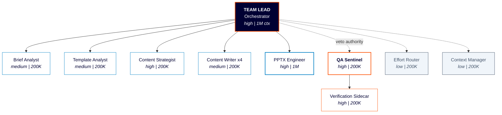

# PROJECT MAESTRO

## Multi-Agent Executive Slide Team for Reliable Output

**Claude Code | Agent Teams | Opus 4.6**

CONFIDENTIAL | MSC Cruises — Technology Innovation | March 2026

---

## 1. Executive Summary

**Project MAESTRO** (Multi-Agent Executive Slide Team for Reliable Output) is a 10-agent system designed for Claude Code's native Agent Teams orchestration. It transforms raw briefs, notes, and data into polished, template-compliant MSC Cruises corporate presentations — fully automated from intake to delivery.

The system leverages Opus 4.6's Agent Teams for parallel content writing, effort routing for cost optimisation, and a mandatory QA Sentinel with verification sidecar to enforce corporate template fidelity on every slide.

### Key Metrics

| Metric | Value |
|--------|-------|
| **Agents** | 10 |
| **Pipeline Phases** | 7 |
| **Parallel Writers** | 4 |
| **QA Sentinel w/ Veto** | 1 |

### Key Features

- Native Agent Teams orchestration
- Template-based XML editing (no from-scratch)
- Adaptive effort routing (low → max)
- Evidence-based visual QA on every slide

---

## 2. End-to-End Pipeline

Seven sequential phases with parallel execution within Phase 4 (content writing).

### Phase P1 — Brief Intake

Requirements gathering, audience tier, clarification.

### Phase P2 — Template Analysis

Unpack, thumbnail, layout cataloguing.

### Phase P3 — Content Strategy

Slide mapping, audience adaptation, structure.

### Phase P4 — Content Writing ⟨PARALLEL — 4 Writers⟩

Parallel slide content generation (4 writers).

### Phase P5 — PPTX Production

XML editing, structural assembly, formatting.

### Phase P6 — Visual QA

Image conversion, inspection, fix-verify loop.

### Phase P7 — Delivery

Final pack, metadata, .pptx file output.

---

## 3. Team Architecture

Hybrid orchestration: Agent Teams for pipeline coordination + subagents for parallel content writing.

```
                        ┌──────────────────────────────┐
  LEADERSHIP            │   TEAM LEAD (Orchestrator)   │
                        │     high effort | 1M ctx     │
                        └──────────────┬───────────────┘
                                       │
          ┌────────────┬───────────────┼───────────────┬────────────┐
          │            │               │               │            │
  SPECIALIST  ┌────────┴───┐  ┌───────┴──────┐  ┌─────┴──────┐  ┌─┴──────────┐  ┌──────────────┐
          │ Brief Analyst│  │Template Analyst│  │  Content   │  │  Content   │  │    PPTX      │
          │medium | 200K │  │ medium | 200K  │  │ Strategist │  │ Writer x4  │  │  Engineer    │
          └──────────────┘  └────────────────┘  │high | 200K │  │medium|200K │  │ high | 1M    │
                                                └────────────┘  └────────────┘  └──────────────┘

  OVERSIGHT   ┌──────────────────┐  ┌──────────────────────┐
              │   QA Sentinel    │  │ Verification Sidecar  │
              │  high | 200K     │  │    high | 200K        │
              └──────────────────┘  └───────────────────────┘

  INFRASTRUCTURE  ┌──────────────┐  ┌──────────────────┐
                  │ Effort Router│  │ Context Manager   │
                  │  low | 200K  │  │   low | 200K      │
                  └──────────────┘  └───────────────────┘
```

---

## 4. Agent Roster — Leadership & Specialists

### Team Lead (Orchestrator)

| Attribute | Value |
|-----------|-------|
| **Mode** | team_lead |
| **Effort** | high |
| **Context** | 1M |
| **Primary Responsibility** | Pipeline orchestration, Task DAG management, teammate spawning, final synthesis |
| **Key Skills / Tools** | Agent Teams API, Task DAG ops, direct messaging, effort routing |

### Brief Analyst

| Attribute | Value |
|-----------|-------|
| **Mode** | teammate |
| **Effort** | medium |
| **Context** | 200K |
| **Primary Responsibility** | Requirements extraction, audience tier determination, clarification Q&A |
| **Key Skills / Tools** | NLP parsing, structured brief output, user interaction |

### Template Analyst

| Attribute | Value |
|-----------|-------|
| **Mode** | teammate |
| **Effort** | medium |
| **Context** | 200K |
| **Primary Responsibility** | Template unpacking, layout cataloguing, XML pattern extraction |
| **Key Skills / Tools** | thumbnail.py, markitdown, unpack.py, XML parsing |

### Content Strategist

| Attribute | Value |
|-----------|-------|
| **Mode** | teammate |
| **Effort** | high |
| **Context** | 200K |
| **Primary Responsibility** | Slide mapping, audience adaptation, content density planning |
| **Key Skills / Tools** | Layout catalogue, content transformation rules, writing standards |

### Content Writer (x4 parallel)

| Attribute | Value |
|-----------|-------|
| **Mode** | subagent |
| **Effort** | medium |
| **Context** | 200K |
| **Primary Responsibility** | Parallel slide content generation per assigned section |
| **Key Skills / Tools** | Writing standards, tone/style rules, content density limits |

### PPTX Engineer

| Attribute | Value |
|-----------|-------|
| **Mode** | teammate |
| **Effort** | high |
| **Context** | 1M |
| **Primary Responsibility** | XML editing, slide assembly, structural ops, formatting compliance |
| **Key Skills / Tools** | add_slide.py, str_replace, clean.py, pack.py, XML entities |

---

## 5. Agent Roster — Oversight & Infrastructure

### QA Sentinel

| Attribute | Value |
|-----------|-------|
| **Mode** | teammate |
| **Effort** | high |
| **Context** | 200K |
| **Primary Responsibility** | Cross-cutting quality gate with veto power. Validates all outputs against corporate template standards, colour palette, typography, content density, and audience tier compliance. |
| **Key Skills / Tools** | Visual QA loop (soffice + pdftoppm), markitdown text check, XML structure validation |

### Verification Sidecar

| Attribute | Value |
|-----------|-------|
| **Mode** | subagent (of QA) |
| **Effort** | high |
| **Context** | 200K |
| **Primary Responsibility** | Evidence-based truth enforcement. Converts slides to images, inspects each one, compares against specification. Reports all issues with evidence. |
| **Key Skills / Tools** | soffice.py, pdftoppm, image analysis, diff comparison |

### Effort Router

| Attribute | Value |
|-----------|-------|
| **Mode** | built-in (Team Lead) |
| **Effort** | low |
| **Context** | 200K |
| **Primary Responsibility** | Dynamically adjusts effort level per task type. Escalates from medium to high/max when complexity detected. |
| **Key Skills / Tools** | Effort-level API, dynamic escalation rules, cost tracking |

### Context Manager

| Attribute | Value |
|-----------|-------|
| **Mode** | built-in (Team Lead) |
| **Effort** | low |
| **Context** | 200K |
| **Primary Responsibility** | Monitors context usage across agents. Triggers compaction, persists critical state to filesystem for long-running sessions. |
| **Key Skills / Tools** | Context compaction API, filesystem persistence, Task descriptions as state carriers |

> **QA Sentinel Authority:** The QA Sentinel holds formal veto power over all deliverables. No .pptx file is released without QA Sentinel approval. Rejection triggers a revision loop with specific feedback and evidence (image diffs, XML violations, content density breaches).

---

## 6. Task DAG — Dependency Graph

| Task ID | Task Name | Assigned To | Blocked By | Effort | Parallel? |
|---------|-----------|-------------|------------|--------|-----------|
| T1 | Intake & Requirements | Brief Analyst | -- | medium | No |
| T2 | Template Unpack & Catalogue | Template Analyst | -- | medium | Yes (with T1) |
| T3 | Slide Mapping & Strategy | Content Strategist | **T1, T2** | high | No |
| T4a-d | Content Writing (4 sections) | Content Writer x4 | **T3** | medium | **Yes (fan-out)** |
| T5 | Structural Assembly (XML) | PPTX Engineer | **T2, T3** | high | Yes (with T4) |
| T6 | Content Injection (XML edit) | PPTX Engineer | **T4a-d, T5** | high | No |
| T7 | Clean & Pack | PPTX Engineer | **T6** | medium | No |
| T8 | Visual QA (image inspection) | QA Sentinel + Sidecar | **T7** | high | No |
| T9 | Fix-Verify Loop (if needed) | PPTX Engineer + QA | **T8** | high → max | No |
| T10 | Final Delivery (.pptx output) | Team Lead | **T8 (pass) or T9** | low | No |

### Task DAG Operations (Claude Code)

```yaml
TaskCreate({ subject: "T1 — Intake & Requirements", description: "Brief Analyst extracts requirements, confirms audience tier" })
TaskCreate({ subject: "T2 — Template Unpack & Catalogue", description: "Template Analyst unpacks PPTX, catalogues layouts" })
TaskCreate({ subject: "T3 — Slide Mapping & Strategy", description: "Content Strategist maps content to template layouts" })
TaskUpdate({ taskId: "T3", addBlockedBy: ["T1", "T2"] })
TaskCreate({ subject: "T4a — Content Writing Section 1", description: "Writer 1 generates slide content for assigned section" })
TaskCreate({ subject: "T4b — Content Writing Section 2", description: "Writer 2 generates slide content for assigned section" })
TaskCreate({ subject: "T4c — Content Writing Section 3", description: "Writer 3 generates slide content for assigned section" })
TaskCreate({ subject: "T4d — Content Writing Section 4", description: "Writer 4 generates slide content for assigned section" })
TaskUpdate({ taskId: "T4a", addBlockedBy: ["T3"] })
TaskUpdate({ taskId: "T4b", addBlockedBy: ["T3"] })
TaskUpdate({ taskId: "T4c", addBlockedBy: ["T3"] })
TaskUpdate({ taskId: "T4d", addBlockedBy: ["T3"] })
TaskCreate({ subject: "T5 — Structural Assembly", description: "PPTX Engineer builds slide structure from template" })
TaskUpdate({ taskId: "T5", addBlockedBy: ["T2", "T3"] })
TaskCreate({ subject: "T6 — Content Injection", description: "PPTX Engineer injects written content into XML slides" })
TaskUpdate({ taskId: "T6", addBlockedBy: ["T4a", "T4b", "T4c", "T4d", "T5"] })
TaskCreate({ subject: "T7 — Clean & Pack", description: "Run clean.py and pack.py to produce .pptx" })
TaskUpdate({ taskId: "T7", addBlockedBy: ["T6"] })
TaskCreate({ subject: "T8 — Visual QA", description: "QA Sentinel + Verification Sidecar inspect all slides" })
TaskUpdate({ taskId: "T8", addBlockedBy: ["T7"] })
TaskCreate({ subject: "T9 — Fix-Verify Loop", description: "Iterative fix cycle if QA rejects" })
TaskUpdate({ taskId: "T9", addBlockedBy: ["T8"] })
TaskCreate({ subject: "T10 — Final Delivery", description: "Team Lead delivers .pptx and cleans up agents" })
TaskUpdate({ taskId: "T10", addBlockedBy: ["T8"] })  # or T9 if fix loop was needed
```

---

## 7. Effort Routing & Context Strategy

### Effort-Level Distribution

| Level | Percentage | Assigned Agents |
|-------|-----------|-----------------|
| **MAX** | 5% | QA escalation, complex fix-verify cycles |
| **HIGH** | 45% | Team Lead, Content Strategist, PPTX Engineer, QA Sentinel |
| **MEDIUM** | 40% | Brief Analyst, Template Analyst, Content Writers (x4) |
| **LOW** | 10% | Effort Router, Context Manager, final delivery |

### Context Budget Allocation

| Agent | Context Budget | Rationale |
|-------|---------------|-----------|
| **Team Lead** | 1M tokens | Global visibility across all phases, DAG state, agent outputs |
| **PPTX Engineer** | 1M tokens | Full template XML + all slide content in context for assembly |
| **All other agents (8)** | 200K tokens each | Focused tasks with bounded scope; no need for global view |

### Dynamic Escalation Rule

Start at medium. If test failures, ambiguity, or XML errors detected, escalate to high. Reserve max for multi-slide fix-verify loops.

```yaml
effort_router:
  strategy: "Single model (Opus 4.6) with dynamic effort levels"
  escalation_path: "medium → high → max"
  triggers:
    - "XML validation errors after first attempt"
    - "QA Sentinel rejects output"
    - "Content density limits exceeded"
    - "Multi-slide formatting inconsistencies"
```

---

## 8. Communication Architecture

### Channel 1: Shared Task Board

- DAG-based task list with blocking dependencies
- All teammates can read; only Team Lead creates/updates
- Filesystem persistence (`~/.claude/tasks`)
- Idle notifications on task completion

### Channel 2: Direct Messaging

- Point-to-point between any two teammates
- Used for findings, questions, revision requests
- QA Sentinel sends rejection evidence directly
- Content Strategist broadcasts slide map to Writers

### Channel 3: Lifecycle Events

- **Spawn:** Team Lead creates teammate with prompt
- **Idle:** Completed agent signals availability
- **Shutdown:** Team Lead requests graceful termination
- **Escalation:** Agent signals need for higher effort

### Key Interaction Pattern

Fan-out at Phase 4 (Team Lead spawns 4 Content Writers in parallel) → Fan-in at Phase 5 (PPTX Engineer collects all content) → QA gate before delivery.

### Message Format

```yaml
message_format:
  sender: "agent_id"
  recipient: "agent_id | broadcast"
  type: "task_assignment | finding | question | escalation | completion"
  priority: "critical | high | normal | low"
  payload:
    content: ""
    context: {}
    evidence: {}      # diffs, test results, links
    metadata:
      effort_level: ""
      tokens_used: 0
      timestamp: ""
```

---

## 9. Quality Gates & Verification Sidecar

### Quality Gates (5 Checkpoints)

| Gate | Name | Validation Criteria |
|------|------|-------------------|
| **G1** | Brief Validation | Audience tier confirmed, requirements complete, no fabricated data |
| **G2** | Slide Map Review | Every content block mapped to a template layout, density within limits |
| **G3** | Content Quality | Tone, style, terminology consistent; audience-appropriate depth |
| **G4** | XML Compliance | Run properties preserved, colours in palette, no emoji, ALL CAPS titles |
| **G5** | Visual Inspection | No overflow, alignment correct, no overlaps, no placeholder text |

### Verification Sidecar Pattern

**Purpose:** Real-time truth enforcement. Prevents agents from claiming success without evidence.

| Check | Method |
|-------|--------|
| File modified? | git diff / file timestamps |
| XML valid? | defusedxml parsing + pack.py validation |
| Colours in palette? | grep for non-palette srgbClr values |
| No overflow? | soffice PDF + pdftoppm image inspection |
| No placeholder text? | markitdown \| grep pattern matching |
| Template fidelity? | rPr preservation check, font size audit |

**On failure:** Block delivery + revision request with evidence.

---

## 10. Workflow Sequence — Spawn Order & Execution

| Step | Action | Mode | Active Agents |
|------|--------|------|---------------|
| **1** | Team Lead spawns Brief Analyst and Template Analyst in parallel | PARALLEL | Brief Analyst, Template Analyst |
| **2** | Both complete; Team Lead spawns Content Strategist (blocked by T1 + T2) | SEQUENTIAL | Content Strategist |
| **3** | Content Strategist delivers slide map; Team Lead fans out 4 Content Writers | FAN-OUT | Content Writer x4 |
| **4** | Team Lead spawns PPTX Engineer for structural assembly (parallel with T4) | PARALLEL | PPTX Engineer |
| **5** | All Content Writers complete; PPTX Engineer injects content into XML slides | SEQUENTIAL | PPTX Engineer |
| **6** | PPTX Engineer runs clean + pack; QA Sentinel + Verification Sidecar inspect | SEQUENTIAL | QA Sentinel, Verification Sidecar |
| **7** | If QA passes: deliver. If QA fails: fix-verify loop (effort escalation) | LOOP | PPTX Engineer + QA |
| **8** | Team Lead delivers final .pptx, requests shutdown of all agents, cleanup | FINAL | Team Lead |

---

## 11. Deployment Configuration

### Environment Setup

```bash
export CLAUDE_CODE_EXPERIMENTAL_AGENT_TEAMS=1

# Directory structure
./template/*.pptx      # MSC Corporate Template
./output/              # Final deliverables

# Required skill
# pptx (editing workflow)

# Dependencies
pip install "markitdown[pptx]" Pillow
# LibreOffice (soffice) — PDF conversion
# Poppler (pdftoppm) — PDF to images
```

### CLAUDE.md Governance Policies

```markdown
# MAESTRO Team Governance

## Mandatory Rules (all agents)
- Use ONLY MSC corporate colour palette
- NEVER change template font sizes
- NEVER use emoji or unicode symbols
- ALL slide titles in CAPS
- Visual QA mandatory before delivery
- No fabricated data — use placeholders
- British English spelling throughout

## Quality Standards
- Maximum 50 words of body text per slide (EXECUTIVE tier)
- Content density limits enforced per element type
- Template layouts only — no custom card/box arrangements
- Preserve all <a:rPr> run properties when editing XML
- Use <a:schemeClr> references, not hardcoded <a:srgbClr>

## Escalation Protocol
- QA Sentinel has veto power on all outputs
- Rejection triggers revision loop with evidence
- Max 3 fix-verify iterations before human escalation
- Dynamic effort escalation: medium → high → max
```

### Estimated Token Budget per Run

| Agent | Input Tokens | Output Tokens | Effort | Est. Cost/Run |
|-------|-------------|---------------|--------|--------------|
| Team Lead | ~150K | ~30K | high | $1.87 |
| Brief + Template Analysts | ~80K (total) | ~15K | medium | $0.96 |
| Content Strategist | ~60K | ~20K | high | $0.80 |
| Content Writers (x4) | ~200K (total) | ~60K | medium | $2.50 |
| PPTX Engineer | ~300K | ~80K | high | $3.50 |
| QA Sentinel + Sidecar | ~100K | ~25K | high | $1.43 |
| **TOTAL (per presentation)** | **~890K** | **~230K** | **mixed** | **~$11.06** |

### Monitoring Metrics

- Token usage per agent (actual vs. budget)
- Effort level distribution (% low/medium/high/max)
- Context compaction frequency
- Task completion rate and elapsed time
- QA rejection rate and iteration count

---

## 12. Organisation Chart (Mermaid)



---

## 13. Opus 4.6 Execution Strategy Summary

```yaml
execution_strategy:
  orchestration_mode: "hybrid"
  rationale: "Agent Teams for pipeline coordination and inter-agent communication; subagents for parallel content writing (focused, no cross-talk needed)"

  effort_distribution:
    max: ["QA escalation cycles", "complex fix-verify loops"]
    high: ["Team Lead", "Content Strategist", "PPTX Engineer", "QA Sentinel", "Verification Sidecar"]
    medium: ["Brief Analyst", "Template Analyst", "Content Writer x4"]
    low: ["Effort Router", "Context Manager", "final delivery task"]

  context_plan:
    agents_needing_1M: ["Team Lead", "PPTX Engineer"]
    agents_within_200K: ["Brief Analyst", "Template Analyst", "Content Strategist", "Content Writer x4", "QA Sentinel", "Verification Sidecar", "Effort Router", "Context Manager"]

  compaction_plan:
    long_running_agents: ["Team Lead", "PPTX Engineer"]
    persistence_strategy: "Critical state written to ~/.claude/tasks and shared filesystem. Intermediate results (slide map, content drafts) persisted as files. Task descriptions used as state carriers."

  mcp_servers_needed: []  # Self-contained system — no external MCP integrations required

  estimated_token_budget: "~1.12M tokens per presentation run (~$11.06)"
```

---

## 14. Design Principles Applied

1. **Separation of Concerns** — Each agent has a focused, well-defined responsibility (brief analysis, content strategy, XML engineering, quality assurance are all separate roles)
2. **Minimal Authority** — Content Writers cannot edit XML; PPTX Engineer cannot approve deliverables; only QA Sentinel can veto
3. **Fail-Safe Defaults** — QA gate blocks delivery by default; must actively approve to release
4. **Observable Behaviour** — All agent actions tracked via Task DAG; QA produces image evidence
5. **Right-Size Effort** — Medium effort for content writing (40% of workload); max reserved for escalation only (5%)
6. **Parallel by Default** — P1/P2 parallel, P4 fan-out (4 writers), P4/P5 overlap
7. **Evidence-Based Verification** — Verification Sidecar checks actual file diffs, XML validity, image inspection — not self-reported success
8. **DAG-Driven Execution** — Task dependencies enforced; no task starts until blockers complete
9. **Compaction-Resilient Design** — All critical state (slide map, content drafts, QA findings) persisted to filesystem

---

*Project MAESTRO — Multi-Agent Team Architecture v1.0*
*MSC Cruises — Technology Innovation Division*
*March 2026*
