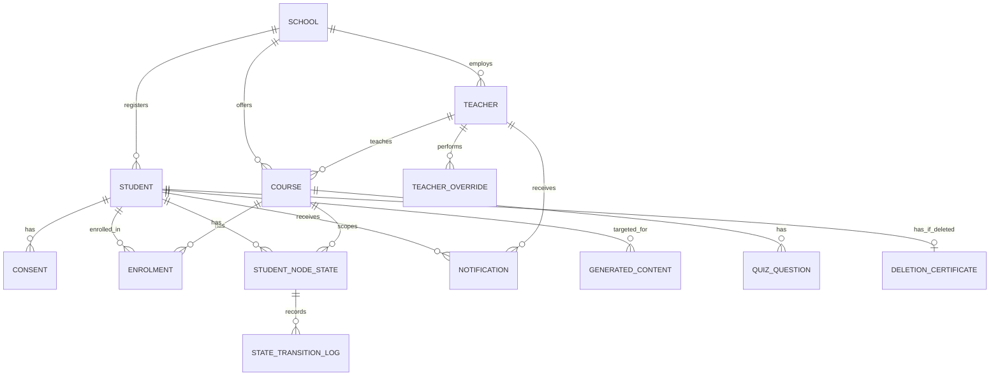

# HLD-004: Data & Mastery State Architecture

**Status**: Proposed
**Date**: 2026-05-18
**Author**: MSTR-07 (Data & Mastery State Architect)
**Reviewers required**: MSTR-02 (CTA), MSTR-05 (KG Architect), MSTR-11 (Data Engineer), MSTR-16 (Privacy & Compliance)
**Task**: T2.4 (Data & mastery state architecture)
**Depends on**: ADR-001 (Tech Stack), ADR-002 (Pedagogical Model)

---

## 1. Overview

This document defines the complete data layer for MAESTRO: the Knowledge Map Manager (KMM) state store, the F14 identity/consent/enrolment model, the immutable audit log, notification store, content metadata, and pseudonymization layer.

### Design Philosophy

1. **Single PostgreSQL 17 instance** (per ADR-001). Every table, index, function, and constraint lives in one database. Apache AGE (graph) and pgvector (vectors) coexist as extensions; this HLD covers the relational data layer.
2. **Append-only audit**. Audit tables have no UPDATE or DELETE privileges. Immutability is enforced at the database level via triggers.
3. **Application-level state machine**. State transition validation is enforced in the Python application (FastAPI/LangGraph), not in PostgreSQL triggers. The database stores the result; the application owns the logic. Rationale: the state machine rules reference external context (quiz scores, teacher identity, consent status) that is not available to a PL/pgSQL trigger without excessive coupling.
4. **GDPR by design**. PII fields encrypted at rest (pgcrypto `pgp_sym_encrypt`), right-to-erasure as an atomic stored procedure, pseudonymization of audit trails post-deletion.
5. **Schema ready for V1/V2**. Fields for FSRS parameters, multi-course enrolment (1:N), temporal decay (`last_seen`, `last_reinforced`), and dual mastery dimensions are present but nullable/unused in MVP.

### Schemas

The database uses four PostgreSQL schemas for logical separation:

| Schema | Purpose |
|---|---|
| `core` | Identity, consent, enrolment, courses, schools |
| `kmm` | Knowledge Map Manager: state store, transitions, retention checks, overrides |
| `content` | Generated content metadata, quiz banks |
| `audit` | Immutable audit log, deletion certificates |

---

## 2. Domain Model

```
                           ┌──────────┐
                           │  school   │
                           └────┬─────┘
                                │ 1:N
                    ┌───────────┼───────────┐
                    ▼           ▼           ▼
              ┌──────────┐ ┌────────┐ ┌──────────┐
              │ teacher  │ │ course │ │ student  │
              └────┬─────┘ └───┬────┘ └────┬─────┘
                   │           │           │
                   │     ┌─────┴─────┐     │
                   │     ▼           ▼     │
                   │  ┌────────┐ ┌───────┐ │
                   │  │kg_node │ │enrolm.│◄┘
                   │  │(via AGE│ └───┬───┘
                   │  │ graph) │     │
                   │  └───┬────┘     │
                   │      │          │
                   │      ▼          ▼
                   │  ┌─────────────────────┐
                   │  │ student_node_state  │ (student_id, node_id, course_id)
                   │  └────────┬────────────┘
                   │           │
                   │           ▼
                   │  ┌─────────────────────┐
                   │  │state_transition_log │ (append-only)
                   │  └─────────────────────┘
                   │
                   ├──► teacher_override ──► audit_log
                   │
                   └──► consent (student, 5 types)
                        notification
                        generated_content
```

### Key Entities

| Entity | Schema | Cardinality notes |
|---|---|---|
| `school` | core | 1 for MVP, N for V1+ |
| `teacher` | core | 1:N to courses |
| `student` | core | Internal UUID, PII encrypted |
| `course` | core | 1 per teacher per year (MVP) |
| `enrolment` | core | student:course = N:M (schema ready), MVP = 1:1 |
| `consent` | core | 5 rows per student (one per category) |
| `student_node_state` | kmm | 1 per (student, node, course) |
| `state_transition_log` | kmm | Append-only, partitioned by month |
| `retention_check` | kmm | Scheduled checks with status |
| `teacher_override` | kmm | Subset of transitions, enriched with motivation |
| `notification` | core | Per recipient |
| `generated_content` | content | Per student per concept |
| `audit_log` | audit | Append-only, partitioned by month |

---

## 3. KMM State Store

### 3.1 student_node_state Table

This is the core table: one row per (student, KG node, course) triple, holding the current mastery state.

```sql
CREATE TABLE kmm.student_node_state (
    student_id       UUID        NOT NULL,
    node_id          TEXT        NOT NULL,  -- stable KG node identifier from AGE
    course_id        UUID        NOT NULL,
    current_state    TEXT        NOT NULL DEFAULT 'non_introdotto'
                     CHECK (current_state IN (
                         'non_introdotto', 'introdotto', 'lacuna',
                         'in_recupero', 'da_consolidare', 'consolidato'
                     )),
    state_since      TIMESTAMPTZ NOT NULL DEFAULT now(),
    attempt_count    SMALLINT    NOT NULL DEFAULT 0,  -- quiz attempts on current cycle
    last_quiz_score  SMALLINT,                        -- 0-100, NULL if never quizzed
    last_quiz_at     TIMESTAMPTZ,
    -- Retention scheduling
    next_retention_check TIMESTAMPTZ,                 -- NULL unless da_consolidare
    retention_checks_passed SMALLINT NOT NULL DEFAULT 0,  -- 0-3 needed for consolidato
    -- FSRS parameters (V1+, nullable for MVP)
    fsrs_stability   REAL,
    fsrs_difficulty  REAL,
    -- Future decay support (out of scope MVP, schema ready)
    last_seen        TIMESTAMPTZ,
    last_reinforced  TIMESTAMPTZ,

    PRIMARY KEY (student_id, node_id, course_id),

    CONSTRAINT fk_sns_student FOREIGN KEY (student_id)
        REFERENCES core.student(id) ON DELETE CASCADE,
    CONSTRAINT fk_sns_course FOREIGN KEY (course_id)
        REFERENCES core.course(id) ON DELETE RESTRICT
);

-- Partitioning note: for MVP (30 students x 500 nodes = 15K rows), no partitioning needed.
-- V1 trigger: if row count exceeds 500K, partition by course_id (hash partitioning).

-- Hot query indexes
CREATE INDEX idx_sns_student_course ON kmm.student_node_state (student_id, course_id);
CREATE INDEX idx_sns_course_state ON kmm.student_node_state (course_id, current_state);
CREATE INDEX idx_sns_next_retention ON kmm.student_node_state (next_retention_check)
    WHERE next_retention_check IS NOT NULL;
```

### 3.2 state_transition_log Table

Every state transition is immutable and recorded. This is the audit trail of the learning journey.

```sql
CREATE TABLE kmm.state_transition_log (
    id               BIGINT GENERATED ALWAYS AS IDENTITY,
    student_id       UUID        NOT NULL,
    node_id          TEXT        NOT NULL,
    course_id        UUID        NOT NULL,
    previous_state   TEXT        NOT NULL,
    new_state        TEXT        NOT NULL,
    trigger_type     TEXT        NOT NULL
                     CHECK (trigger_type IN (
                         'verifica_errore',        -- F4: error mapping from assessment
                         'avvio_recupero',          -- F11.6: student starts recovery mission
                         'quiz_superato',           -- F11.9: quiz >= 80%
                         'quiz_fallito',            -- F11.9: quiz < 80% (50-79% retry or <50% alert)
                         'retention_check_ok',      -- F11.10: retention check passed
                         'retention_check_fail',    -- F11.10: retention check failed
                         'regressione',             -- Error on da_consolidare/consolidato
                         'override_docente',        -- F11.12: teacher manual override
                         'lezione_completata',      -- F1: lesson marked concept as taught
                         'inizializzazione'         -- F14.5: enrolment sets all to non_introdotto
                     )),
    trigger_ref      UUID,       -- FK to assessment, quiz, retention_check, or override
    evidence_ref     TEXT,       -- S3/local path to evidence file (optional)
    quiz_score       SMALLINT,   -- 0-100, NULL if not quiz-related
    response_time_ms INTEGER,    -- For FSRS: time to answer quiz (V1+)
    created_at       TIMESTAMPTZ NOT NULL DEFAULT now(),

    CONSTRAINT pk_stl PRIMARY KEY (id, created_at)
) PARTITION BY RANGE (created_at);

-- Monthly partitions (created by pg_partman or migration script)
-- Example for 2026:
CREATE TABLE kmm.state_transition_log_2026_09
    PARTITION OF kmm.state_transition_log
    FOR VALUES FROM ('2026-09-01') TO ('2026-10-01');

-- BRIN index for time-range queries (efficient for append-only, time-ordered data)
CREATE INDEX idx_stl_created_brin ON kmm.state_transition_log
    USING BRIN (created_at) WITH (pages_per_range = 32);

-- B-tree indexes for student/course lookups
CREATE INDEX idx_stl_student_node ON kmm.state_transition_log (student_id, node_id, course_id);
CREATE INDEX idx_stl_course ON kmm.state_transition_log (course_id, created_at DESC);

-- Immutability: deny UPDATE and DELETE
CREATE OR REPLACE FUNCTION audit.deny_modify()
RETURNS TRIGGER AS $$
BEGIN
    RAISE EXCEPTION 'Modification of append-only table % is prohibited', TG_TABLE_NAME;
END;
$$ LANGUAGE plpgsql;

CREATE TRIGGER trg_stl_no_update
    BEFORE UPDATE ON kmm.state_transition_log
    FOR EACH ROW EXECUTE FUNCTION audit.deny_modify();

CREATE TRIGGER trg_stl_no_delete
    BEFORE DELETE ON kmm.state_transition_log
    FOR EACH ROW EXECUTE FUNCTION audit.deny_modify();
```

### 3.3 State Machine Implementation

The state machine is enforced at the **application level** (Python service layer), not in database triggers.

#### Legal transitions

```
non_introdotto  -> introdotto           (lezione_completata)
introdotto      -> lacuna               (verifica_errore)
introdotto      -> non_introdotto       (ILLEGAL -- never happens)
lacuna          -> in_recupero          (avvio_recupero)
in_recupero     -> da_consolidare       (quiz_superato, score >= 80%)
in_recupero     -> in_recupero          (quiz_fallito, score 50-79%, retry)
in_recupero     -> lacuna               (quiz_fallito, score < 50%, alert teacher)
da_consolidare  -> consolidato          (retention_check_ok, 3rd pass)
da_consolidare  -> da_consolidare       (retention_check_ok, passes 1 or 2)
da_consolidare  -> lacuna               (retention_check_fail OR regressione)
consolidato     -> lacuna               (regressione from new assessment error)
ANY             -> ANY                  (override_docente -- requires motivation)
```

#### Illegal transitions (blocked by application)

- `non_introdotto -> consolidato` (must go through intermediate states)
- `non_introdotto -> lacuna` (cannot have a gap on an untaught concept)
- `non_introdotto -> da_consolidare` (cannot consolidate what was never taught)
- `consolidato -> in_recupero` (regression goes to lacuna, then recovery starts)
- Any transition not in the legal list above (unless override_docente)

#### Application enforcement

```python
# Pseudocode -- actual implementation in FastAPI service layer
LEGAL_TRANSITIONS = {
    'non_introdotto': {'introdotto'},
    'introdotto':     {'lacuna'},
    'lacuna':         {'in_recupero'},
    'in_recupero':    {'da_consolidare', 'in_recupero', 'lacuna'},
    'da_consolidare': {'consolidato', 'da_consolidare', 'lacuna'},
    'consolidato':    {'lacuna'},
}

def validate_transition(current: str, target: str, is_override: bool) -> bool:
    if is_override:
        return True  # Override bypasses; motivation + audit enforced separately
    return target in LEGAL_TRANSITIONS.get(current, set())
```

#### Why application-level, not DB triggers

1. **Context dependency**: Transition validation depends on quiz scores, teacher identity, consent status, retention check sequence -- data not available in a single-row trigger context without expensive lookups.
2. **Testability**: Python unit tests for state machine logic are straightforward. PL/pgSQL trigger testing requires a running database.
3. **Flexibility**: The state machine rules may evolve (ADR-002 notes V2 refinements). Application-level changes deploy without DDL migrations.
4. **Auditability**: The application logs the full decision context (including quiz score, which question bank, which evidence) before writing. A trigger only sees the row.

### 3.4 Retention Scheduler

After a concept reaches `da_consolidare`, retention checks are scheduled.

#### MVP: Fixed D+7

When `current_state` transitions to `da_consolidare`:
1. Set `next_retention_check = now() + INTERVAL '7 days'`
2. Set `retention_checks_passed = 0`

A **pg_cron** job runs every hour during school hours (08:00-16:00 CET, weekdays):

```sql
-- pg_cron job: find due retention checks and create notifications
SELECT cron.schedule(
    'retention_check_scheduler',
    '0 8-16 * * 1-5',  -- Every hour, Mon-Fri, 08:00-16:00
    $$
    INSERT INTO core.notification (recipient_id, recipient_type, notification_type,
                                   title, body, action_url, metadata)
    SELECT
        s.student_id,
        'student',
        'retention_check_due',
        'Verifica di consolidamento disponibile',
        'Hai un breve quiz di ripasso su ' || s.node_id || '. Fallo quando vuoi!',
        '/student/retention-check/' || s.student_id || '/' || s.node_id || '/' || s.course_id,
        jsonb_build_object('node_id', s.node_id, 'course_id', s.course_id)
    FROM kmm.student_node_state s
    WHERE s.current_state = 'da_consolidare'
      AND s.next_retention_check <= now()
      AND NOT EXISTS (
          SELECT 1 FROM core.notification n
          WHERE n.recipient_id = s.student_id
            AND n.notification_type = 'retention_check_due'
            AND n.metadata->>'node_id' = s.node_id
            AND n.metadata->>'course_id' = s.course_id::text
            AND n.created_at > s.next_retention_check - INTERVAL '1 hour'
      );
    $$
);
```

After a retention check is completed:
- **Pass**: Increment `retention_checks_passed`. If `= 1` (MVP D+7 only check) -> transition to `consolidato`. Schedule next if V1 (D+3, D+7, D+21 sequence).
- **Fail**: Transition to `lacuna`. Clear `next_retention_check` and `retention_checks_passed`.

#### V1: Fixed D+3, D+7, D+21 (with optional D+14)

```sql
CREATE TABLE kmm.retention_schedule (
    id              BIGINT GENERATED ALWAYS AS IDENTITY PRIMARY KEY,
    student_id      UUID        NOT NULL,
    node_id         TEXT        NOT NULL,
    course_id       UUID        NOT NULL,
    check_number    SMALLINT    NOT NULL,  -- 1, 2, 3 (or 4 with optional D+14)
    scheduled_at    TIMESTAMPTZ NOT NULL,
    status          TEXT        NOT NULL DEFAULT 'pending'
                    CHECK (status IN ('pending', 'notified', 'completed_pass',
                                      'completed_fail', 'cancelled')),
    completed_at    TIMESTAMPTZ,
    quiz_score      SMALLINT,
    response_time_ms INTEGER,
    -- FSRS data collection (V2 migration path)
    concept_difficulty_estimate REAL,

    CONSTRAINT fk_rs_student FOREIGN KEY (student_id)
        REFERENCES core.student(id) ON DELETE CASCADE,
    CONSTRAINT fk_rs_course FOREIGN KEY (course_id)
        REFERENCES core.course(id) ON DELETE RESTRICT
);

CREATE INDEX idx_rs_pending ON kmm.retention_schedule (scheduled_at)
    WHERE status = 'pending';
CREATE INDEX idx_rs_student ON kmm.retention_schedule (student_id, node_id, course_id);
```

V1 scheduling logic (application level):
```
When state -> da_consolidare at time T:
  Schedule check 1: T + 3 days
  Schedule check 2: T + 7 days
  Schedule check 3: T + 21 days
  If student regression rate > 20%: also schedule check 2.5: T + 14 days
```

#### V2: FSRS Adaptive

The `retention_schedule` table and `student_node_state.fsrs_stability` / `fsrs_difficulty` columns collect the data needed for FSRS parameter estimation. The FSRS algorithm replaces the fixed schedule, computing `next_retention_check` dynamically per (student, concept).

### 3.5 Macro Rollup

Per ADR-002, macro state = worst state of all child micro-nodes, with two-tier display (progress indicator).

#### Implementation: Computed on read (not materialized)

For MVP scale (30 students x ~50 macro-nodes), computing macro state on read is fast enough. No materialized view needed.

```sql
-- Function to compute macro state for a (student, macro_node, course) triple
CREATE OR REPLACE FUNCTION kmm.compute_macro_state(
    p_student_id UUID,
    p_macro_node_id TEXT,
    p_course_id UUID
) RETURNS TABLE (
    macro_state TEXT,
    total_micros INT,
    micros_per_state JSONB
) AS $$
BEGIN
    RETURN QUERY
    WITH micro_states AS (
        SELECT
            sns.current_state,
            -- Ordinal encoding for worst-state: lower = worse
            CASE sns.current_state
                WHEN 'non_introdotto' THEN 0
                WHEN 'introdotto'     THEN 1
                WHEN 'lacuna'         THEN 2
                WHEN 'in_recupero'    THEN 3
                WHEN 'da_consolidare' THEN 4
                WHEN 'consolidato'    THEN 5
            END AS state_ord
        FROM kmm.student_node_state sns
        -- Join with KG to get micro-nodes that are children of macro_node
        -- NOTE: this requires a KG query to get child micro-node IDs
        -- In practice, the application pre-fetches child IDs from AGE
        WHERE sns.student_id = p_student_id
          AND sns.course_id = p_course_id
          AND sns.node_id = ANY(
              -- Placeholder: in production, this is passed as a parameter
              -- from the application layer which queries AGE for children
              ARRAY(SELECT unnest(ARRAY[]::TEXT[]))
          )
    )
    SELECT
        CASE MIN(state_ord)
            WHEN 0 THEN 'non_introdotto'
            WHEN 1 THEN 'introdotto'
            WHEN 2 THEN 'lacuna'
            WHEN 3 THEN 'in_recupero'
            WHEN 4 THEN 'da_consolidare'
            WHEN 5 THEN 'consolidato'
        END,
        COUNT(*)::INT,
        jsonb_object_agg(current_state, cnt) FROM (
            SELECT current_state, COUNT(*) as cnt
            FROM micro_states
            GROUP BY current_state
        ) sub;
END;
$$ LANGUAGE plpgsql STABLE;
```

In practice, the macro rollup is computed in the **application layer** because it needs the KG child-node relationship from Apache AGE:

```python
# Application-level macro rollup (pseudocode)
STATE_ORDER = {
    'non_introdotto': 0, 'introdotto': 1, 'lacuna': 2,
    'in_recupero': 3, 'da_consolidare': 4, 'consolidato': 5
}

def compute_macro_state(micro_states: list[str]) -> tuple[str, dict]:
    if not micro_states:
        return 'non_introdotto', {}
    worst = min(micro_states, key=lambda s: STATE_ORDER[s])
    counts = Counter(micro_states)
    return worst, dict(counts)
```

#### V1: Materialized view for class heatmap

When class-level aggregation becomes a hot query (V1, F11.14 temporal heatmap), a materialized view refreshed on state change or on schedule may be warranted. For MVP, the teacher dashboard queries are acceptable with direct computation.

### 3.6 Heatmap Queries

#### Student heatmap (F11.13): node x time -> state

```sql
-- Student temporal heatmap: state at each date for each node
-- Uses state_transition_log to reconstruct state at time points
SELECT
    stl.node_id,
    date_trunc('day', stl.created_at) AS day,
    stl.new_state AS state_at_day
FROM kmm.state_transition_log stl
WHERE stl.student_id = $1
  AND stl.course_id = $2
  AND stl.created_at >= $3  -- start date
  AND stl.created_at <= $4  -- end date
ORDER BY stl.node_id, stl.created_at;

-- For recent data: daily granularity
-- For older data (>30 days): weekly granularity (application level aggregation)
```

#### Class heatmap (F11.14): student x macro-concept -> state

```sql
-- Class heatmap: current state for each student x macro-node
-- Macro state computed by application (worst-state of children)
SELECT
    sns.student_id,
    sns.node_id,
    sns.current_state
FROM kmm.student_node_state sns
WHERE sns.course_id = $1
ORDER BY sns.student_id, sns.node_id;
```

The application groups by macro-node (using KG parent-child relationships from AGE), computes worst-state per macro, and returns the grid.

#### Performance considerations

- `student_node_state` indexed by `(student_id, course_id)` and `(course_id, current_state)` -- covers both heatmap queries.
- `state_transition_log` has BRIN index on `created_at` for time-range scans and B-tree on `(student_id, node_id, course_id)` for per-student history.
- MVP data volume (~90K transitions/semester) makes these queries trivially fast.

---

## 4. F14 -- Identity & Consent Data Model

### 4.1 Students Table

```sql
CREATE TABLE core.student (
    id                  UUID        PRIMARY KEY DEFAULT gen_random_uuid(),
    school_id           UUID        NOT NULL REFERENCES core.school(id),
    -- School registry reference: separate from internal ID (F14.2)
    school_registry_ref TEXT,       -- External identifier from school system
    -- PII: encrypted at rest with pgcrypto
    name_encrypted      BYTEA       NOT NULL,  -- pgp_sym_encrypt(name, key)
    surname_encrypted   BYTEA       NOT NULL,
    email_encrypted     BYTEA,                 -- nullable: not all students have email
    -- Non-PII metadata
    birth_year          SMALLINT,              -- Year only, not full DOB (data minimization)
    school_year         SMALLINT    NOT NULL,  -- 1-5 (biennio: 1-2, triennio: 3-5)
    -- Status lifecycle (F14.1)
    status              TEXT        NOT NULL DEFAULT 'created'
                        CHECK (status IN (
                            'created',      -- Account created, awaiting consent
                            'consent_given',-- Consent received, awaiting enrolment
                            'active',       -- Enrolled and activated
                            'suspended',    -- Temporarily suspended (F14.8)
                            'deleted'       -- Right to erasure executed (F14.9)
                        )),
    -- Lifecycle timestamps
    created_at          TIMESTAMPTZ NOT NULL DEFAULT now(),
    consent_completed_at TIMESTAMPTZ,
    activated_at        TIMESTAMPTZ,
    suspended_at        TIMESTAMPTZ,
    deleted_at          TIMESTAMPTZ,
    suspension_expires_at TIMESTAMPTZ,         -- Auto-reinstate after N days (F14.8)
    -- Content-adaptation profile (F3)
    -- 5-dimension continuous vector, stored as JSONB for flexibility
    adaptation_profile  JSONB       NOT NULL DEFAULT '{
        "preferenza_contenuto_visuale": 20,
        "preferenza_contenuto_audio": 20,
        "preferenza_esercizio_pratico": 20,
        "preferenza_lettura_approfondita": 20,
        "preferenza_interazione_dialogica": 20
    }'::jsonb,
    adaptation_profile_source TEXT  NOT NULL DEFAULT 'default'
                        CHECK (adaptation_profile_source IN (
                            'default', 'onboarding_quiz', 'behavioral', 'manual_override'
                        )),
    -- Preferences
    tone_preference     TEXT        NOT NULL DEFAULT 'neutro'
                        CHECK (tone_preference IN ('confidenziale', 'neutro', 'formale')),
    content_length_preference TEXT  NOT NULL DEFAULT 'standard'
                        CHECK (content_length_preference IN ('sintesi', 'standard', 'approfondimento')),
    -- Native language (Art. 9 sensitive -- only stored if consent (b) granted)
    native_language     TEXT,       -- ISO 639-1 code, NULL unless consent (b)
    bilingualism_active BOOLEAN     NOT NULL DEFAULT FALSE,
    -- Accessibility preferences (F9)
    accessibility_prefs JSONB       NOT NULL DEFAULT '{
        "font": "inter",
        "high_contrast": false,
        "text_size_pt": 16,
        "theme": "light",
        "reduced_animations": false
    }'::jsonb,
    -- Keycloak reference
    keycloak_user_id    TEXT        UNIQUE     -- Links to Keycloak identity
);

CREATE INDEX idx_student_school ON core.student (school_id);
CREATE INDEX idx_student_status ON core.student (status) WHERE status != 'deleted';
CREATE INDEX idx_student_keycloak ON core.student (keycloak_user_id) WHERE keycloak_user_id IS NOT NULL;
```

### 4.2 Consents Table

Five granular consents per F14.3, each separately captured and revocable.

```sql
CREATE TABLE core.consent (
    id              BIGINT GENERATED ALWAYS AS IDENTITY PRIMARY KEY,
    student_id      UUID        NOT NULL REFERENCES core.student(id) ON DELETE CASCADE,
    consent_type    TEXT        NOT NULL
                    CHECK (consent_type IN (
                        'profiling',            -- (a) Behavioral profiling for learning style
                        'native_language',      -- (b) Native language (Art. 9 GDPR)
                        'family_communications',-- (c) Periodic family communications
                        'cross_year_history',   -- (d) Cross-year history preservation
                        'aggregated_research'   -- (e) Aggregated anonymous research use
                    )),
    granted         BOOLEAN     NOT NULL,
    granted_by      TEXT        NOT NULL,  -- 'parent', 'guardian', 'student_14plus'
    granted_at      TIMESTAMPTZ NOT NULL DEFAULT now(),
    revoked_at      TIMESTAMPTZ,           -- NULL if currently granted
    legal_basis     TEXT        NOT NULL,   -- 'art6_1a_consent', 'art9_2a_explicit', etc.
    ip_address_hash TEXT,                   -- SHA-256 hash, not raw IP
    -- For paper-based MVP consent (F14.4)
    paper_reference TEXT,                   -- Reference to physical consent form

    CONSTRAINT uq_consent_active UNIQUE (student_id, consent_type)
        -- Only one active consent per type per student
        -- Revocations create a new row (append pattern for history)
);

-- History of consent changes (append-only)
CREATE TABLE core.consent_history (
    id              BIGINT GENERATED ALWAYS AS IDENTITY PRIMARY KEY,
    student_id      UUID        NOT NULL,
    consent_type    TEXT        NOT NULL,
    action          TEXT        NOT NULL CHECK (action IN ('granted', 'revoked')),
    performed_by    TEXT        NOT NULL,
    performed_at    TIMESTAMPTZ NOT NULL DEFAULT now(),
    legal_basis     TEXT        NOT NULL,
    ip_address_hash TEXT
);

CREATE TRIGGER trg_consent_history_no_update
    BEFORE UPDATE ON core.consent_history
    FOR EACH ROW EXECUTE FUNCTION audit.deny_modify();

CREATE TRIGGER trg_consent_history_no_delete
    BEFORE DELETE ON core.consent_history
    FOR EACH ROW EXECUTE FUNCTION audit.deny_modify();
```

### 4.3 Enrolments Table

```sql
CREATE TABLE core.enrolment (
    id              UUID        PRIMARY KEY DEFAULT gen_random_uuid(),
    student_id      UUID        NOT NULL REFERENCES core.student(id) ON DELETE CASCADE,
    course_id       UUID        NOT NULL REFERENCES core.course(id) ON DELETE RESTRICT,
    enrolled_at     TIMESTAMPTZ NOT NULL DEFAULT now(),
    enrolled_by     UUID,       -- teacher or admin who enrolled
    status          TEXT        NOT NULL DEFAULT 'active'
                    CHECK (status IN ('active', 'completed', 'withdrawn', 'transferred')),
    -- Map initialization tracking
    initial_map_created BOOLEAN NOT NULL DEFAULT FALSE,
    initial_map_created_at TIMESTAMPTZ,
    -- Academic year tracking (V1: multi-year support)
    academic_year   TEXT        NOT NULL,  -- e.g., '2026-2027'
    -- V1: transfer support
    transferred_from UUID,     -- Previous enrolment ID if transferred

    CONSTRAINT uq_enrolment UNIQUE (student_id, course_id, academic_year)
);

CREATE INDEX idx_enrolment_student ON core.enrolment (student_id);
CREATE INDEX idx_enrolment_course ON core.enrolment (course_id) WHERE status = 'active';
```

### 4.4 Courses Table

```sql
CREATE TABLE core.course (
    id                  UUID        PRIMARY KEY DEFAULT gen_random_uuid(),
    name                TEXT        NOT NULL,
    teacher_id          UUID        NOT NULL REFERENCES core.teacher(id),
    school_id           UUID        NOT NULL REFERENCES core.school(id),
    school_level        TEXT        NOT NULL
                        CHECK (school_level IN (
                            'secondaria_primo_grado',
                            'biennio_secondo_grado',
                            'triennio_secondo_grado',
                            'post_diploma_its',
                            'formazione_professionale'
                        )),
    official_language   TEXT        NOT NULL DEFAULT 'it',  -- ISO 639-1
    default_granularity TEXT        NOT NULL DEFAULT 'macro'
                        CHECK (default_granularity IN ('macro', 'micro', 'student_choice')),
    academic_year       TEXT        NOT NULL,  -- e.g., '2026-2027'
    status              TEXT        NOT NULL DEFAULT 'setup'
                        CHECK (status IN ('setup', 'active', 'archived')),
    -- KG reference: identifies which graph in AGE this course uses
    kg_graph_name       TEXT,       -- Apache AGE graph name
    created_at          TIMESTAMPTZ NOT NULL DEFAULT now(),

    CONSTRAINT uq_course UNIQUE (teacher_id, name, academic_year)
);
```

### 4.5 Supporting Tables

```sql
CREATE TABLE core.school (
    id              UUID        PRIMARY KEY DEFAULT gen_random_uuid(),
    name            TEXT        NOT NULL,
    code            TEXT        UNIQUE,    -- Italian school code (codice meccanografico)
    region          TEXT,
    created_at      TIMESTAMPTZ NOT NULL DEFAULT now()
);

CREATE TABLE core.teacher (
    id              UUID        PRIMARY KEY DEFAULT gen_random_uuid(),
    school_id       UUID        NOT NULL REFERENCES core.school(id),
    name_encrypted  BYTEA       NOT NULL,
    surname_encrypted BYTEA     NOT NULL,
    email_encrypted BYTEA,
    keycloak_user_id TEXT       UNIQUE,
    role            TEXT        NOT NULL DEFAULT 'teacher'
                    CHECK (role IN ('teacher', 'coordinator', 'admin')),
    created_at      TIMESTAMPTZ NOT NULL DEFAULT now()
);
```

### 4.6 Right to Erasure Implementation (F14.9)

Atomic deletion procedure. Called when a right-to-erasure request is processed.

```sql
CREATE OR REPLACE FUNCTION core.execute_right_to_erasure(
    p_student_id UUID,
    p_executor_id UUID,       -- Admin or system executing the deletion
    p_executor_role TEXT       -- 'admin', 'system', 'parent'
) RETURNS TABLE (
    deletion_certificate_id UUID,
    data_categories_deleted TEXT[],
    data_categories_anonymized TEXT[],
    data_categories_preserved TEXT[]
) AS $$
DECLARE
    v_cert_id UUID := gen_random_uuid();
    v_student_name_hash TEXT;
    v_has_research_consent BOOLEAN;
    v_deleted_categories TEXT[] := ARRAY[]::TEXT[];
    v_anonymized_categories TEXT[] := ARRAY[]::TEXT[];
    v_preserved_categories TEXT[] := ARRAY[]::TEXT[];
BEGIN
    -- 1. Check student exists and is not already deleted
    IF NOT EXISTS (SELECT 1 FROM core.student WHERE id = p_student_id AND status != 'deleted') THEN
        RAISE EXCEPTION 'Student % not found or already deleted', p_student_id;
    END IF;

    -- 2. Generate pseudonym hash for audit trail preservation
    v_student_name_hash := encode(
        digest(p_student_id::text || extract(epoch from now())::text, 'sha256'),
        'hex'
    );

    -- 3. Check if research consent (e) was given
    SELECT granted INTO v_has_research_consent
    FROM core.consent
    WHERE student_id = p_student_id AND consent_type = 'aggregated_research'
    AND revoked_at IS NULL;

    -- 4. Delete identifiable data (cascading)

    -- 4a. Generated content and files
    -- NOTE: S3 file deletion handled by application layer after this procedure
    DELETE FROM content.generated_content WHERE student_id = p_student_id;
    v_deleted_categories := v_deleted_categories || 'generated_content';

    -- 4b. Notifications
    DELETE FROM core.notification WHERE recipient_id = p_student_id;
    v_deleted_categories := v_deleted_categories || 'notifications';

    -- 4c. Retention schedules
    DELETE FROM kmm.retention_schedule WHERE student_id = p_student_id;
    v_deleted_categories := v_deleted_categories || 'retention_schedules';

    -- 4d. Teacher overrides (the student-identifiable part)
    DELETE FROM kmm.teacher_override WHERE student_id = p_student_id;
    v_deleted_categories := v_deleted_categories || 'teacher_overrides';

    -- 4e. Consent records
    DELETE FROM core.consent WHERE student_id = p_student_id;
    DELETE FROM core.consent_history WHERE student_id = p_student_id;
    v_deleted_categories := v_deleted_categories || 'consents';

    -- 4f. Enrolments
    DELETE FROM core.enrolment WHERE student_id = p_student_id;
    v_deleted_categories := v_deleted_categories || 'enrolments';

    -- 5. Pseudonymize audit trail entries
    -- Audit log is preserved but student references are replaced with hash
    UPDATE audit.audit_log
    SET actor_id = v_student_name_hash,
        previous_value = previous_value - 'student_name' - 'student_email',
        new_value = new_value - 'student_name' - 'student_email'
    WHERE entity_id = p_student_id::text
       OR actor_id = p_student_id::text;
    v_anonymized_categories := v_anonymized_categories || 'audit_log';

    -- 6. Pseudonymize state transition log
    -- Transitions are preserved for anonymous aggregate analysis (if consent e)
    IF v_has_research_consent THEN
        UPDATE kmm.state_transition_log
        SET student_id = '00000000-0000-0000-0000-000000000000'::UUID
        WHERE student_id = p_student_id;
        v_anonymized_categories := v_anonymized_categories || 'state_transitions_anonymized';
    ELSE
        -- Even without research consent, we need to handle the FK
        DELETE FROM kmm.state_transition_log WHERE student_id = p_student_id;
        v_deleted_categories := v_deleted_categories || 'state_transitions';
    END IF;

    -- 7. Delete KMM state
    DELETE FROM kmm.student_node_state WHERE student_id = p_student_id;
    v_deleted_categories := v_deleted_categories || 'kmm_state';

    -- 8. Mark student as deleted, wipe PII
    UPDATE core.student
    SET status = 'deleted',
        deleted_at = now(),
        name_encrypted = pgp_sym_encrypt('DELETED', current_setting('app.encryption_key')),
        surname_encrypted = pgp_sym_encrypt('DELETED', current_setting('app.encryption_key')),
        email_encrypted = NULL,
        native_language = NULL,
        adaptation_profile = '{}'::jsonb,
        accessibility_prefs = '{}'::jsonb,
        school_registry_ref = NULL,
        keycloak_user_id = NULL,
        birth_year = NULL
    WHERE id = p_student_id;
    v_deleted_categories := v_deleted_categories || 'student_pii';

    -- 9. Generate deletion certificate
    INSERT INTO audit.deletion_certificate (
        id, student_id_hash, executed_by, executed_at,
        data_deleted, data_anonymized, data_preserved
    ) VALUES (
        v_cert_id, v_student_name_hash, p_executor_id, now(),
        v_deleted_categories, v_anonymized_categories,
        ARRAY['deletion_certificate', 'pseudonymized_audit_log']
    );

    -- 10. Log the erasure operation itself in audit
    INSERT INTO audit.audit_log (
        actor_id, actor_type, action, entity_type, entity_id,
        previous_value, new_value
    ) VALUES (
        p_executor_id::text, p_executor_role, 'right_to_erasure',
        'student', v_student_name_hash,
        jsonb_build_object('status', 'active'),
        jsonb_build_object(
            'status', 'deleted',
            'deletion_certificate_id', v_cert_id,
            'categories_deleted', to_jsonb(v_deleted_categories),
            'categories_anonymized', to_jsonb(v_anonymized_categories)
        )
    );

    v_preserved_categories := ARRAY['deletion_certificate', 'pseudonymized_audit_log'];

    RETURN QUERY SELECT v_cert_id, v_deleted_categories, v_anonymized_categories, v_preserved_categories;
END;
$$ LANGUAGE plpgsql;
```

**Important notes on erasure**:
- The procedure runs in a single transaction (atomic).
- S3/object storage file deletion (lesson materials, audio, generated PDFs) is handled by the application layer after the DB procedure succeeds. A cleanup job retries failed S3 deletions.
- Keycloak user deletion is also handled by the application layer (API call to Keycloak admin).
- The deletion certificate is generated as a database row. The application layer renders it as a PDF (F14.9).
- Maximum processing time: 30 days per GDPR, but the system targets completion within 24 hours.

---

## 5. Override & Audit

### 5.1 teacher_override Table

```sql
CREATE TABLE kmm.teacher_override (
    id              BIGINT GENERATED ALWAYS AS IDENTITY PRIMARY KEY,
    teacher_id      UUID        NOT NULL REFERENCES core.teacher(id),
    student_id      UUID        NOT NULL,
    node_id         TEXT        NOT NULL,
    course_id       UUID        NOT NULL,
    previous_state  TEXT        NOT NULL,
    forced_state    TEXT        NOT NULL,
    motivation      TEXT        NOT NULL
                    CHECK (char_length(motivation) >= 20),  -- F11.12: min 20 chars
    evidence_file_ref TEXT,     -- S3/local path to optional evidence file
    created_at      TIMESTAMPTZ NOT NULL DEFAULT now(),

    -- An override also creates a state_transition_log entry with
    -- trigger_type = 'override_docente' and trigger_ref = this row's id

    CONSTRAINT fk_to_course FOREIGN KEY (course_id)
        REFERENCES core.course(id) ON DELETE RESTRICT
);

-- Immutability
CREATE TRIGGER trg_override_no_update
    BEFORE UPDATE ON kmm.teacher_override
    FOR EACH ROW EXECUTE FUNCTION audit.deny_modify();

CREATE TRIGGER trg_override_no_delete
    BEFORE DELETE ON kmm.teacher_override
    FOR EACH ROW EXECUTE FUNCTION audit.deny_modify();

CREATE INDEX idx_override_teacher ON kmm.teacher_override (teacher_id, created_at DESC);
CREATE INDEX idx_override_student ON kmm.teacher_override (student_id, node_id, course_id);
CREATE INDEX idx_override_course ON kmm.teacher_override (course_id, created_at DESC);
```

### 5.2 audit_log Table

The universal audit log for all operations across MAESTRO.

```sql
CREATE TABLE audit.audit_log (
    id              BIGINT GENERATED ALWAYS AS IDENTITY,
    actor_id        TEXT        NOT NULL,  -- UUID as text (for pseudonymization flexibility)
    actor_type      TEXT        NOT NULL
                    CHECK (actor_type IN ('student', 'teacher', 'admin', 'system', 'parent')),
    action          TEXT        NOT NULL,
    entity_type     TEXT        NOT NULL,  -- 'student', 'consent', 'enrolment', 'node_state', etc.
    entity_id       TEXT        NOT NULL,  -- ID of affected entity
    previous_value  JSONB,                 -- State before the operation
    new_value       JSONB,                 -- State after the operation
    ip_address_hash TEXT,                  -- SHA-256 hash of IP
    user_agent_hash TEXT,                  -- SHA-256 hash of user agent
    created_at      TIMESTAMPTZ NOT NULL DEFAULT now(),

    CONSTRAINT pk_audit_log PRIMARY KEY (id, created_at)
) PARTITION BY RANGE (created_at);

-- Monthly partitions
CREATE TABLE audit.audit_log_2026_09
    PARTITION OF audit.audit_log
    FOR VALUES FROM ('2026-09-01') TO ('2026-10-01');

-- BRIN index on timestamp (append-only, time-ordered)
CREATE INDEX idx_audit_created_brin ON audit.audit_log
    USING BRIN (created_at) WITH (pages_per_range = 32);

-- B-tree indexes for lookups
CREATE INDEX idx_audit_entity ON audit.audit_log (entity_type, entity_id);
CREATE INDEX idx_audit_actor ON audit.audit_log (actor_id, created_at DESC);

-- Immutability enforcement
CREATE TRIGGER trg_audit_no_update
    BEFORE UPDATE ON audit.audit_log
    FOR EACH ROW EXECUTE FUNCTION audit.deny_modify();

CREATE TRIGGER trg_audit_no_delete
    BEFORE DELETE ON audit.audit_log
    FOR EACH ROW EXECUTE FUNCTION audit.deny_modify();
```

### 5.3 Deletion Certificate Table

```sql
CREATE TABLE audit.deletion_certificate (
    id                  UUID        PRIMARY KEY,
    student_id_hash     TEXT        NOT NULL,  -- Pseudonymized reference
    executed_by         UUID        NOT NULL,
    executed_at         TIMESTAMPTZ NOT NULL DEFAULT now(),
    data_deleted        TEXT[]      NOT NULL,
    data_anonymized     TEXT[]      NOT NULL,
    data_preserved      TEXT[]      NOT NULL,
    -- PDF rendering is application-level; this stores the structured data
    pdf_storage_ref     TEXT        -- S3 path once PDF is generated
);

-- Immutability
CREATE TRIGGER trg_delcert_no_update
    BEFORE UPDATE ON audit.deletion_certificate
    FOR EACH ROW EXECUTE FUNCTION audit.deny_modify();

CREATE TRIGGER trg_delcert_no_delete
    BEFORE DELETE ON audit.deletion_certificate
    FOR EACH ROW EXECUTE FUNCTION audit.deny_modify();
```

### 5.4 Post-Deletion Pseudonymization

When a student is deleted (section 4.6):
1. All `audit_log` entries where `actor_id` or `entity_id` references the student are updated: the student UUID is replaced with a one-way SHA-256 hash.
2. JSONB fields (`previous_value`, `new_value`) have PII keys (`student_name`, `student_email`) stripped.
3. The `state_transition_log` entries either have `student_id` set to the null UUID (if research consent was given) or are deleted entirely.
4. The `teacher_override` entries referencing the student are deleted.
5. The audit log entry for the deletion itself uses the pseudonymized hash, not the original UUID.

This ensures the audit trail remains useful for compliance review (what operations occurred, when, by whom) without retaining identifiable student data.

**Note**: The UPDATE on `audit_log` during erasure is the one exception to immutability. The `deny_modify` trigger is temporarily disabled within the `execute_right_to_erasure` function:

```sql
-- Inside execute_right_to_erasure, before the UPDATE:
ALTER TABLE audit.audit_log DISABLE TRIGGER trg_audit_no_update;
-- ... perform pseudonymization UPDATE ...
ALTER TABLE audit.audit_log ENABLE TRIGGER trg_audit_no_update;
```

This is acceptable because:
- It only occurs during a legally mandated erasure operation.
- The operation is fully logged (the erasure itself creates an audit entry).
- The function runs with elevated privileges (SECURITY DEFINER) and is not callable by normal application roles.

---

## 6. Notification Store

### 6.1 Schema

```sql
CREATE TABLE core.notification (
    id              BIGINT GENERATED ALWAYS AS IDENTITY PRIMARY KEY,
    recipient_id    UUID        NOT NULL,  -- student_id or teacher_id
    recipient_type  TEXT        NOT NULL
                    CHECK (recipient_type IN ('student', 'teacher', 'parent', 'admin')),
    notification_type TEXT      NOT NULL
                    CHECK (notification_type IN (
                        -- Student notifications
                        'new_mission',              -- New recovery mission available
                        'retention_check_due',      -- Retention check available
                        'new_content',              -- New generated content
                        'mission_reminder',         -- Reminder for unstarted mission
                        'consolidation_achieved',   -- Concept reached consolidato
                        -- Teacher notifications
                        'lacuna_alert',             -- Student lacuna > threshold
                        'mission_not_started',      -- Student hasn't started mission
                        'assessment_processed',     -- Assessment results ready
                        'override_logged',          -- Override was recorded
                        'weekly_report',            -- Weekly class report
                        'content_review_needed',    -- AI content needs review
                        -- Parent notifications (V1)
                        'monthly_report',           -- Monthly family report
                        'consent_confirmation',     -- Consent change confirmed
                        'erasure_confirmation'      -- Erasure completed
                    )),
    title           TEXT        NOT NULL,
    body            TEXT        NOT NULL,
    action_url      TEXT,       -- Deep link to relevant screen
    metadata        JSONB,     -- Structured data (node_id, course_id, etc.)
    read_at         TIMESTAMPTZ,
    created_at      TIMESTAMPTZ NOT NULL DEFAULT now(),
    -- Auto-expire old notifications
    expires_at      TIMESTAMPTZ
);

CREATE INDEX idx_notif_recipient ON core.notification (recipient_id, recipient_type, read_at NULLS FIRST)
    WHERE expires_at IS NULL OR expires_at > now();
CREATE INDEX idx_notif_created ON core.notification (created_at DESC);
```

### 6.2 Teacher Notification Preferences

```sql
CREATE TABLE core.notification_preference (
    teacher_id          UUID    PRIMARY KEY REFERENCES core.teacher(id),
    lacuna_threshold_days INT   NOT NULL DEFAULT 7,  -- F16.2: alert after N days in lacuna
    mission_not_started_days INT NOT NULL DEFAULT 3,  -- F16.2
    weekly_report_enabled BOOLEAN NOT NULL DEFAULT TRUE,
    weekly_report_day   SMALLINT NOT NULL DEFAULT 1   -- 1=Monday
                        CHECK (weekly_report_day BETWEEN 1 AND 7),
    channel             TEXT    NOT NULL DEFAULT 'in_app'
                        CHECK (channel IN ('in_app', 'email', 'both'))
);
```

---

## 7. Content Metadata Store

### 7.1 Schema

```sql
CREATE TABLE content.generated_content (
    id              UUID        PRIMARY KEY DEFAULT gen_random_uuid(),
    student_id      UUID        NOT NULL REFERENCES core.student(id) ON DELETE CASCADE,
    course_id       UUID        NOT NULL REFERENCES core.course(id),
    node_id         TEXT        NOT NULL,  -- KG node this content addresses
    content_type    TEXT        NOT NULL
                    CHECK (content_type IN (
                        'recovery_document',    -- F5: text document
                        'quiz',                 -- F11.8: mini-quiz
                        'retention_quiz',       -- F11.10: retention check quiz
                        'podcast_script',       -- F6: podcast script (V1)
                        'podcast_audio',        -- F6: generated audio (V1)
                        'visual_diagram',       -- F10: visual content (V1)
                        'exercise',             -- F10: interactive exercise (V1)
                        'assessment_report'     -- F4: post-assessment report
                    )),
    content_ref     TEXT        NOT NULL,  -- S3/local path to content file
    -- Content versioning
    version         SMALLINT    NOT NULL DEFAULT 1,
    replaces_id     UUID,       -- Previous version (if regenerated, F15.3)
    -- Status lifecycle (F15)
    status          TEXT        NOT NULL DEFAULT 'active'
                    CHECK (status IN ('active', 'archived', 'deleted', 'pending_review')),
    -- Authorship tracking
    created_by_agent TEXT,      -- Agent name that generated this
    llm_model       TEXT,       -- Model used for generation
    prompt_hash     TEXT,       -- Hash of the prompt (for audit, N7)
    -- Teacher review
    reviewed_by_teacher UUID REFERENCES core.teacher(id),
    reviewed_at     TIMESTAMPTZ,
    teacher_modified BOOLEAN    NOT NULL DEFAULT FALSE,  -- F5.7: "Rivisto dal Prof."
    -- Language
    language        TEXT        NOT NULL DEFAULT 'it',
    bilingual       BOOLEAN     NOT NULL DEFAULT FALSE,
    bilingual_language TEXT,    -- Secondary language if bilingual

    created_at      TIMESTAMPTZ NOT NULL DEFAULT now(),
    modified_at     TIMESTAMPTZ
);

CREATE INDEX idx_gc_student_course ON content.generated_content (student_id, course_id);
CREATE INDEX idx_gc_node ON content.generated_content (node_id, content_type);
CREATE INDEX idx_gc_status ON content.generated_content (status) WHERE status = 'active';
CREATE INDEX idx_gc_review ON content.generated_content (status)
    WHERE status = 'pending_review';
```

### 7.2 Quiz Bank

```sql
CREATE TABLE content.quiz_question (
    id              UUID        PRIMARY KEY DEFAULT gen_random_uuid(),
    course_id       UUID        NOT NULL REFERENCES core.course(id),
    node_id         TEXT        NOT NULL,  -- Target micro-node
    -- Question content
    question_text   TEXT        NOT NULL,
    question_type   TEXT        NOT NULL
                    CHECK (question_type IN ('mcq', 'fill_in', 'code_completion', 'true_false')),
    options         JSONB,      -- For MCQ: array of {text, is_correct}
    correct_answer  TEXT        NOT NULL,
    explanation     TEXT        NOT NULL,  -- Shown after answer (ADR-002: mandatory feedback)
    -- Metadata
    bloom_level     TEXT        NOT NULL
                    CHECK (bloom_level IN ('remember', 'understand', 'apply', 'analyze')),
    difficulty      TEXT        NOT NULL DEFAULT 'medium'
                    CHECK (difficulty IN ('easy', 'medium', 'hard')),
    language        TEXT        NOT NULL DEFAULT 'it',
    -- Source and review
    source          TEXT        NOT NULL
                    CHECK (source IN ('teacher', 'ai_generated', 'ai_reviewed')),
    created_by      UUID,       -- Teacher ID or NULL for AI
    reviewed_by     UUID REFERENCES core.teacher(id),
    reviewed_at     TIMESTAMPTZ,
    -- Quality metrics (V2: psychometric validation)
    times_used      INTEGER     NOT NULL DEFAULT 0,
    times_correct   INTEGER     NOT NULL DEFAULT 0,
    discrimination_index REAL,  -- V2: item analysis
    -- Status
    status          TEXT        NOT NULL DEFAULT 'active'
                    CHECK (status IN ('active', 'pending_review', 'retired', 'flagged')),

    created_at      TIMESTAMPTZ NOT NULL DEFAULT now()
);

CREATE INDEX idx_qq_node ON content.quiz_question (node_id, status, bloom_level)
    WHERE status = 'active';
CREATE INDEX idx_qq_review ON content.quiz_question (status)
    WHERE status = 'pending_review';
```

---

## 8. Pseudonymization Layer

### 8.1 LLM Prompt Pseudonymization

All student data is pseudonymized before being sent to external LLM APIs (Claude, GPT-4o-mini). The pseudonymization layer operates at the application level (Python `LLMGateway` service).

**Session-scoped pseudonym mapping** -- in-memory only, never persisted:

```python
# Pseudocode for LLMGateway pseudonymization
class PseudonymMapper:
    """Session-scoped, in-memory only. Destroyed after LLM call completes."""
    def __init__(self):
        self._map = {}
        self._counter = 0

    def pseudonymize_student(self, student_id: UUID, name: str) -> str:
        if student_id not in self._map:
            self._counter += 1
            self._map[student_id] = f"STUDENT_{self._counter:04d}"
        return self._map[student_id]

    def rehydrate(self, text: str) -> str:
        for real_id, pseudo in self._map.items():
            text = text.replace(pseudo, self._get_real_name(real_id))
        return text
```

**What is pseudonymized**:
- Student name -> `STUDENT_0001`
- Teacher name -> `TEACHER_0001`
- School name -> `SCHOOL_001`

**What is never sent to LLMs**:
- Native language as a student identity attribute (only the language code `uk`, `ar` is used for bilingual content generation)
- Email, birth year, school registry reference
- IP addresses

**Audit of LLM calls**: The `audit_log` stores the pseudonymized prompt hash, the model used, and the response hash. The full pseudonymized prompt is stored in object storage (S3) for N7 traceability, with retention per DPIA policy.

### 8.2 No Persistent Mapping Table

The pseudonym mapping is **session-scoped and in-memory** per ADR-001 cross-cutting concerns. There is no database table for pseudonym mappings. This eliminates a potential single-point-of-re-identification.

---

## 9. Indexes & Performance

### 9.1 Index Strategy Summary

| Table | Index | Type | Purpose |
|---|---|---|---|
| `student_node_state` | `(student_id, course_id)` | B-tree | Student knowledge map queries |
| `student_node_state` | `(course_id, current_state)` | B-tree | Class heatmap, state distribution |
| `student_node_state` | `(next_retention_check) WHERE NOT NULL` | B-tree (partial) | pg_cron retention scheduler |
| `state_transition_log` | `(created_at)` | BRIN | Time-range scans (heatmap, timeline) |
| `state_transition_log` | `(student_id, node_id, course_id)` | B-tree | Per-student transition history |
| `state_transition_log` | `(course_id, created_at DESC)` | B-tree | Course-level recent transitions |
| `audit_log` | `(created_at)` | BRIN | Time-range compliance queries |
| `audit_log` | `(entity_type, entity_id)` | B-tree | Entity-specific audit trail |
| `audit_log` | `(actor_id, created_at DESC)` | B-tree | Actor-specific audit trail |
| `notification` | `(recipient_id, recipient_type, read_at NULLS FIRST)` | B-tree (partial) | Unread notifications first |
| `teacher_override` | `(course_id, created_at DESC)` | B-tree | Override panel (F12.6) |

### 9.2 BRIN vs B-tree Decision Criteria

- **BRIN** for append-only, time-ordered tables where queries are primarily time-range based: `state_transition_log`, `audit_log`. BRIN is 100-1000x smaller than B-tree on these tables.
- **B-tree** for point lookups and equality/range queries on non-time columns.

### 9.3 Partitioning Strategy

| Table | Partitioning | Key | When |
|---|---|---|---|
| `state_transition_log` | RANGE | `created_at` (monthly) | From day 1 |
| `audit_log` | RANGE | `created_at` (monthly) | From day 1 |
| `student_node_state` | None (MVP) | -- | V1: HASH by `course_id` if >500K rows |
| `notification` | None (MVP) | -- | V1: RANGE by `created_at` if >1M rows |

Partition management: **pg_partman** extension for automatic monthly partition creation and retention-based dropping.

```sql
-- pg_partman setup for state_transition_log
SELECT partman.create_parent(
    'kmm.state_transition_log',
    'created_at',
    'native',
    'monthly',
    p_premake := 3  -- Create 3 months ahead
);

-- pg_partman setup for audit_log
SELECT partman.create_parent(
    'audit.audit_log',
    'created_at',
    'native',
    'monthly',
    p_premake := 3
);
```

### 9.4 Estimated Data Volumes (MVP: 1 school, 1 class, 30 students)

| Table | Rows/semester | Growth pattern |
|---|---|---|
| `student_node_state` | ~15,000 (30 students x 500 nodes) | Stable after initial enrolment |
| `state_transition_log` | ~90,000 (30 students x 500 nodes x 6 transitions avg) | Linear, append-only |
| `audit_log` | ~50,000 (all operations) | Linear, append-only |
| `notification` | ~10,000 | Linear, old ones expire |
| `generated_content` | ~5,000 | Linear |
| `teacher_override` | ~200 | Low volume |

Total estimated database size for MVP: <100MB. PostgreSQL handles this without any performance concerns.

---

## 10. Retention Policies

| Data Category | Retention Period | Legal Basis | Deletion Method |
|---|---|---|---|
| **Student PII** (name, email, birth year) | Until right-to-erasure or end of enrolment + 1 year | Art. 6(1)(b) contract, Art. 8 minor consent | Atomic erasure procedure (section 4.6) |
| **Consent records** | Duration of relationship + 5 years | Art. 7(1) demonstrability of consent | Pseudonymized after erasure, kept 5 years |
| **KMM state** (current) | Until right-to-erasure or enrolment end + 1 year | Art. 6(1)(b) | Deleted with student |
| **State transition log** | Until right-to-erasure or 3 years after enrolment end | Art. 6(1)(f) legitimate interest (quality improvement) | Anonymized (if consent e) or deleted |
| **Audit log** | 7 years (Italian fiscal/administrative obligation) | Art. 6(1)(c) legal obligation | Pseudonymized on student deletion; retained 7 years |
| **Deletion certificates** | 10 years | Art. 6(1)(c) proof of GDPR compliance | Never deleted |
| **Generated content** | Until student deletion or teacher archives | Art. 6(1)(b) | Deleted with student |
| **Teacher overrides** | Until student deletion or 3 years | Art. 6(1)(f) | Deleted with student |
| **LLM prompt logs** (pseudonymized) | 1 year | Art. 6(1)(f) quality & safety monitoring | Auto-purged from S3 |
| **Notifications** | 90 days after read, or 180 days if unread | Art. 6(1)(b) | Auto-purged by scheduled job |
| **Native language** | Until consent (b) revocation or student deletion | Art. 9(2)(a) explicit consent | Deleted immediately on revocation or erasure |

A pg_cron job runs weekly to enforce auto-expiration of notifications and flag data past retention deadlines for review.

---

## 11. Migration Strategy

### 11.1 Schema Migrations: Alembic

Python ecosystem (FastAPI/LangGraph) uses **Alembic** for schema migrations.

```
migrations/
  alembic.ini
  env.py
  versions/
    001_initial_schema.py        -- All tables, indexes, constraints, functions
    002_seed_data.py             -- MVP seed: school, teacher, course
    003_pg_partman_setup.py      -- Partition management
    004_pg_cron_jobs.py          -- Scheduled jobs
```

Migration naming convention: `NNN_description.py` with sequential numbering.

### 11.2 Seed Data for MVP

```sql
-- MVP seed: 1 school, 1 teacher, 1 course
INSERT INTO core.school (id, name, code, region) VALUES
    ('00000000-0000-0000-0001-000000000001', 'I.T.E.T. Pantanelli-Monnet', 'BRTA01000X', 'Puglia');

-- Teacher and course created via the application's setup wizard (F17)
-- KG nodes loaded via Curriculum Ingestion Agent (F1)
-- Students created via admin interface (F14.2)
```

### 11.3 Extension Setup

```sql
-- Required PostgreSQL extensions
CREATE EXTENSION IF NOT EXISTS pgcrypto;       -- Encryption (PII)
CREATE EXTENSION IF NOT EXISTS pg_partman;     -- Partition management
CREATE EXTENSION IF NOT EXISTS pg_cron;        -- Scheduled jobs
CREATE EXTENSION IF NOT EXISTS age;            -- Graph (KG)
CREATE EXTENSION IF NOT EXISTS vector;         -- Vector search (pgvector)
```

---

## 12. Complete DDL

The full DDL below is the reference for implementation. It should be executable on a clean PostgreSQL 17 instance with the required extensions.

```sql
-- =============================================================================
-- MAESTRO Database DDL -- HLD-004 Reference Implementation
-- PostgreSQL 17 + pgcrypto + pg_partman + pg_cron + AGE + pgvector
-- =============================================================================

-- ---------------------------------------------------------------------------
-- 0. Extensions and schemas
-- ---------------------------------------------------------------------------
CREATE EXTENSION IF NOT EXISTS pgcrypto;
CREATE EXTENSION IF NOT EXISTS pg_partman;
CREATE EXTENSION IF NOT EXISTS pg_cron;

CREATE SCHEMA IF NOT EXISTS core;
CREATE SCHEMA IF NOT EXISTS kmm;
CREATE SCHEMA IF NOT EXISTS content;
CREATE SCHEMA IF NOT EXISTS audit;

-- ---------------------------------------------------------------------------
-- 1. Audit utility function (used by immutability triggers)
-- ---------------------------------------------------------------------------
CREATE OR REPLACE FUNCTION audit.deny_modify()
RETURNS TRIGGER AS $$
BEGIN
    RAISE EXCEPTION 'Modification of append-only table % is prohibited', TG_TABLE_NAME;
END;
$$ LANGUAGE plpgsql;

-- ---------------------------------------------------------------------------
-- 2. core.school
-- ---------------------------------------------------------------------------
CREATE TABLE core.school (
    id              UUID        PRIMARY KEY DEFAULT gen_random_uuid(),
    name            TEXT        NOT NULL,
    code            TEXT        UNIQUE,
    region          TEXT,
    created_at      TIMESTAMPTZ NOT NULL DEFAULT now()
);

-- ---------------------------------------------------------------------------
-- 3. core.teacher
-- ---------------------------------------------------------------------------
CREATE TABLE core.teacher (
    id              UUID        PRIMARY KEY DEFAULT gen_random_uuid(),
    school_id       UUID        NOT NULL REFERENCES core.school(id),
    name_encrypted  BYTEA       NOT NULL,
    surname_encrypted BYTEA     NOT NULL,
    email_encrypted BYTEA,
    keycloak_user_id TEXT       UNIQUE,
    role            TEXT        NOT NULL DEFAULT 'teacher'
                    CHECK (role IN ('teacher', 'coordinator', 'admin')),
    created_at      TIMESTAMPTZ NOT NULL DEFAULT now()
);

CREATE INDEX idx_teacher_school ON core.teacher (school_id);

-- ---------------------------------------------------------------------------
-- 4. core.student
-- ---------------------------------------------------------------------------
CREATE TABLE core.student (
    id                  UUID        PRIMARY KEY DEFAULT gen_random_uuid(),
    school_id           UUID        NOT NULL REFERENCES core.school(id),
    school_registry_ref TEXT,
    name_encrypted      BYTEA       NOT NULL,
    surname_encrypted   BYTEA       NOT NULL,
    email_encrypted     BYTEA,
    birth_year          SMALLINT,
    school_year         SMALLINT    NOT NULL,
    status              TEXT        NOT NULL DEFAULT 'created'
                        CHECK (status IN (
                            'created', 'consent_given', 'active', 'suspended', 'deleted'
                        )),
    created_at          TIMESTAMPTZ NOT NULL DEFAULT now(),
    consent_completed_at TIMESTAMPTZ,
    activated_at        TIMESTAMPTZ,
    suspended_at        TIMESTAMPTZ,
    deleted_at          TIMESTAMPTZ,
    suspension_expires_at TIMESTAMPTZ,
    adaptation_profile  JSONB       NOT NULL DEFAULT '{
        "preferenza_contenuto_visuale": 20,
        "preferenza_contenuto_audio": 20,
        "preferenza_esercizio_pratico": 20,
        "preferenza_lettura_approfondita": 20,
        "preferenza_interazione_dialogica": 20
    }'::jsonb,
    adaptation_profile_source TEXT  NOT NULL DEFAULT 'default'
                        CHECK (adaptation_profile_source IN (
                            'default', 'onboarding_quiz', 'behavioral', 'manual_override'
                        )),
    tone_preference     TEXT        NOT NULL DEFAULT 'neutro'
                        CHECK (tone_preference IN ('confidenziale', 'neutro', 'formale')),
    content_length_preference TEXT  NOT NULL DEFAULT 'standard'
                        CHECK (content_length_preference IN ('sintesi', 'standard', 'approfondimento')),
    native_language     TEXT,
    bilingualism_active BOOLEAN     NOT NULL DEFAULT FALSE,
    accessibility_prefs JSONB       NOT NULL DEFAULT '{
        "font": "inter",
        "high_contrast": false,
        "text_size_pt": 16,
        "theme": "light",
        "reduced_animations": false
    }'::jsonb,
    keycloak_user_id    TEXT        UNIQUE
);

CREATE INDEX idx_student_school ON core.student (school_id);
CREATE INDEX idx_student_status ON core.student (status) WHERE status != 'deleted';
CREATE INDEX idx_student_keycloak ON core.student (keycloak_user_id)
    WHERE keycloak_user_id IS NOT NULL;

-- ---------------------------------------------------------------------------
-- 5. core.consent
-- ---------------------------------------------------------------------------
CREATE TABLE core.consent (
    id              BIGINT GENERATED ALWAYS AS IDENTITY PRIMARY KEY,
    student_id      UUID        NOT NULL REFERENCES core.student(id) ON DELETE CASCADE,
    consent_type    TEXT        NOT NULL
                    CHECK (consent_type IN (
                        'profiling', 'native_language', 'family_communications',
                        'cross_year_history', 'aggregated_research'
                    )),
    granted         BOOLEAN     NOT NULL,
    granted_by      TEXT        NOT NULL,
    granted_at      TIMESTAMPTZ NOT NULL DEFAULT now(),
    revoked_at      TIMESTAMPTZ,
    legal_basis     TEXT        NOT NULL,
    ip_address_hash TEXT,
    paper_reference TEXT,

    CONSTRAINT uq_consent_active UNIQUE (student_id, consent_type)
);

CREATE TABLE core.consent_history (
    id              BIGINT GENERATED ALWAYS AS IDENTITY PRIMARY KEY,
    student_id      UUID        NOT NULL,
    consent_type    TEXT        NOT NULL,
    action          TEXT        NOT NULL CHECK (action IN ('granted', 'revoked')),
    performed_by    TEXT        NOT NULL,
    performed_at    TIMESTAMPTZ NOT NULL DEFAULT now(),
    legal_basis     TEXT        NOT NULL,
    ip_address_hash TEXT
);

CREATE TRIGGER trg_consent_history_no_update
    BEFORE UPDATE ON core.consent_history
    FOR EACH ROW EXECUTE FUNCTION audit.deny_modify();

CREATE TRIGGER trg_consent_history_no_delete
    BEFORE DELETE ON core.consent_history
    FOR EACH ROW EXECUTE FUNCTION audit.deny_modify();

-- ---------------------------------------------------------------------------
-- 6. core.course
-- ---------------------------------------------------------------------------
CREATE TABLE core.course (
    id                  UUID        PRIMARY KEY DEFAULT gen_random_uuid(),
    name                TEXT        NOT NULL,
    teacher_id          UUID        NOT NULL REFERENCES core.teacher(id),
    school_id           UUID        NOT NULL REFERENCES core.school(id),
    school_level        TEXT        NOT NULL
                        CHECK (school_level IN (
                            'secondaria_primo_grado', 'biennio_secondo_grado',
                            'triennio_secondo_grado', 'post_diploma_its',
                            'formazione_professionale'
                        )),
    official_language   TEXT        NOT NULL DEFAULT 'it',
    default_granularity TEXT        NOT NULL DEFAULT 'macro'
                        CHECK (default_granularity IN ('macro', 'micro', 'student_choice')),
    academic_year       TEXT        NOT NULL,
    status              TEXT        NOT NULL DEFAULT 'setup'
                        CHECK (status IN ('setup', 'active', 'archived')),
    kg_graph_name       TEXT,
    created_at          TIMESTAMPTZ NOT NULL DEFAULT now(),

    CONSTRAINT uq_course UNIQUE (teacher_id, name, academic_year)
);

-- ---------------------------------------------------------------------------
-- 7. core.enrolment
-- ---------------------------------------------------------------------------
CREATE TABLE core.enrolment (
    id              UUID        PRIMARY KEY DEFAULT gen_random_uuid(),
    student_id      UUID        NOT NULL REFERENCES core.student(id) ON DELETE CASCADE,
    course_id       UUID        NOT NULL REFERENCES core.course(id) ON DELETE RESTRICT,
    enrolled_at     TIMESTAMPTZ NOT NULL DEFAULT now(),
    enrolled_by     UUID,
    status          TEXT        NOT NULL DEFAULT 'active'
                    CHECK (status IN ('active', 'completed', 'withdrawn', 'transferred')),
    initial_map_created BOOLEAN NOT NULL DEFAULT FALSE,
    initial_map_created_at TIMESTAMPTZ,
    academic_year   TEXT        NOT NULL,
    transferred_from UUID,

    CONSTRAINT uq_enrolment UNIQUE (student_id, course_id, academic_year)
);

CREATE INDEX idx_enrolment_student ON core.enrolment (student_id);
CREATE INDEX idx_enrolment_course ON core.enrolment (course_id) WHERE status = 'active';

-- ---------------------------------------------------------------------------
-- 8. core.notification
-- ---------------------------------------------------------------------------
CREATE TABLE core.notification (
    id              BIGINT GENERATED ALWAYS AS IDENTITY PRIMARY KEY,
    recipient_id    UUID        NOT NULL,
    recipient_type  TEXT        NOT NULL
                    CHECK (recipient_type IN ('student', 'teacher', 'parent', 'admin')),
    notification_type TEXT      NOT NULL
                    CHECK (notification_type IN (
                        'new_mission', 'retention_check_due', 'new_content',
                        'mission_reminder', 'consolidation_achieved',
                        'lacuna_alert', 'mission_not_started', 'assessment_processed',
                        'override_logged', 'weekly_report', 'content_review_needed',
                        'monthly_report', 'consent_confirmation', 'erasure_confirmation'
                    )),
    title           TEXT        NOT NULL,
    body            TEXT        NOT NULL,
    action_url      TEXT,
    metadata        JSONB,
    read_at         TIMESTAMPTZ,
    created_at      TIMESTAMPTZ NOT NULL DEFAULT now(),
    expires_at      TIMESTAMPTZ
);

CREATE INDEX idx_notif_recipient ON core.notification
    (recipient_id, recipient_type, read_at NULLS FIRST)
    WHERE expires_at IS NULL OR expires_at > now();
CREATE INDEX idx_notif_created ON core.notification (created_at DESC);

-- ---------------------------------------------------------------------------
-- 9. core.notification_preference
-- ---------------------------------------------------------------------------
CREATE TABLE core.notification_preference (
    teacher_id                  UUID    PRIMARY KEY REFERENCES core.teacher(id),
    lacuna_threshold_days       INT     NOT NULL DEFAULT 7,
    mission_not_started_days    INT     NOT NULL DEFAULT 3,
    weekly_report_enabled       BOOLEAN NOT NULL DEFAULT TRUE,
    weekly_report_day           SMALLINT NOT NULL DEFAULT 1
                                CHECK (weekly_report_day BETWEEN 1 AND 7),
    channel                     TEXT    NOT NULL DEFAULT 'in_app'
                                CHECK (channel IN ('in_app', 'email', 'both'))
);

-- ---------------------------------------------------------------------------
-- 10. kmm.student_node_state
-- ---------------------------------------------------------------------------
CREATE TABLE kmm.student_node_state (
    student_id       UUID        NOT NULL,
    node_id          TEXT        NOT NULL,
    course_id        UUID        NOT NULL,
    current_state    TEXT        NOT NULL DEFAULT 'non_introdotto'
                     CHECK (current_state IN (
                         'non_introdotto', 'introdotto', 'lacuna',
                         'in_recupero', 'da_consolidare', 'consolidato'
                     )),
    state_since      TIMESTAMPTZ NOT NULL DEFAULT now(),
    attempt_count    SMALLINT    NOT NULL DEFAULT 0,
    last_quiz_score  SMALLINT,
    last_quiz_at     TIMESTAMPTZ,
    next_retention_check TIMESTAMPTZ,
    retention_checks_passed SMALLINT NOT NULL DEFAULT 0,
    fsrs_stability   REAL,
    fsrs_difficulty  REAL,
    last_seen        TIMESTAMPTZ,
    last_reinforced  TIMESTAMPTZ,

    PRIMARY KEY (student_id, node_id, course_id),

    CONSTRAINT fk_sns_student FOREIGN KEY (student_id)
        REFERENCES core.student(id) ON DELETE CASCADE,
    CONSTRAINT fk_sns_course FOREIGN KEY (course_id)
        REFERENCES core.course(id) ON DELETE RESTRICT
);

CREATE INDEX idx_sns_student_course ON kmm.student_node_state (student_id, course_id);
CREATE INDEX idx_sns_course_state ON kmm.student_node_state (course_id, current_state);
CREATE INDEX idx_sns_next_retention ON kmm.student_node_state (next_retention_check)
    WHERE next_retention_check IS NOT NULL;

-- ---------------------------------------------------------------------------
-- 11. kmm.state_transition_log (partitioned, append-only)
-- ---------------------------------------------------------------------------
CREATE TABLE kmm.state_transition_log (
    id               BIGINT GENERATED ALWAYS AS IDENTITY,
    student_id       UUID        NOT NULL,
    node_id          TEXT        NOT NULL,
    course_id        UUID        NOT NULL,
    previous_state   TEXT        NOT NULL,
    new_state        TEXT        NOT NULL,
    trigger_type     TEXT        NOT NULL
                     CHECK (trigger_type IN (
                         'verifica_errore', 'avvio_recupero', 'quiz_superato',
                         'quiz_fallito', 'retention_check_ok', 'retention_check_fail',
                         'regressione', 'override_docente', 'lezione_completata',
                         'inizializzazione'
                     )),
    trigger_ref      UUID,
    evidence_ref     TEXT,
    quiz_score       SMALLINT,
    response_time_ms INTEGER,
    created_at       TIMESTAMPTZ NOT NULL DEFAULT now(),

    CONSTRAINT pk_stl PRIMARY KEY (id, created_at)
) PARTITION BY RANGE (created_at);

-- Create initial partitions (Sep 2026 - Feb 2027 for school year)
CREATE TABLE kmm.state_transition_log_2026_09
    PARTITION OF kmm.state_transition_log
    FOR VALUES FROM ('2026-09-01') TO ('2026-10-01');
CREATE TABLE kmm.state_transition_log_2026_10
    PARTITION OF kmm.state_transition_log
    FOR VALUES FROM ('2026-10-01') TO ('2026-11-01');
CREATE TABLE kmm.state_transition_log_2026_11
    PARTITION OF kmm.state_transition_log
    FOR VALUES FROM ('2026-11-01') TO ('2026-12-01');
CREATE TABLE kmm.state_transition_log_2026_12
    PARTITION OF kmm.state_transition_log
    FOR VALUES FROM ('2026-12-01') TO ('2027-01-01');
CREATE TABLE kmm.state_transition_log_2027_01
    PARTITION OF kmm.state_transition_log
    FOR VALUES FROM ('2027-01-01') TO ('2027-02-01');
CREATE TABLE kmm.state_transition_log_2027_02
    PARTITION OF kmm.state_transition_log
    FOR VALUES FROM ('2027-02-01') TO ('2027-03-01');

CREATE INDEX idx_stl_created_brin ON kmm.state_transition_log
    USING BRIN (created_at) WITH (pages_per_range = 32);
CREATE INDEX idx_stl_student_node ON kmm.state_transition_log
    (student_id, node_id, course_id);
CREATE INDEX idx_stl_course ON kmm.state_transition_log
    (course_id, created_at DESC);

CREATE TRIGGER trg_stl_no_update
    BEFORE UPDATE ON kmm.state_transition_log
    FOR EACH ROW EXECUTE FUNCTION audit.deny_modify();
CREATE TRIGGER trg_stl_no_delete
    BEFORE DELETE ON kmm.state_transition_log
    FOR EACH ROW EXECUTE FUNCTION audit.deny_modify();

-- ---------------------------------------------------------------------------
-- 12. kmm.retention_schedule (V1, schema created from day 1)
-- ---------------------------------------------------------------------------
CREATE TABLE kmm.retention_schedule (
    id              BIGINT GENERATED ALWAYS AS IDENTITY PRIMARY KEY,
    student_id      UUID        NOT NULL,
    node_id         TEXT        NOT NULL,
    course_id       UUID        NOT NULL,
    check_number    SMALLINT    NOT NULL,
    scheduled_at    TIMESTAMPTZ NOT NULL,
    status          TEXT        NOT NULL DEFAULT 'pending'
                    CHECK (status IN (
                        'pending', 'notified', 'completed_pass',
                        'completed_fail', 'cancelled'
                    )),
    completed_at    TIMESTAMPTZ,
    quiz_score      SMALLINT,
    response_time_ms INTEGER,
    concept_difficulty_estimate REAL,

    CONSTRAINT fk_rs_student FOREIGN KEY (student_id)
        REFERENCES core.student(id) ON DELETE CASCADE,
    CONSTRAINT fk_rs_course FOREIGN KEY (course_id)
        REFERENCES core.course(id) ON DELETE RESTRICT
);

CREATE INDEX idx_rs_pending ON kmm.retention_schedule (scheduled_at)
    WHERE status = 'pending';
CREATE INDEX idx_rs_student ON kmm.retention_schedule (student_id, node_id, course_id);

-- ---------------------------------------------------------------------------
-- 13. kmm.teacher_override (append-only)
-- ---------------------------------------------------------------------------
CREATE TABLE kmm.teacher_override (
    id              BIGINT GENERATED ALWAYS AS IDENTITY PRIMARY KEY,
    teacher_id      UUID        NOT NULL REFERENCES core.teacher(id),
    student_id      UUID        NOT NULL,
    node_id         TEXT        NOT NULL,
    course_id       UUID        NOT NULL,
    previous_state  TEXT        NOT NULL,
    forced_state    TEXT        NOT NULL,
    motivation      TEXT        NOT NULL
                    CHECK (char_length(motivation) >= 20),
    evidence_file_ref TEXT,
    created_at      TIMESTAMPTZ NOT NULL DEFAULT now(),

    CONSTRAINT fk_to_course FOREIGN KEY (course_id)
        REFERENCES core.course(id) ON DELETE RESTRICT
);

CREATE TRIGGER trg_override_no_update
    BEFORE UPDATE ON kmm.teacher_override
    FOR EACH ROW EXECUTE FUNCTION audit.deny_modify();
CREATE TRIGGER trg_override_no_delete
    BEFORE DELETE ON kmm.teacher_override
    FOR EACH ROW EXECUTE FUNCTION audit.deny_modify();

CREATE INDEX idx_override_teacher ON kmm.teacher_override (teacher_id, created_at DESC);
CREATE INDEX idx_override_student ON kmm.teacher_override (student_id, node_id, course_id);
CREATE INDEX idx_override_course ON kmm.teacher_override (course_id, created_at DESC);

-- ---------------------------------------------------------------------------
-- 14. content.generated_content
-- ---------------------------------------------------------------------------
CREATE TABLE content.generated_content (
    id              UUID        PRIMARY KEY DEFAULT gen_random_uuid(),
    student_id      UUID        NOT NULL REFERENCES core.student(id) ON DELETE CASCADE,
    course_id       UUID        NOT NULL REFERENCES core.course(id),
    node_id         TEXT        NOT NULL,
    content_type    TEXT        NOT NULL
                    CHECK (content_type IN (
                        'recovery_document', 'quiz', 'retention_quiz',
                        'podcast_script', 'podcast_audio', 'visual_diagram',
                        'exercise', 'assessment_report'
                    )),
    content_ref     TEXT        NOT NULL,
    version         SMALLINT    NOT NULL DEFAULT 1,
    replaces_id     UUID,
    status          TEXT        NOT NULL DEFAULT 'active'
                    CHECK (status IN ('active', 'archived', 'deleted', 'pending_review')),
    created_by_agent TEXT,
    llm_model       TEXT,
    prompt_hash     TEXT,
    reviewed_by_teacher UUID    REFERENCES core.teacher(id),
    reviewed_at     TIMESTAMPTZ,
    teacher_modified BOOLEAN    NOT NULL DEFAULT FALSE,
    language        TEXT        NOT NULL DEFAULT 'it',
    bilingual       BOOLEAN     NOT NULL DEFAULT FALSE,
    bilingual_language TEXT,
    created_at      TIMESTAMPTZ NOT NULL DEFAULT now(),
    modified_at     TIMESTAMPTZ
);

CREATE INDEX idx_gc_student_course ON content.generated_content (student_id, course_id);
CREATE INDEX idx_gc_node ON content.generated_content (node_id, content_type);
CREATE INDEX idx_gc_status ON content.generated_content (status) WHERE status = 'active';
CREATE INDEX idx_gc_review ON content.generated_content (status)
    WHERE status = 'pending_review';

-- ---------------------------------------------------------------------------
-- 15. content.quiz_question
-- ---------------------------------------------------------------------------
CREATE TABLE content.quiz_question (
    id              UUID        PRIMARY KEY DEFAULT gen_random_uuid(),
    course_id       UUID        NOT NULL REFERENCES core.course(id),
    node_id         TEXT        NOT NULL,
    question_text   TEXT        NOT NULL,
    question_type   TEXT        NOT NULL
                    CHECK (question_type IN ('mcq', 'fill_in', 'code_completion', 'true_false')),
    options         JSONB,
    correct_answer  TEXT        NOT NULL,
    explanation     TEXT        NOT NULL,
    bloom_level     TEXT        NOT NULL
                    CHECK (bloom_level IN ('remember', 'understand', 'apply', 'analyze')),
    difficulty      TEXT        NOT NULL DEFAULT 'medium'
                    CHECK (difficulty IN ('easy', 'medium', 'hard')),
    language        TEXT        NOT NULL DEFAULT 'it',
    source          TEXT        NOT NULL
                    CHECK (source IN ('teacher', 'ai_generated', 'ai_reviewed')),
    created_by      UUID,
    reviewed_by     UUID        REFERENCES core.teacher(id),
    reviewed_at     TIMESTAMPTZ,
    times_used      INTEGER     NOT NULL DEFAULT 0,
    times_correct   INTEGER     NOT NULL DEFAULT 0,
    discrimination_index REAL,
    status          TEXT        NOT NULL DEFAULT 'active'
                    CHECK (status IN ('active', 'pending_review', 'retired', 'flagged')),
    created_at      TIMESTAMPTZ NOT NULL DEFAULT now()
);

CREATE INDEX idx_qq_node ON content.quiz_question (node_id, status, bloom_level)
    WHERE status = 'active';
CREATE INDEX idx_qq_review ON content.quiz_question (status)
    WHERE status = 'pending_review';

-- ---------------------------------------------------------------------------
-- 16. audit.audit_log (partitioned, append-only)
-- ---------------------------------------------------------------------------
CREATE TABLE audit.audit_log (
    id              BIGINT GENERATED ALWAYS AS IDENTITY,
    actor_id        TEXT        NOT NULL,
    actor_type      TEXT        NOT NULL
                    CHECK (actor_type IN ('student', 'teacher', 'admin', 'system', 'parent')),
    action          TEXT        NOT NULL,
    entity_type     TEXT        NOT NULL,
    entity_id       TEXT        NOT NULL,
    previous_value  JSONB,
    new_value       JSONB,
    ip_address_hash TEXT,
    user_agent_hash TEXT,
    created_at      TIMESTAMPTZ NOT NULL DEFAULT now(),

    CONSTRAINT pk_audit_log PRIMARY KEY (id, created_at)
) PARTITION BY RANGE (created_at);

-- Create initial partitions
CREATE TABLE audit.audit_log_2026_09
    PARTITION OF audit.audit_log
    FOR VALUES FROM ('2026-09-01') TO ('2026-10-01');
CREATE TABLE audit.audit_log_2026_10
    PARTITION OF audit.audit_log
    FOR VALUES FROM ('2026-10-01') TO ('2026-11-01');
CREATE TABLE audit.audit_log_2026_11
    PARTITION OF audit.audit_log
    FOR VALUES FROM ('2026-11-01') TO ('2026-12-01');
CREATE TABLE audit.audit_log_2026_12
    PARTITION OF audit.audit_log
    FOR VALUES FROM ('2026-12-01') TO ('2027-01-01');
CREATE TABLE audit.audit_log_2027_01
    PARTITION OF audit.audit_log
    FOR VALUES FROM ('2027-01-01') TO ('2027-02-01');
CREATE TABLE audit.audit_log_2027_02
    PARTITION OF audit.audit_log
    FOR VALUES FROM ('2027-02-01') TO ('2027-03-01');

CREATE INDEX idx_audit_created_brin ON audit.audit_log
    USING BRIN (created_at) WITH (pages_per_range = 32);
CREATE INDEX idx_audit_entity ON audit.audit_log (entity_type, entity_id);
CREATE INDEX idx_audit_actor ON audit.audit_log (actor_id, created_at DESC);

CREATE TRIGGER trg_audit_no_update
    BEFORE UPDATE ON audit.audit_log
    FOR EACH ROW EXECUTE FUNCTION audit.deny_modify();
CREATE TRIGGER trg_audit_no_delete
    BEFORE DELETE ON audit.audit_log
    FOR EACH ROW EXECUTE FUNCTION audit.deny_modify();

-- ---------------------------------------------------------------------------
-- 17. audit.deletion_certificate (append-only)
-- ---------------------------------------------------------------------------
CREATE TABLE audit.deletion_certificate (
    id                  UUID        PRIMARY KEY,
    student_id_hash     TEXT        NOT NULL,
    executed_by         UUID        NOT NULL,
    executed_at         TIMESTAMPTZ NOT NULL DEFAULT now(),
    data_deleted        TEXT[]      NOT NULL,
    data_anonymized     TEXT[]      NOT NULL,
    data_preserved      TEXT[]      NOT NULL,
    pdf_storage_ref     TEXT
);

CREATE TRIGGER trg_delcert_no_update
    BEFORE UPDATE ON audit.deletion_certificate
    FOR EACH ROW EXECUTE FUNCTION audit.deny_modify();
CREATE TRIGGER trg_delcert_no_delete
    BEFORE DELETE ON audit.deletion_certificate
    FOR EACH ROW EXECUTE FUNCTION audit.deny_modify();

-- ---------------------------------------------------------------------------
-- 18. Database roles (least privilege)
-- ---------------------------------------------------------------------------

-- Application role: read/write on core, kmm, content; append-only on audit
CREATE ROLE maestro_app LOGIN;
GRANT USAGE ON SCHEMA core, kmm, content, audit TO maestro_app;
GRANT SELECT, INSERT, UPDATE, DELETE ON ALL TABLES IN SCHEMA core TO maestro_app;
GRANT SELECT, INSERT, UPDATE, DELETE ON ALL TABLES IN SCHEMA kmm TO maestro_app;
GRANT SELECT, INSERT, UPDATE, DELETE ON ALL TABLES IN SCHEMA content TO maestro_app;
GRANT SELECT, INSERT ON ALL TABLES IN SCHEMA audit TO maestro_app;
-- Explicit deny: no UPDATE/DELETE on audit tables (triggers enforce this too)

-- Read-only role for analytics/reporting
CREATE ROLE maestro_readonly LOGIN;
GRANT USAGE ON SCHEMA core, kmm, content, audit TO maestro_readonly;
GRANT SELECT ON ALL TABLES IN SCHEMA core TO maestro_readonly;
GRANT SELECT ON ALL TABLES IN SCHEMA kmm TO maestro_readonly;
GRANT SELECT ON ALL TABLES IN SCHEMA content TO maestro_readonly;
GRANT SELECT ON ALL TABLES IN SCHEMA audit TO maestro_readonly;

-- Erasure role: elevated privileges for right-to-erasure procedure
CREATE ROLE maestro_erasure LOGIN;
GRANT maestro_app TO maestro_erasure;
-- This role can temporarily disable audit triggers during pseudonymization
-- (controlled via the execute_right_to_erasure SECURITY DEFINER function)

-- ---------------------------------------------------------------------------
-- 19. pg_cron scheduled jobs
-- ---------------------------------------------------------------------------

-- Retention check notification (every hour during school hours)
SELECT cron.schedule(
    'retention_check_notifier',
    '0 8-16 * * 1-5',
    $$
    INSERT INTO core.notification (recipient_id, recipient_type, notification_type,
                                   title, body, action_url, metadata)
    SELECT
        s.student_id, 'student', 'retention_check_due',
        'Verifica di consolidamento disponibile',
        'Hai un breve quiz di ripasso. Fallo quando vuoi!',
        '/student/retention-check/' || s.student_id || '/' || s.node_id || '/' || s.course_id,
        jsonb_build_object('node_id', s.node_id, 'course_id', s.course_id)
    FROM kmm.student_node_state s
    WHERE s.current_state = 'da_consolidare'
      AND s.next_retention_check <= now()
      AND NOT EXISTS (
          SELECT 1 FROM core.notification n
          WHERE n.recipient_id = s.student_id
            AND n.notification_type = 'retention_check_due'
            AND n.metadata->>'node_id' = s.node_id
            AND n.metadata->>'course_id' = s.course_id::text
            AND n.created_at > s.next_retention_check - INTERVAL '1 hour'
      );
    $$
);

-- Notification cleanup (weekly: expire old read notifications)
SELECT cron.schedule(
    'notification_cleanup',
    '0 3 * * 0',  -- Sunday 03:00
    $$
    DELETE FROM core.notification
    WHERE (read_at IS NOT NULL AND read_at < now() - INTERVAL '90 days')
       OR (read_at IS NULL AND created_at < now() - INTERVAL '180 days')
       OR (expires_at IS NOT NULL AND expires_at < now());
    $$
);

-- Lacuna alert for teachers (daily at 08:00)
SELECT cron.schedule(
    'lacuna_alert',
    '0 8 * * 1-5',
    $$
    INSERT INTO core.notification (recipient_id, recipient_type, notification_type,
                                   title, body, action_url, metadata)
    SELECT DISTINCT
        c.teacher_id, 'teacher', 'lacuna_alert',
        'Lacuna persistente',
        'Uno studente ha una lacuna aperta da piu'' di ' ||
            COALESCE(np.lacuna_threshold_days, 7) || ' giorni.',
        '/teacher/student/' || s.student_id,
        jsonb_build_object(
            'student_id', s.student_id,
            'node_id', s.node_id,
            'days_in_lacuna', EXTRACT(DAY FROM now() - s.state_since)::int
        )
    FROM kmm.student_node_state s
    JOIN core.enrolment e ON e.student_id = s.student_id
        AND e.course_id = s.course_id AND e.status = 'active'
    JOIN core.course c ON c.id = s.course_id
    LEFT JOIN core.notification_preference np ON np.teacher_id = c.teacher_id
    WHERE s.current_state IN ('lacuna', 'in_recupero')
      AND s.state_since < now() - (COALESCE(np.lacuna_threshold_days, 7) || ' days')::interval
      AND NOT EXISTS (
          SELECT 1 FROM core.notification n
          WHERE n.recipient_id = c.teacher_id
            AND n.notification_type = 'lacuna_alert'
            AND n.metadata->>'student_id' = s.student_id::text
            AND n.metadata->>'node_id' = s.node_id
            AND n.created_at > now() - INTERVAL '7 days'
      );
    $$
);

-- pg_partman maintenance (daily at 02:00)
SELECT cron.schedule(
    'partman_maintenance',
    '0 2 * * *',
    $$SELECT partman.run_maintenance();$$
);
```

---

## 13. MVP Scope vs V1/V2

| Feature | MVP | V1 | V2 |
|---|---|---|---|
| **State machine** (6 states) | Full | Full | Full |
| **Transition log** | Full, partitioned | Full | Full |
| **Retention checks** | D+7 only (`next_retention_check` on `student_node_state`) | D+3, D+7, D+21 via `retention_schedule` table | FSRS adaptive via `fsrs_*` columns |
| **Macro rollup** | Computed on read (application) | Materialized view for class heatmap | Real-time with TimescaleDB if needed |
| **Override tracking** | Full (single student) | Bulk override | Same |
| **Student heatmap** | Basic (current state grid) | Temporal (node x time) | Same |
| **Class heatmap** | Static (student x macro -> state) | Temporal with trend | Same |
| **Consent** | Paper-based, 5 categories, admin-entered | Self-service via link/QR | Same |
| **Right to erasure** | Full atomic procedure | Same | Same |
| **Audit log** | Full, immutable, partitioned | + CSV/JSON export API | + SIEM integration |
| **Notifications** | In-app for student and teacher | + email channel | + push notifications |
| **Content metadata** | Basic tracking | Full lifecycle (F15) | + psychometric data |
| **Quiz bank** | Teacher-provided + AI (teacher review) | Vetted bank reuse | Statistical validation |
| **PII encryption** | pgcrypto `pgp_sym_encrypt` | Same | Evaluate column-level TDE |
| **Pseudonymization** | Session-scoped, in-memory | Same | Same |
| **FSRS data collection** | Schema columns present, nullable | Columns populated | FSRS algorithm active |
| **Multi-course enrolment** | 1:1 enforced by app, schema 1:N | 1:N active | Same |
| **Temporal decay** | `last_seen`/`last_reinforced` columns present, unused | Data collected | Decay algorithm active |

### Tables active in MVP

All tables in the DDL above are created at MVP deployment. Some are populated minimally:
- `retention_schedule`: unused in MVP (D+7 uses `student_node_state.next_retention_check` column directly)
- FSRS columns on `student_node_state`: NULL
- `generated_content` types limited to: `recovery_document`, `quiz`, `assessment_report`
- `notification_type` limited to MVP set (no `monthly_report`, etc.)

### V1 schema changes anticipated

1. Enable `retention_schedule` table usage (application code change, no DDL)
2. Add `quiz_session` table to track individual quiz attempts with per-question results (needed for V2 psychometric analysis)
3. Add `family_member` table for self-service consent flows
4. Potential: materialized view for class heatmap aggregation

### V2 schema changes anticipated

1. `student_node_state` dual mastery columns for bilingual students
2. TimescaleDB extension if analytic query load warrants it
3. `quiz_question` psychometric columns fully populated
4. Cross-school federation tables

---

## Appendix A: Entity-Relationship Summary (Mermaid)



## Appendix B: State Machine Diagram

```
            lezione_completata
  [non_introdotto] ──────────────► [introdotto]
                                        │
                                        │ verifica_errore
                                        ▼
                              ┌──── [lacuna] ◄────────────────────────┐
                              │                                        │
                              │ avvio_recupero                         │
                              ▼                                        │
                         [in_recupero]                                 │
                           │      │                                    │
              quiz_superato│      │quiz_fallito                        │
              (>=80%)      │      │(<80%)                              │
                           ▼      │                                    │
                    [da_consolidare]│                                   │
                      │    │      └──► [in_recupero] (50-79%)         │
                      │    │          [lacuna] (<50% + alert)         │
   retention_check_ok │    │                                           │
   (3 passes)         │    │ retention_check_fail / regressione       │
                      ▼    └───────────────────────────────────────────┘
                 [consolidato] ──── regressione ──────────────────────┘

   [ANY] ──── override_docente ──► [ANY]  (requires motivation >= 20 chars)
```
